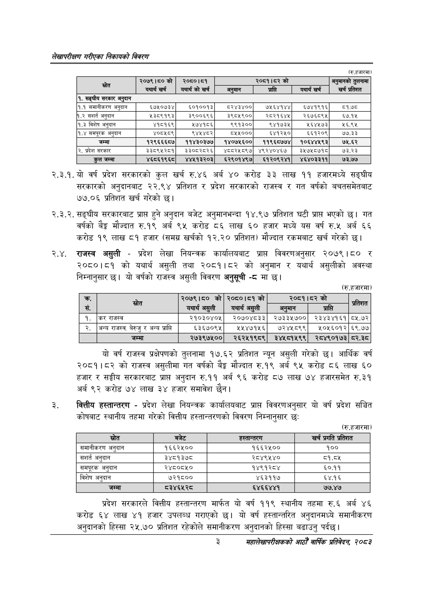

# Page 19 QA

## Rendered page


## Extracted text

```text
लेखापरीक्षण गरीएका निकायको विवरण
(रु.हजारमा)
२.३.१. यो वर्ष प्रदेश सरकारको कुल खर्च रु.४६ अर्ब ४० करोड ३३ लाख ११ हजारमध्ये सङ्घीय सरकारको अनुदानबाट २२.९४ प्रतिशत र प्रदेश सरकारको राजस्व र गत वर्षको बचतसमेतबाट ७७.०६ प्रतिशत खर्च गरेको छ।
२.३.२. सङ्घीय सरकारबाट प्राप्त हुने अनुदान बजेट अनुमानभन्दा १४.९७ प्रतिशत घटी प्रापत भएको छ। गत वर्षको बेङ्ग मौज्दात रु.१९ अर्ब ९५ करोड ८६ लाख ६० हजार मध्ये यस वर्ष रु.५ अर्ब ६६ करोड १९ लाख ८१ हजार (समग्र खर्चको १२.२० प्रतिशत) मौज्दात रकमबाट खर्च गरेको छ।
२.४. राजस्व असुली -प्रदेश लेखा नियन्त्रक कार्यालयबाट प्राप्त विवरणअनुसार २०७९।८० र २०८०।८१ को यथार्थ असुली तथा २०८१।८२ को अनुमान र यथार्थ असुलीको अवस्था निम्नानुसार छ। यो वर्षको राजस्व असुली विवरण अनुसूची -८ मा छ।
(रु.हजारमा)
यो वर्ष राजस्व प्रक्षेपणको तुलनामा १७.६२ प्रतिशत न्यून असुली गरेको छ। आर्थिक वर्ष २०८१।८२ को राजस्व असुलीमा गत वर्षको बैङ्क मौज्दात रु.१९ अर्ब ९५ करोड ८६ लाख ६० हजार र सङ्घीय सरकारबाट प्राप्त अनुदान रु.११ अर्ब ९६ करोड ८७ लाख ७४ हजारसमेत रु.३१ अर्ब ९२ करोड ७४ लाख ३४ हजार समावेश छैन।
वित्तीय हस्तान्तरण -प्रदेश लेखा नियन्त्रक कार्यालयबाट प्राप्त विवरणअनुसार यो वर्ष प्रदेश सञ्चित कोषबाट स्थानीय तहमा गरेको वित्तीय हस्तान्तरणको विवरण निम्नानुसार छः
(रु.हजारमा)
प्रदेश सरकारले वित्तीय हस्तान्तरण मार्फत यो वर्ष ११९ स्थानीय तहमा रु.६ अर्ब ४६ करोड लाख ४१ हजार उपलब्ध गराएको | यो वर्ष हस्तान्तरित अनुदानमध्ये समानीकरण अनुदानको हिस्सा २५.७० प्रतिशत रहेकोले समानीकरण अनुदानको हिस्सा बढाउनु पर्दछ।
३
महालेखापरीक्षकको आठौँ वाषिकि प्रतिवेदन २०८२

|  | २०७९।८०को | २०८०।८१ |  | २०८१।८२ को |  | तुलनामा |
| --- | --- | --- | --- | --- | --- | --- |
|  | यथार्थ खर्व | यथार्थ को खर्च | अनुमान | प्राप्ति | यथार्थ खर्च | खर्च प्रतिशत |
| १. सङ्घीय सरकार अनुदान |  |  |  |  |  |  |
| १.१ समानीकरण अनुदान | ६७५०७३४ | ६०१००१३ | ८२४३४०० | ७५६४१४४ | ६७४१९१६ | ८१:७८ |
| १.२ सशर्त अनुदान | २३८९१९३ | ३९००६९६ | ३९८५९०० | र२८२१६४५ | र२६७६५९५ | ६७.१५ |
| १.३ विशेष अनुदान | ४१८१६९ | ५७४१८६ | ९९१३०० | ९४१७३५ | ५६४५७३ | १६.९५ |
| १.४ समप्रक अनुदान | ४०८५८९ | ९४५४८२ | ५५५००० | ६४१२५० | ६६१२०९ | ७७.३३ |
| जम्मा | १२९६६६८७ | ११४३०३७७ | १४०७५६०० | ११९६८७७४ | १०६४४१९३ | ७५.६२ |
| २. प्रदेश सरकार | ३३८९५२८१ | ३३०८२८२६ | ४८८२५८९७ | ४९२४०४६७ | ३५७१८७१८ | ७३.२३ |
| कुल जम्मा | ४६८६१९६८ | ४४५१३२०३ | ६२९०१४९७ | ६१२०९२४१ | ४६४०३३११ | ७३.७७ |

| क्र रस. |  | २०७९।८० को यथार्थ असुली | २०८०।८१ यथार्थ असुली | ३०५९१५३ अनुमान | को प्राप्ति | प्रतिशत |
| --- | --- | --- | --- | --- | --- | --- |
| १. | कर राजस्व | २१०३०४०५ | २०७०४८३३ | २७३३५७०० | २३४३४१६१ | ८५.७२ |
| २. | अन्य राजस्व, बेरुजु र अन्य प्राप्त | ६३६७०९४५ | २२४७१५६ | ७२४५८९९ | २०५६०१२ | ६९.७७ |
|  | जम्मा | २७३९७५०० | २६२५१९८९ | ३४५८१५९९ | २८४९०१७३ | दर२.३८ |

| स्रोत | बजेट | हत्तान्तरण | खर्च प्रगति प्रतिशत |
| --- | --- | --- | --- |
| समानीकरण अनुदान | १६६२५०० | १६६२५०० | १०० |
| सशार्त अनुदान | ३४८१३७८ | २८४९५४० | ८१.८४५ |
| 'समपूरक अनुदान | २४८०८५० | १४९१२८४ | ६०.११ |
| विशेष अनुदान | ७२१८०० | ४६३११७ | ६५४.१६ |
| जम्मा | ८३४६५२८ | ६४६६४४१ | ७७.४७ |
```

## Flags
- table_page
- medium_quality_table
