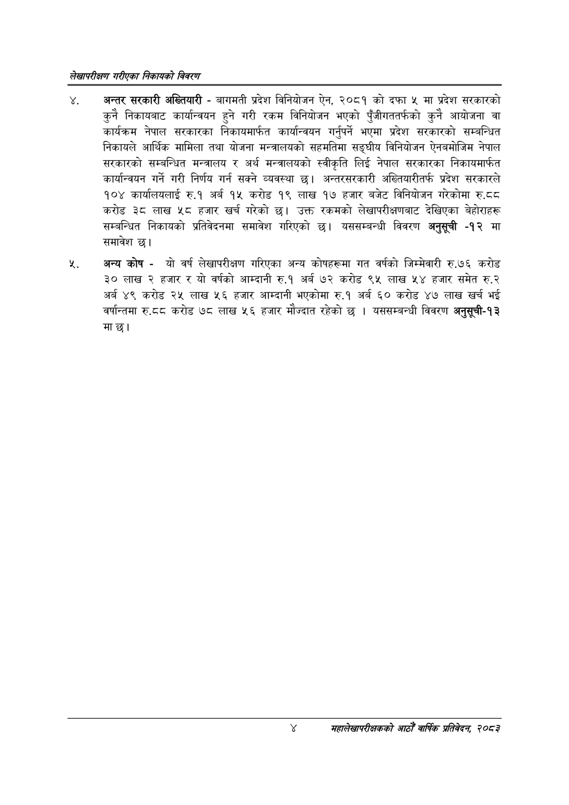

# Page 20 QA

## Rendered page


## Extracted text

```text
लेखापरीक्षण गरीएका निकायको विवरण
अन्तर सरकारी अख्तियारी -बागमती प्रदेश विनियोजन ऐन, २०८१ को दफा ४ मा प्रदेश सरकारको कुनै निकायबाट कार्यान्वयन हुने गरी रकम विनियोजन भएको पुँजीगततर्फको कुनै आयोजना वा कार्यक्रम नेपाल सरकारका निकायमार्फत कार्यान्वयन गर्नुपर्ने भएमा प्रदेश सरकारको सम्बन्धित निकायले आर्थिक मामिला तथा योजना मन्त्रालयको सहमतिमा सङ्घीय विनियोजन ऐनबमोजिम नेपाल सरकारको सम्बन्धित मन्त्रालय र अर्थ मन्त्रालयको स्वीकृति लिई नेपाल सरकारका निकायमार्फत कार्यान्वयन गर्ने गरी निर्णय गर्न सक्ने व्यवस्था छ। अन्तरसरकारी अख्तियारीतर्फ प्रदेश सरकारले १०४ कार्यालयलाई रु.१ अर्ब १५ करोड १९ लाख १७ हजार बजेट विनियोजन गरेकोमा रु.८८ करोड ३८ लाख हजार खर्च गरेको छ। उक्त रकमको लेखापरीक्षणबाट देखिएका बेहोराहरू सम्बन्धित निकायको प्रतिवेदनमा समावेश गरिएको छ। यससम्बन्धी विवरण अनुसूची -१२ मा समावेश छ।
अन्य कोष -यो वर्ष लेखापरीक्षण गरिएका अन्य कोषहरूमा गत वर्षको जिम्मेवारी रु.७६ करोड ३० लाख हजार र यो वर्षको आम्दानी रु.१ अर्ब ७२ करोड ९४५ लाख ५४ हजार समेत रु.२ अर्ब ४९ करोड २५ लाख ५६ हजार आम्दानी भएकोमा रु.१ अर्ब ६० करोड ४७ लाख खर्च भई वर्षान्तमा रु.८द करोड ७८ लाख ५६ हजार मौज्दात रहेको छ | यससम्बन्धी विवरण अनुसूची-१३ माछ।
महालेखापरीक्षकको आठौँ वाषिकि प्रतिवेदन २०८२
```

## Flags
- None
