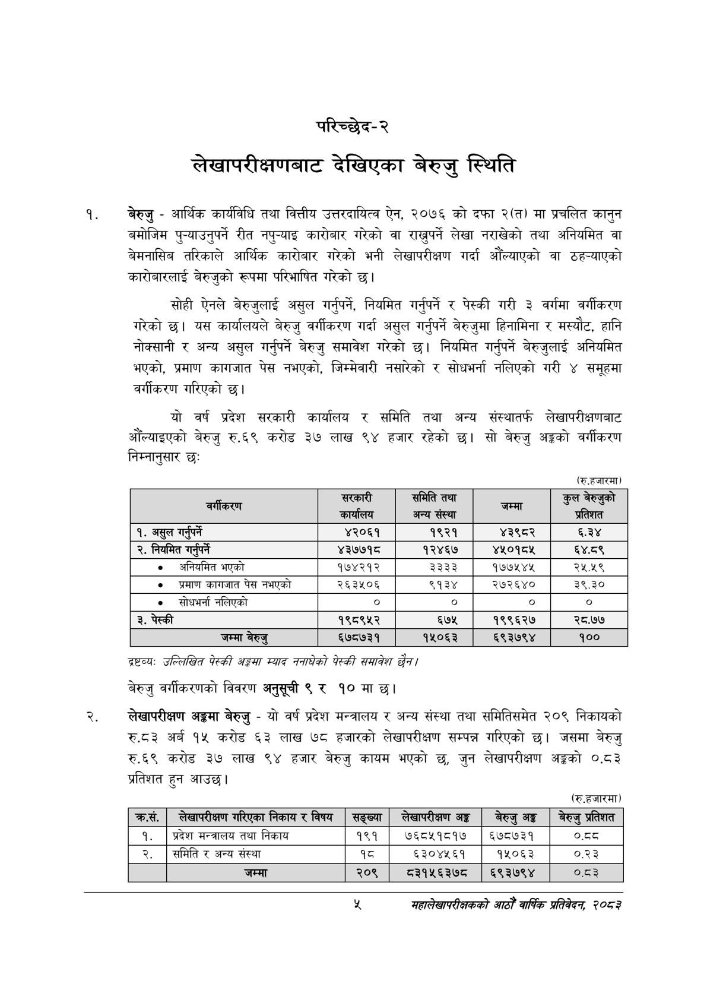

# Page 23 QA

## Rendered page


## Extracted text

```text
परिच्छेद-२
लेखापरीक्षणबाट देखिएका बेरुजु स्थिति
बेरुजु -आर्थिक कार्यविधि तथा वित्तीय उत्तरदायित्व ऐन, २०७६ को दफा २(त) मा प्रचलित कानुन बमोजिम पुन्याउनुपर्ने रीत नपु-्याइ कारोबार गरेको वा राख्नुपर्ने लेखा नराखेको तथा अनियमित वा बेमनासिब तरिकाले आर्थिक कारोबार गरेको भनी लेखापरीक्षण गर्दा औंल्याएको वा ठहन्याएको कारोबारलाई बेरुजुको रूपमा परिभाषित गरेको छ।
सोही ऐनले बेरुजुलाई असुल गर्नुपर्ने, नियमित गर्नुपर्ने र पेस्की गरी ३ वर्गमा वर्गीकरण गरेको छ। यस कार्यालयले बेरुजु वर्गीकरण गर्दा असुल गर्नुपर्ने बेरुजुमा हिनामिना र मस्यौट, हानि नोक्सानी र अन्य असुल गर्नुपर्ने बेरुजु समावेश गरेको छ। नियमित गर्नुपर्ने बेरुजुलाई अनियमित भएको, प्रमाण कागजात पेस नभएको, जिम्मेवारी नसारेको र सोधभर्ना नलिएको गरी ४ समूहमा वर्गीकरण गरिएको छ।
यो वर्ष प्रदेश सरकारी कार्यालय र समिति तथा अन्य संस्थातर्फ लेखापरीक्षणबाट औंल्याइएको बेरुजु रु.६९ करोड ३७ लाख ९४ हजार रहेको सो बेरुजु अङ्गको वर्गीकरण निम्नानुसार छः
(रु.हजारमा)
द्रष्टव्य:
उल्लिखित पेटकी अङ्कसा स्याद ननाघेको पेटकी समावेश
बेरुजु वर्गीकरणको विवरण अनुसूची ९ र १० मा छ।
लेखापरीक्षण अङ्गमा बेरुजु -यो वर्ष प्रदेश मन्त्रालय र अन्य संस्था तथा समितिसमेत २०९ निकायको रु.टद३ अर्ब १५ करोड ६३ लाख ७८ हजारको लेखापरीक्षण सम्पन्न गरिएको छ। जसमा बेरुजु रु६९ करोड ३७ लाख ९४ हजार बेरुजु कायम भएको छ, जुन लेखापरीक्षण अङ्गको ०.८३ प्रतिशत हुन आउछ।
(रु.हजारमा)
महालेखापरीक्षकको आठौँ वाषिकि प्रतिवेदन २०८२

|  | सरकारी कार्यालय | समिति तथा अन्य संस्था | जम्मा | कुल नेरुजुको प्रतिशत |
| --- | --- | --- | --- | --- |
| १. असुल गर्नुपर्ने | ४२०६१ | १९२१ | ४३९८२ | ३ |
| २. नियमित गर्नपर्ने | ४३७७१८ | १२४६७ | ४५०१८५ | ६४.८९ |
| ७० अनियमित भएको | १७४२१२ | ३३३३ | १७७५४४५ | २५.२९ |
| ७ प्रमाण कागजात पेस नभएको | २६३५०६ | ९१३४ | २७२६४० | ३९.३० |
| ७० सोधभर्ना नलिएको | ० | ० |  | ० |
| ३. पेस्की | १९८९५२ | ६७४५ | १९९६२७ | २८.७७ |
| जम्मा बेरुजु | ६७८७३१ | १५०६३ | ६९३७९४ | १०० |

| क्रस. | लखापरीक्षण गरिएका निकाय र विषय | सङ्ख्या | लखापरीक्षण अङ्ग | बेरुजु अङ्ग | बेरुजु प्रतिशत |
| --- | --- | --- | --- | --- | --- |
| १. | प्रदेश भन्त्रालष तथा निकाय | १९१ | ७६८५१८१७ | ६७८७३१ | ७्व् |
| २. | समिति र अन्य संस्था | १८ | ६३०४५६१ | १५०६३ | ०.२३ |
|  | जम्मा | २०९ | ८३१५६३७८० | ६९३७९४ | ०.८३ |
```

## Flags
- table_page
- medium_quality_table
