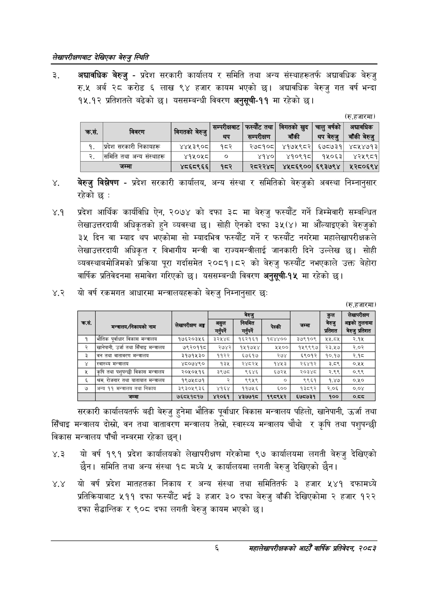

# Page 24 QA

## Rendered page


## Extracted text

```text
लेखापरीक्षणबाट देखिएका बेरुजु स्थिति
अद्यावधिक बेरुजु -प्रदेश सरकारी कार्यालय र समिति तथा अन्य संस्थाहरूतर्फ अद्यावधिक बेरुजु रु.५ अर्ब २८ करोड ६ लाख ९४ हजार कायम भएको छ। अद्यावधिक बेरुजु गत वर्ष भन्दा १५.१२ प्रतिशतले बढेको छ। यससम्बन्धी विवरण अनुसूची-११ मा रहेको
(रु.हजारमा)
बेरुजु विश्लेषण -प्रदेश सरकारी कार्यालय, अन्य संस्था र समितिको बेरुजुको अवस्था निम्नानुसार रहेको छ:
४.१ प्रदेश आर्थिक कार्यविधि ऐन, २०७४ को दफा ३८ मा बेरुजु फस्यौट गर्ने जिम्मेवारी सम्बन्धित लेखाउत्तरदायी अधिकृतको हुने व्यवस्था छ। सोही ऐनको दफा ३५(४) मा औंल्याइएको बेरुजुको ३ दिन वा म्याद थप भएकोमा सो म्यादभित्र फस्यौट गर्ने र फस्यौट नगरेमा महालेखापरीक्षकले लेखाउत्तरदायी अधिकृत र विभागीय मन्त्री वा राज्यमन्त्रीलाई जानकारी दिने उल्लेख छ। सोही व्यवस्थाबमोजिमको प्रक्रिया पूरा गर्दासमेत २०८१।८२ को बेरुजु फस्यौट नभएकाले उक्त बेहोरा वार्षिक प्रतिवेदनमा समावेश गरिएको छ। यससम्बन्धी विवरण अनुसूची-१५ मा रहेको छ।
४.२ यो वर्ष रकमगत आधारमा मन्त्रालयहरूको बेरुजु निम्नानुसार छः
(रु.हजारमा)
सरकारी कार्यालयतर्फ बढी बेरुजु हुनेमा भौतिक पूर्वाधार विकास मन्त्रालय पहिलो, खानेपानी, उर्जा तथा सिँचाइ मन्त्रालय दोस्रो, वन तथा वातावरण मन्त्रालय तेस्रो, स्वास्थ्य मन्त्रालय चौथो र कृषि तथा पशुपन्छी विकास मन्त्रालय पाँचौ नम्बरमा रहेका छन्‌।
४.२ यो वर्ष १९१ प्रदेश कार्यालयको लेखापरीक्षण गरेकोमा ९७ कार्यालयमा लगती बेरुजु देखिएको छैन। समिति तथा अन्य संस्था १८ मध्ये ५ कार्यालयमा लगती बेरुजु देखिएको छैन।
४.४ यो वर्ष प्रदेश मातहतका निकाय र अन्य संस्था तथा समितितर्फ ३ हजार ५४१ दफामध्ये प्रतिक्रियाबाट २११ दफा फस्यौट भई ३ हजार ३० दफा बेरुजु बाँकी देखिएकोमा २ हजार १२२ दफा सैद्धान्तिक र ९०८ दफा लगती बेरुजु कायम भएको |
६
महालेखापरीक्षकको आठौँ वाषिकि प्रतिवेदन २०८२

| छै कस |  |  | सन्परीकानाट थप | फस्योट तथा सन्परीक्षण | विगतको खुद बाँकी | चालु वर्षको थप बेरुजु | अचानक बाँकी बेरुजु |
| --- | --- | --- | --- | --- | --- | --- | --- |
| १. | प्रदेश सरकारी निकाषहरू | ४४५३९०८ | १८२ | २७८१०८ | ४१७५९८२ | ६७८७३१ | ४८५४७१३ |
| २. | समिति तथा अन्य संस्थाहरू | ४१५०५८ | ० | ४१४० | ४१०९१८ | १५०६३ | ४२५९८१ |
|  | जम्मा | ४८०६८९६६ | १८२ | २८२२४८ | ४४५८६९०० | ६९३७९४ |  |

| कस. | 'मन्त्रालय/निकायको नाम | अङ्ग | असुल सरि | बेरुजु नियमित | चेस्की | जम्मा | कुल बेरुजु प्रतिशत | लेखापरीकाण अङ्कको तुलनामा जेरखु प्रतिशत |
| --- | --- | --- | --- | --- | --- | --- | --- | --- |
| १ | भौतिक पूर्वाधार विकास मन्त्रालय | १७६२०३५६ | ३२५४८ | १६२१६१ | १८४४०० | ३७९१०९ | २५.८५ | २.१५ |
| २ | खानेपानी, उर्जा तथा सिँचाइ मन्त्रालय | ७९२०११८ | २७४२ | १५१७५४ | ५५०० | १५९९९७ | २३.१७ | र२.०२ |
| ३ | वन तथा वातावरण मन्त्रालय | ३१७१५३० | ११२२ | ६७६१७ | २७४ | ६९०१२ | १०१७ | २.१६ |
| ४ | स्वास्थ्य मन्त्रालय | ४८०७४९० | १३५ | र२४८२४५ | १४५३ | २६४१२ | ३८९ |  |
| ५ | कृषि तथा पशुपन्छी विकास मन्त्रालय | २०५०५१६ | ३९७८ | ९६४६ | ६७२५ | २०३४८ | र२.९९ | ०.९९ |
| ६ | थम, रोजगार तथा यातायात मन्त्रालय | १९७५८७१ | र | ९९५९ | ० | ९९६१ | १४७ | ०,५१० |
| ७ | अन्य ११ मन्त्रालय तथा निकाय | ३९३०५९३६५ | ४१६४ | ११७५६ | ६५०० | १३८९२ | २.०६ | ०.०४ |
| ८ | जम्मा | ७६८५१८१७ | ४२०६१ | ४३७७१८ | १९८९५२ | ६७८७३१ | १०० | १ |
```

## Flags
- table_page
- medium_quality_table
