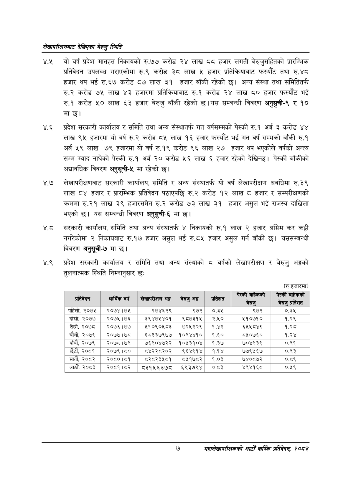

# Page 25 QA

## Rendered page


## Extracted text

```text
लेखापरीक्षणबाट देखिएका बेरुजु स्थिति
१८३ यो वर्ष प्रदेश मातहत निकायको रु.७७ करोड २४ लाख ६ हजार लगती बेरुजुसहितको प्रारम्भिक प्रतिवेदन उपलब्ध गराएकोमा रु.९ करोड ३८ लाख ५ हजार प्रतिक्रियाबाट फस्यौट तथा रु.४८ हजार थप भई रु.६७ करोड ८७ लाख ३१ हजार बाँकी रहेको छ। अन्य संस्था तथा समितितर्फ रु.२ करोड ७५ लाख ४३ हजारमा प्रतिक्रियाबाट रु.१ करोड २४ लाख ८० हजार फस्यौट भई रु.१ करोड ५० लाख ६३ हजार बेरुजु बाँकी रहेको छ। यस सम्बन्धी विवरण अनुसुची-९ र ९० मा छ।
४.६ प्रदेश सरकारी कार्यालय र समिति तथा अन्य संस्थातर्फ गत वर्षसम्मको पेस्की रु.१ अर्ब ३ करोड ४४ लाख ९५ हजारमा यो वर्ष रु.२ करोड ८५ लाख १६ हजार फस्यौट भई गत वर्ष सम्मको बाँकी रु.१ अर्ब ५९ लाख ७९ हजारमा यो वर्ष रु.१९ करोड ९६ लाख २७ हजार थप भएकोले वर्षको अन्त्य सम्म म्याद नाघेको पेस्की रु.१ अर्ब २० करोड ५६ लाख ६ हजार रहेको देखिन्छ। पेस्की बाँकीको अद्यावधिक विवरण अनुसूची-५ मा रहेको
४.७ लेखापरीक्षणबाट सरकारी कार्यालय, समिति र अन्य संस्थातर्फ यो वर्ष लेखापरीक्षण अवधिमा रु.३९ लाख ८४ हजार र प्रारम्भिक प्रतिवेदन पठाएपछि रु.२ करोड १२ लाख हजार र सम्परीक्षणको क्रममा रु.२१ लाख ३९ हजारसमेत रु.२ करोड ७३ लाख ३१ हजार असुल भई राजस्व दाखिला भएको | यस सम्बन्धी विवरण अनुसुची-६ मा छ।
सरकारी कार्यालय, समिति तथा अन्य संस्थातर्फ ४ निकायको रु.१ लाख २ हजार अग्रिम कर कट्टी नगरेकोमा २ निकायबाट रु.१७ हजार असुल भई रु.८५ हजार असुल गर्न बाँकी छ। यससम्बन्धी विवरण अनुसूची-७ मा छ।
४.९ प्रदेश सरकारी कार्यालय र समिति तथा अन्य संस्थाको ८ वर्षको लेखापरीक्षण र बेरुजु अङ्गको तुलनात्मक स्थिति निम्नानुसार छः
(रु.हजारमा)
७
महालेखापरीक्षकको आठौँ वाषिकि प्रतिवेदन २०८२

| प्रतिवेदन | आर्थिक वर्ष | लेखापरीक्षण अङ्ग | बेरुजु अङ्ग | प्रतिशत | नो | र |
| --- | --- | --- | --- | --- | --- | --- |
| पहिलो, २०७५ | २०७४।७५ | २७४६२९ | ९७२ | ०.३४५ | ९७२ | ०.३५ |
| दोस्रो, २०७७ | २०७५।७६ | ३९४७५४०१ | ९८७३१५ | २.५० | ४५१०७१० | १.२९ |
| तेस्रो, २०७८ | २०७६।७४ | ५१०९०५८३ | ७२५२२९ | १.४२ | ६५५८४९ | १.२८ |
| चौथों, २०७९ | २०७७।७८ | ६८३३७९७७ | १०९४४१० | १.६० | ८५०७६० | १.२४ |
| पाँचौं, २०७९ | २०७८।७९ | ७६९०४७२२ | १०५३१०४ | १.३७ | ७०४९३९ | ०.९१ |
| छैटौं, २०८१ | २०७९।८० | ८४२२८२०२ | ९६४९१४ | १.१४ | ७७९५६७ | ०.९३ |
| सातौं, २०८२ | २०८०।८१ | ८२८२३४५८१ | ८५१७८२ | १.०३ | ७४०८७२ | ०.८९ |
| आठौँ, २०८३ | २०८१।२ | ८३१५६३७८ | ६९३७९४ | ०८३ | ४९४१६८ | ०४८ |
```

## Flags
- table_page
- medium_quality_table
