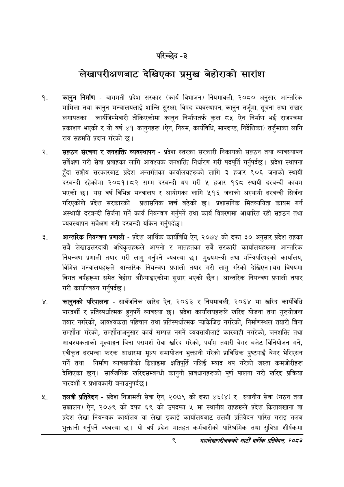

# Page 29 QA

## Rendered page


## Extracted text

```text
परिच्छेद -३
लेखापरीक्षणबाट देखिएका प्रमुख बेहोराको सारांश
कानुन निर्माण -बागमती प्रदेश सरकार (कार्य विभाजन) नियमावली, २०८० अनुसार आन्तरिक मामिला तथा कानुन मन्त्रालयलाई शान्ति सुरक्षा, विपद व्यवस्थापन, कानुन तर्जूमा, सूचना तथा सञ्चार लगायतका कार्यजिम्मेवारी तोकिएकोमा कानुन निर्माणतर्फ कुल ८५ ऐन निर्माण भई राजपत्रमा प्रकाशन भएको र यो वर्ष ४१ कानुनहरू (ऐन, नियम, कार्यविधि, मापदण्ड, निर्देशिका) तर्जुमाका लागि राय सहमति प्रदान गरेको छ।
सङ्गठन संरचना र जनशक्ति व्यवस्थापन -प्रदेश स्तरका सरकारी निकायको सङ्गठन तथा व्यवस्थापन सर्वेक्षण गरी सेवा प्रवाहका लागि आवश्यक जनशक्ति निर्धारण गरी पदपूर्ति गर्नुपर्दछ। प्रदेश स्थापना हुँदा सङ्घीय सरकारबाट प्रदेश अन्तर्गतका कार्यालयहरूको लागि ३ हजार ९०६ जनाको स्थायी दरबन्दी रहेकोमा २०८१।८२ सम्म दरबन्दी थप गरी ५ हजार १६८ स्थायी दरबन्दी कायम भएको छ। यस वर्ष विभिन्न मन्त्रालय र आयोगका लागि ५१६ जनाको अस्थायी दरबन्दी सिर्जना गरिएकोले प्रदेश सरकारको प्रशासनिक खर्च बढेको छ। प्रशासनिक मितव्ययिता कायम गर्न अस्थायी दरबन्दी सिर्जना गर्ने कार्य नियन्त्रण गर्नुपर्ने तथा कार्य विवरणमा आधारित रही सङ्गठन तथा व्यवस्थापन सर्वेक्षण गरी दरबन्दी यकिन गर्नुपर्दछ |
आन्तरिक नियन्त्रण प्रणाली -प्रदेश आर्थिक कार्यविधि ऐन, २०७४ को दफा ३० अनुसार प्रदेश तहका सबै लेखाउत्तरदायी अधिकृतहरूले आफ्नो र मातहतका सबै सरकारी कार्यालयहरूमा आन्तरिक नियन्त्रण प्रणाली तयार गरी लागु गर्नुपर्ने व्यवस्था छ। मुख्यमन्त्री तथा मन्त्रिपरिषद्को कार्यालय, विभिन्न मन्त्रालयहरूले आन्तरिक नियन्त्रण प्रणाली तयार गरी लागु गरेको देखिएन। यस विषयमा विगत वर्षहरूमा समेत बेहोरा आँल्याइएकोमा सुधार भएको छैन। आन्तरिक नियन्त्रण प्रणाली तयार गरी कार्यान्वयन गर्नुपर्दछ |
कानुनको परिपालना -सार्वजनिक खरिद ऐन, २०६३ र नियमावली, २०६४ मा खरिद कार्यविधि पारदर्शी र प्रतिस्पर्धात्मक हुनुपर्ने व्यवस्था छ। प्रदेश कार्यालयहरूले खरिद योजना तथा गुरुयोजना तयार नगरेको, आवश्यकता पहिचान तथा प्रतिस्पर्धात्मक प्याकेजिङ नगरेको, निर्माणस्थल तयारी बिना सम्झौता गरेको, सम्झौताअनुसार कार्य सम्पन्न नगर्ने व्यवसायीलाई कारबाही नगरेको, जनशक्ति तथा आवश्यकताको मूल्याङ्कन बिना परामर्श सेवा खरिद गरेको, पर्याप्त तयारी वेगर बजेट विनियोजन गर्ने, स्वीकृत दरभन्दा फरक आधारमा मूल्य समायोजन भुक्तानी गरेको प्राविधिक पुष्ट्याइँ बेगर भेरिएसन गर्ने तथा निर्माण व्यवसायीको ढिलाइमा क्षतिपूर्ति नलिई म्याद थप गरेको जस्ता कमजोरीहरू देखिएका छन्‌। सार्वजनिक खरिदसम्बन्धी कानुनी प्रावधानहरूको पूर्ण पालना गरी खरिद प्रक्रिया पारदर्शी र प्रभावकारी बनाउनुपर्दछ |
तलबी प्रतिवेदन -प्रदेश निजामती सेवा ऐन, २०७९ को दफा ४६(४) र स्थानीय सेवा (गठन तथा सञ्चालन) ऐन, २०७९ को दफा ६९ को उपदफा मा स्थानीय तहहरूले प्रदेश किताबखाना वा प्रदेश लेखा नियन्त्रक कार्यालय वा लेखा इकाई कार्यालयबाट तलबी प्रतिवेदन पारित गराइ तलब भुक्तानी गर्नुपर्ने व्यवस्था छ। यो वर्ष प्रदेश मातहत कर्मचारीको पारिश्रमिक तथा सुविधा शीर्षकमा
द्‌
महालेखापरीक्षकको आठौँ वाषिकि प्रतिवेदन २०८२
```

## Flags
- None
