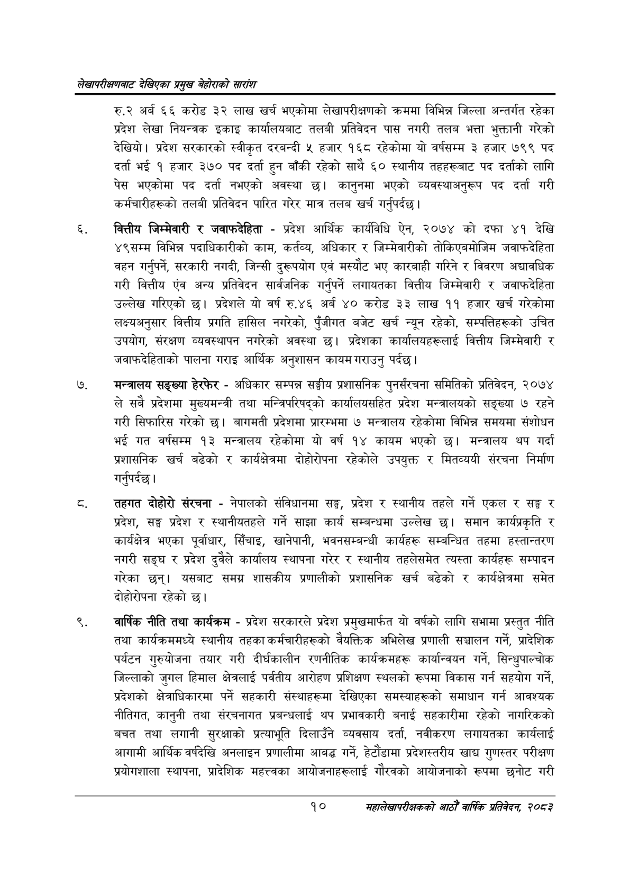

# Page 30 QA

## Rendered page


## Extracted text

```text
लेखापरीक्षणबाट देखिएका प्रमुख बेहोराको सारांश
रु.२ अर्ब ६६ करोड ३२ लाख खर्च भएकोमा लेखापरीक्षणको क्रममा विभिन्न जिल्ला अन्तर्गत रहेका प्रदेश लेखा नियन्त्रक इकाइ कार्यालयबाट तलबी प्रतिवेदन पास नगरी तलब भत्ता भुक्तानी गरेको देखियो। प्रदेश सरकारको स्वीकृत दरबन्दी ५ हजार १६८ रहेकोमा यो वर्षसम्म ३ हजार ७९९ पद दर्ता ई १ हजार ३७० पद दर्ता हुन बाँकी रहेको साथै ६० स्थानीय तहहरूबाट पद दर्ताको लागि पेस भएकोमा पद दर्ता नभएको अवस्था छ। कानुनमा भएको व्यवस्थाअनुरूप पद दर्ता गरी कर्मचारीहरूको तलबी प्रतिवेदन पारित गरेर मात्र तलब खर्च गर्नुपर्दछ |
वित्तीय जिम्मेवारी र जवाफदेहिता -प्रदेश आर्थिक कार्यविधि ऐन, २०७४ को दफा ४१ देखि ४९सम्म विभिन्न पदाधिकारीको काम, कर्तव्य, अधिकार र जिम्मेवारीको तोकिएबमोजिम जवाफदेहिता वहन गर्नुपर्ने, सरकारी नगदी, जिन्सी दुरूपयोग एवं मस्यौट भए कारबाही गरिने र विवरण अद्यावधिक गरी वित्तीय एंव अन्य प्रतिवेदन सार्वजनिक गर्नुपर्ने लगायतका वित्तीय जिम्मेवारी र जवाफदेहिता उल्लेख गरिएको छ। प्रदेशले यो वर्ष रु.४६ अर्ब ४० करोड ३३ लाख ११ हजार खर्च गरेकोमा लक्ष्यअनुसार वित्तीय प्रगति हासिल नगरेको, पुँजीगत बजेट खर्च न्यून रहेको, सम्पत्तिहरूको उचित उपयोग, संरक्षण व्यवस्थापन नगरेको अवस्था छ। प्रदेशका कार्यालयहरूलाई वित्तीय जिम्मेवारी र जवाफदेहिताको पालना गराइ आर्थिक अनुशासन कायम गराउनु पर्दछ।
मन्त्रालय सङ्ख्या हेरफेर -अधिकार सम्पन्न सङ्घीय प्रशासनिक पुनर्संरचना समितिको प्रतिवेदन, २०७४ ले सबै प्रदेशमा मुख्यमन्त्री तथा मन्त्रिपरिषद्को कार्यालयसहित प्रदेश मन्त्रालयको सङ्ख्या ७ रहने गरी सिफारिस गरेको छ। बागमती प्रदेशमा प्रारम्भमा ७ मन्त्रालय रहेकोमा विभिन्न समयमा संशोधन भई गत वर्षसम्म १३ मन्त्रालय रहेकोमा यो वर्ष १४ कायम भएको छ। मन्त्रालय थप गर्दा प्रशासनिक खर्च बढेको र कार्यक्षेत्रमा दोहोरोपना रहेकोले उपयुक्त र मितव्ययी संरचना निर्माण गर्नुपर्दछ |
तहगत दोहोरो संरचना -नेपालको संविधानमा सङ्ग, प्रदेश र स्थानीय तहले गर्ने एकल र सङ्ग र प्रदेश, सङ्घ प्रदेश र स्थानीयतहले गर्ने साझा कार्य सम्बन्धमा उल्लेख छ। समान कार्यप्रकृति र कार्यक्षेत्र भएका पूर्वाधार, सिँचाइ, खानेपानी, भवनसम्बन्धी कार्यहरू सम्बन्धित तहमा हस्तान्तरण नगरी सङ्घ र प्रदेश दुवैले कार्यालय स्थापना गरेर र स्थानीय तहलेसमेत त्यस्ता कार्यहरू सम्पादन गरेका छन्‌। यसबाट समग्र शासकीय प्रणालीको प्रशासनिक खर्च बढेको र कार्यक्षेत्रमा समेत दोहोरोपना रहेको छ।
वार्षिक नीति तथा कार्यक्रम -प्रदेश सरकारले प्रदेश प्रमुखमार्फत यो वर्षको लागि सभामा प्रस्तुत नीति तथा कार्यक्रममध्ये स्थानीय तहका कर्मचारीहरूको वैयक्तिक अभिलेख प्रणाली सञ्चालन गर्ने, प्रादेशिक पर्यटन गुरुयोजना तयार गरी दीर्घकालीन रणनीतिक कार्यक्रमहरू कार्यान्वयन गर्ने, सिन्धुपाल्चोक जिल्लाको जुगल हिमाल क्षेत्रलाई पर्वतीय आरोहण प्रशिक्षण स्थलको रूपमा विकास गर्न सहयोग गर्ने, प्रदेशको क्षेत्राधिकारमा पर्ने सहकारी संस्थाहरूमा देखिएका समस्याहरूको समाधान गर्न आवश्यक नीतिगत, कानुनी तथा संरचनागत प्रबन्धलाई थप प्रभावकारी बनाई सहकारीमा रहेको नागरिकको बचत तथा लगानी सुरक्षाको प्रत्याभूति दिलाउँने व्यवसाय दर्ता, नवीकरण लगायतका कार्यलाई आगामी आर्थिक वर्षदेखि अनलाइन प्रणालीमा आबद्ध गर्ने, हेटौंडामा प्रदेशस्तरीय खाद्य गुणस्तर परीक्षण प्रयोगशाला स्थापना, प्रादेशिक महत्त्वका आयोजनाहरूलाई गौरवको आयोजनाको रूपमा छनोट गरी
१०
महालेखापरीक्षकको आठौं वाषिकि प्रतिवेदन २०८२
```

## Flags
- None
