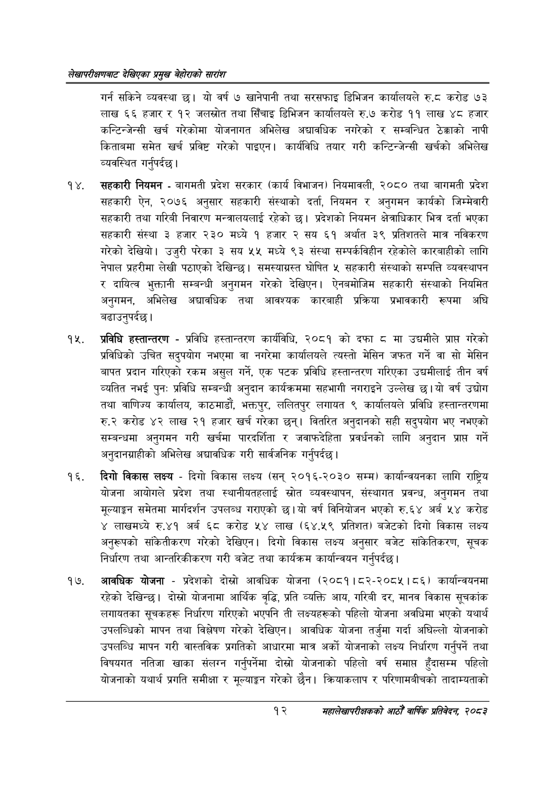

# Page 32 QA

## Rendered page


## Extracted text

```text
लेखापरीक्षणबाट देखिएका प्रमुख बेहोराको सारांश
गर्न सकिने व्यवस्था छु। यो वर्ष ७ खानेपानी तथा सरसफाइ डिभिजन कार्यालयले रु.ट करोड ७३ लाख ६६ हजार र १२ जलस्रोत तथा सिँचाइ डिभिजन कार्यालयले रु.७ करोड ११ लाख ४८ हजार कन्टिन्जेन्सी खर्च गरेकोमा योजनागत अभिलेख अद्यावधिक नगरेको र सम्बन्धित ठेक्काको नापी किताबमा समेत खर्च प्रविष्ट गरको पाइएन। कार्यविधि तयार गरी कन्टिन्जेन्सी खर्चको अभिलेख व्यवस्थित गर्नुपर्दछ |
सहकारी नियमन -बागमती प्रदेश सरकार (कार्य विभाजन) नियमावली, २०८० तथा बागमती प्रदेश सहकारी ऐन, २०७६ अनुसार सहकारी संस्थाको दर्ता, नियमन र अनुगमन कार्यको जिम्मेवारी सहकारी तथा गरिबी निवारण मन्त्रालयलाई रहेको छ। प्रदेशको नियमन क्षेत्राधिकार भित्र दर्ता भएका सहकारी संस्था ३ हजार २३० मध्ये १ हजार २ सय ६१ अर्थात ३९ प्रतिशतले मात्र नविकरण गरेको देखियो। उजुरी परेका ३ सय ५५ मध्ये ९३ संस्था सम्पर्कविहीन रहेकोले कारबाहीको लागि नेपाल प्रहरीमा लेखी पठाएको देखिन्छ। समस्याग्रस्त घोषित ५ सहकारी संस्थाको सम्पत्ति व्यवस्थापन र दायित्व भुक्तानी सम्बन्धी अनुगमन गरेको देखिएन। ऐनबमोजिम सहकारी संस्थाको नियमित अनुगमन, अभिलेख अद्यावधिक तथा आवश्यक कारबाही प्रक्रिया प्रभावकारी रूपमा अघि बढाउनुपर्दछ।
प्रविधि हस्तान्तरण -प्रविधि हस्तान्तरण कार्यविधि, २०८१ को दफा ८ मा उद्यमीले प्राप्त गरेको प्रविधिको उचित सदुपयोग नभएमा वा नगरेमा कार्यालयले त्यस्तो मेसिन जफत गर्ने वा सो मेसिन बापत प्रदान गरिएको रकम असुल गर्ने, एक पटक प्रविधि हस्तान्तरण गरिएका उद्यमीलाई तीन वर्ष व्यतित नभई पुन: प्रविधि सम्बन्धी अनुदान कार्यक्रममा सहभागी नगराइने उल्लेख छ। यो वर्ष उद्योग तथा वाणिज्य कार्यालय, काठमाडौं, भक्तपुर, ललितपुर लगायत ९ कार्यालयले प्रविधि हस्तान्तरणमा रु.२ करोड ४२ लाख २१ हजार खर्च गरेका छन्‌। वितरित अनुदानको सही सदुपयोग भए नभएको सम्बन्धमा अनुगमन गरी खर्चमा पारदर्शिता र जवाफदेहिता प्रवर्धनको लागि अनुदान प्राप्त गर्ने अनुदानग्राहीको अभिलेख अद्यावधिक गरी सार्वजनिक गर्नुपर्दछ |
दिगो विकास लक्ष्य -दिगो विकास लक्ष्य (सन्‌ २०१६-२०३० सम्म) कार्यान्वयनका लागि राष्ट्रिय योजना आयोगले प्रदेश तथा स्थानीयतहलाई स्रोत व्यवस्थापन, संस्थागत प्रवन्ध, अनुगमन तथा मूल्याङ्गन समेतमा मार्गदर्शन उपलब्ध गराएको छ। यो वर्ष विनियोजन भएको रु.६४ अर्ब ५४ करोड ४ लाखमध्ये रु.४१ अर्ब ६८ करोड ५४ लाख (६४.५९ प्रतिशत) बजेटको दिगो विकास लक्ष्य अनुरूपको सकितीकरण गरेको देखिएन। दिगो विकास लक्ष्य अनुसार बजेट सकितिकरण, सूचक निर्धारण तथा आन्तरिकीकरण गरी बजेट तथा कार्यक्रम कार्यान्वयन गर्नुपर्दछ |
आवधिक योजना -प्रदेशको दोस्रो आवधिक योजना (२०८१।८२-२०८५। ८६) कार्यान्वयनमा रहेको देखिन्छ। दोस्रो योजनामा आर्थिक वृद्धि, प्रति व्यक्ति आय, गरिबी दर, मानव विकास सूचकांक लगायतका सूचकहरू निर्धारण गरिएको भएपनि ती लक्ष्यहरूको पहिलो योजना अवधिमा भएको यथार्थ उपलब्धिको मापन तथा विश्लेषण गरेको देखिएन। आवधिक योजना तर्जुमा गर्दा अघिल्लो योजनाको उपलब्धि मापन गरी वास्तविक प्रगतिको आधारमा मात्र अर्को योजनाको लक्ष्य निर्धारण गर्नुपर्ने तथा विषयगत नतिजा खाका संलग्न गर्नुपर्नेमा दोस्रो योजनाको पहिलो वर्ष समाप्त हुँदासम्म पहिलो योजनाको यथार्थ प्रगति समीक्षा र मूल्याङ्कन गरेको छैन। क्रियाकलाप र परिणामबीचको तादाम्यताको
१२
महालेखापरीक्षकको आठौं वाषिकि प्रतिवेदन २०८२
```

## Flags
- None
