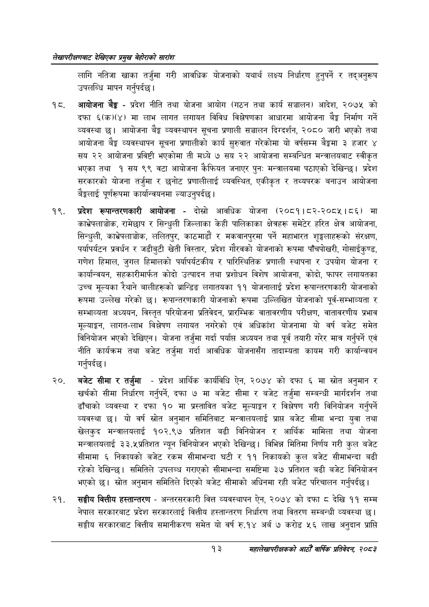

# Page 33 QA

## Rendered page


## Extracted text

```text
लेखापरीक्षणबाट देखिएका प्रमुख बेहोराको सारांश
लागि नतिजा खाका तर्जुमा गरी आवधिक योजनाको यथार्थ लक्ष्य निर्धारण हुनुपर्ने र तद्अनुरूप उपलब्धि मापन गर्नुपर्दछ।
१८, आयोजना बैङ्क -प्रदेश नीति तथा योजना आयोग (गठन तथा कार्य सञ्चालन) आदेश, २०७५ को दफा ६(क)(४) मा लाभ लागत लगायत विविध विश्लेषणका आधारमा आयोजना बेङ्ग निर्माण गर्ने व्यवस्था छ। आयोजना बैङ्क व्यवस्थापन सूचना प्रणाली सञ्चालन दिग्दर्शन, २०८० जारी भएको तथा आयोजना व्यवस्थापन सूचना प्रणालीको कार्य सुरुवात गरेकोमा यो वर्षसम्म बैङ्कमा ३ हजार ४ सय २२ आयोजना प्रविष्टी भएकोमा ती मध्ये ७ सय २२ आयोजना सम्बन्धित मन्त्रालयबाट स्वीकृत भएका तथा १ सय ९९ वटा आयोजना कैफियत जनाएर पुन: मन्त्रालयमा पठाएको देखिन्छ। प्रदेश सरकारको योजना तर्जुमा र छनोट प्रणालीलाई व्यवस्थित, एकीकृत र तथ्यपरक बनाउन आयोजना बैङ्कलाई पूर्णरूपमा कार्यान्वयनमा ल्याउनुपर्दछ।
प्रदेश रूपान्तरणकारी आयोजना -दोस्रो आवधिक योजना (२०८१।८२-२०८५।८६) मा काभ्रेपलाञ्चोक, रामेछाप र सिन्धुली जिल्लाका केही पालिकाका क्षेत्रहरू समेटेर हरित क्षेत्र आयोजना, सिन्धुली, काभ्रेपलाञ्चोक, ललितपुर, काठमाडौं र मकवानपुरमा पर्ने महाभारत शृङ्खलाहरूको संरक्षण, पर्यापर्यटन प्रवर्धन र जडीबुटी खेती विस्तार, प्रदेश गौरवको योजनाको रूपमा पाँचपोखरी, गोसाईकुण्ड, गणेश हिमाल, जुगल हिमालको पर्यापर्यटकीय र पारिस्थितिक प्रणाली स्थापना र उपयोग योजना र कार्यान्वयन, सहकारीमार्फत कोदो उत्पादन तथा प्रशोधन विशेष आयोजना, कोदो, फापर लगायतका उच्च मूल्यका रेथाने बालीहरूको ब्रान्डिङ लगातयका ११ योजनालाई प्रदेश रूपान्तरणकारी योजनाको रूपमा उल्लेख गरेको छ। रूपान्तरणकारी योजनाको रूपमा उल्लिखित योजनाको पूर्व-सम्भाव्यता र सम्भाव्यता अध्ययन, विस्तृत परियोजना प्रतिवेदन, प्रारम्भिक वातावरणीय परीक्षण, वातावरणीय प्रभाव मूल्याङ्गन, लागत-लाभ विश्लेषण लगायत नगरेको एवं अधिकांश योजनामा यो वर्ष बजेट समेत विनियोजन भएको देखिएन। योजना तर्जुमा गर्दा पर्याप्त अध्ययन तथा पूर्व तयारी गरेर मात्र गर्नुपर्ने एवं नीति कार्यक्रम तथा बजेट तर्जुमा गर्दा आवधिक योजनासँग तादाम्यता कायम गरी कार्यान्वयन गर्नुपर्दछ |
बजेट सीमा र तर्जुमा -प्रदेश आर्थिक कार्यविधि ऐन, २०७४ को दफा ६ मा स्रोत अनुमान र खर्चको सीमा निर्धारण गर्नुपर्ने, दफा ७ मा बजेट सीमा र बजेट तर्जुमा सम्बन्धी मार्गदर्शन तथा ढाँचाको व्यवस्था र दफा १० मा प्रस्तावित बजेट मूल्याङ्कन र विश्लेषण गरी विनियोजन गर्नुपर्ने व्यवस्था छ। यो वर्ष स्रोत अनुमान समितिबाट मन्त्रालयलाई प्राप्त बजेट सीमा भन्दा युवा तथा खेलकुद मन्त्रालयलाई १०२.९७ प्रतिशत बढी विनियोजन र आर्थिक मामिला तथा योजना मन्त्रालयलाई ३३.५ प्रतिशत न्यून विनियोजन भएको देखिन्छ। विभिन्न मितिमा निर्णय गरी कुल बजेट सीमामा ६ निकायको बजेट रकम सीमाभन्दा घटी र ११ निकायको कुल बजेट सीमाभन्दा बढी रहेको देखिन्छ। समितिले उपलब्ध गराएको सीमाभन्दा समष्टिमा ३७ प्रतिशत बढी बजेट विनियोजन भएको | स्रोत अनुमान समितिले दिएको बजेट सीमाको अधिनमा रही बजेट परिचालन गर्नुपर्दछ |
सङ्घीय वित्तीय हस्तान्तरण -अन्तरसरकारी वित्त व्यवस्थापन ऐन, २०७४ को दफा ८ देखि ११ सम्म नेपाल सरकारबाट प्रदेश सरकारलाई वित्तीय हस्तान्तरण निर्धारण तथा वितरण सम्बन्धी व्यवस्था | सङ्घीय सरकारबाट वित्तीय समानीकरण समेत यो वर्ष रु.१४ अर्ब ७ करोड ५६ लाख अनुदान प्राप्ति
१३
महालेखापरीक्षकको आठौं वाषिकि प्रतिवेदन २०८२
```

## Flags
- None
