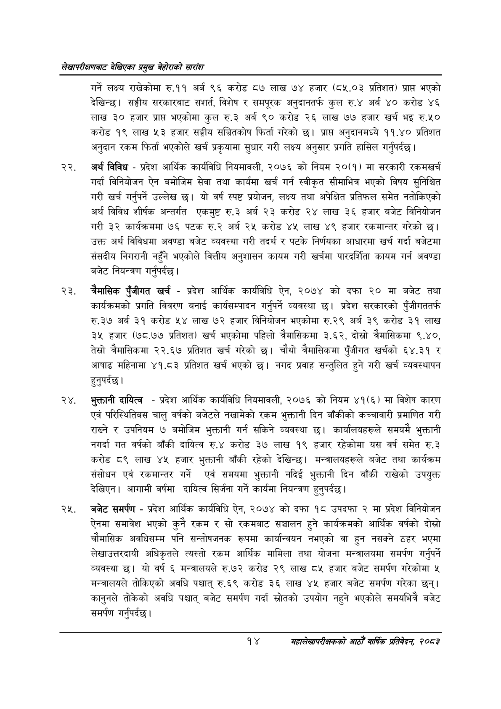

# Page 34 QA

## Rendered page


## Extracted text

```text
लेखापरीक्षणबाट देखिएका प्रमुख बेहोराको सारांश
गर्ने लक्ष्य राखेकोमा रु.११ अर्ब ९६ करोड ८७ लाख ७४ हजार (८५.०३ प्रतिशत) प्रापत भएको देखिन्छ। सङ्घीय सरकारबाट सशार्त, विशेष र समपूरक अनुदानतर्फ कुल रु.४ अर्ब ४० करोड ४६ लाख ३० हजार प्रापत भएकोमा कुल रु.३ अर्ब ९० करोड २६ लाख ७७ हजार खर्च भइ रु.५० करोड १९ लाख ५३ हजार सङ्घीय सञ्चितकोष फिर्ता गरेको छ। प्राप्त अनुदानमध्ये ११.४० प्रतिशत अनुदान रकम फिर्ता भएकोले खर्च प्रकृयामा सुधार गरी लक्ष्य अनुसार प्रगति हासिल गर्नुपर्दछ |
अर्थ विविध -प्रदेश आर्थिक कार्यविधि नियमावली, २०७६ को नियम २०(१) मा सरकारी रकमखर्च गर्दा विनियोजन ऐन बमोजिम सेवा तथा कार्यमा खर्च गर्न स्वीकृत सीमाभित्र भएको विषय सुनिश्चित गरी खर्च गर्नुपर्ने उल्लेख यो वर्ष स्पष्ट प्रयोजन, लक्ष्य तथा अपेक्षित प्रतिफल समेत नतोकिएको अर्थ विविध शीर्षक अन्तर्गत एकमुष्ट रु.३ अर्ब २३ करोड २४ लाख ३६ हजार बजेट विनियोजन गरी ३२ कार्यक्रममा ७६ पटक रु.२ अर्ब २५ करोड ४४५ लाख ४९ हजार रकमान्तर गरेको छ। उक्त अर्थ विविधमा अवण्डा बजेट व्यवस्था गरी तदर्थ र पटके निर्णयका आधारमा खर्च गर्दा बजेटमा संसदीय निगरानी नहुँने भएकोले वित्तीय अनुशासन कायम गरी खर्चमा पारदर्शिता कायम गर्न अवण्डा बजेट नियन्त्रण गर्नुपर्दछ |
चैमासिक पुँजीगत खर्च -प्रदेश आर्थिक कार्यविधि ऐन, २०७४ को दफा २० मा बजेट तथा कार्यक्रमको प्रगति विवरण बनाई कार्यसम्पादन गर्नुपर्ने व्यवस्था छ। प्रदेश सरकारको पुँजीगततर्फ रु.३७ अर्ब ३१ करोड ५४ लाख ७२ हजार विनियोजन भएकोमा रु.२९ अर्ब ३९ करोड ३१ लाख ३५ हजार (७८.७७ प्रतिशत) खर्च भएकोमा पहिलो त्रैमासिकमा ३.६२, दोस्रो त्रैमासिकमा ९.४०, तेस्रो त्रैमासिकमा २२.६७ प्रतिशत खर्च गरेको छ। चौथो त्रैमासिकमा पुँजीगत खर्चको ६४.३१ र आषाढ महिनामा ४१.८३ प्रतिशत खर्च भएको | नगद प्रवाह सन्तुलित हुने गरी खर्च व्यवस्थापन हुनुपर्दछ |
२४, भुक्तानी दायित्व -प्रदेश आर्थिक कार्यविधि नियमावली, २०७६ को नियम ४१(६) मा विशेष कारण एवं परिस्थितिबस चालु वर्षको बजेटले नखामेको रकम भुक्तानी दिन बाँकीको कच्चावारी प्रमाणित गरी राख्ने र उपनियम ७ बमोजिम भुक्तानी गर्न सकिने व्यवस्था छ। कार्यालयहरूले समयमै भुक्तानी नगर्दा गत वर्षको बाँकी दायित्व रु.४ करोड ३७ लाख १९ हजार रहेकोमा यस वर्ष समेत रु.३ करोड ८९ लाख ४५ हजार भुक्तानी बाँकी रहेको देखिन्छ। मन्त्रालयहरूले बजेट तथा कार्यक्रम संसोधन एवं रकमान्तर गर्ने एवं समयमा भुक्तानी नदिई भुक्तानी दिन बाँकी राखेको उपयुक्त देखिएन। आगामी वर्षमा दायित्व सिर्जना गर्ने कार्यमा नियन्त्रण हुनुपर्दछ |
बजेट समर्पण -प्रदेश आर्थिक कार्यविधि ऐन, २०७४ को दफा १८ उपदफा २ मा प्रदेश विनियोजन ऐनमा समावेश भएको कुनै रकम र सो रकमबाट सञ्चालन हुने कार्यक्रमको आर्थिक वर्षको दोस्रो चौमासिक अवधिसम्म पनि सन्तोषजनक रूपमा कार्यान्वयन नभएको वा हुन नसक्ने ठहर भएमा लेखाउत्तरदायी अधिकृतले त्यस्तो रकम आर्थिक मामिला तथा योजना मन्त्रालयमा समर्पण गर्नुपर्ने व्यवस्था | यो वर्ष ६ मन्त्रालयले रु.७२ करोड २९ लाख ८५ हजार बजेट समर्पण गरेकोमा ५ मन्त्रालयले तोकिएको अवधि पश्चात्‌ रु.६९ करोड ३६ लाख ४५ हजार बजेट समर्पण गरेका छन्‌। कानुनले तोकेको अवधि पश्चात्‌ बजेट समर्पण गर्दा स्रोतको उपयोग नहुने भएकोले समयभित्रै बजेट समर्पण गर्नुपर्दछ |
१४
महालेखापरीक्षकको आठौं वाषिकि प्रतिवेदन २०८२
```

## Flags
- None
