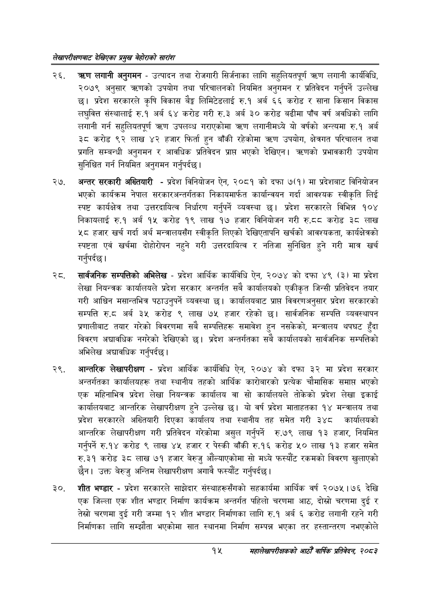

# Page 35 QA

## Rendered page


## Extracted text

```text
लेखापरीक्षणबाट देखिएका प्रमुख बेहोराको सारांश
लगानी अनुगमन -उत्पादन तथा रोजगारी सिर्जनाका लागि सहुलियतपूर्ण त्रधण लगानी कार्यविधि, २०७९ अनुसार त्रहणको उपयोग तथा परिचालनको नियमित अनुगमन र प्रतिवेदन गर्नुपर्ने उल्लेख छ। प्रदेश सरकारले कृषि विकास बैङ्ग लिमिटेडलाई रु.१ अर्ब ६६ करोड र साना किसान विकास लघुवित्त संस्थालाई रु.१ अर्ब ६४ करोड गरी रु.३ अर्ब ३० करोड बढीमा पाँच वर्ष अवधिको लागि लगानी गर्न सहुलियतपूर्ण त्रहण उपलव्ध गराएकोमा त्रण लगानीमध्ये यो वर्षको अन्त्यमा रु.१ अर्ब ३८ करोड ९२ लाख ४२ हजार फिर्ता हुन बाँकी रहेकोमा त्रटण उपयोग, क्षेत्रगत परिचालन तथा प्रगति सम्बन्धी अनुगमन र आवधिक प्रतिवेदन प्राप भएको देखिएन। क्रहणको प्रभावकारी उपयोग सुनिश्चित गर्न नियमित अनुगमन गर्नुपर्दछ |
अन्तर सरकारी अख्तियारी -प्रदेश विनियोजन ऐन, २०८१ को दफा ७(१) मा प्रदेशबाट विनियोजन भएको कार्यक्रम नेपाल सरकारअन्तर्गतका निकायमार्फत कार्यान्वयन गर्दा आवश्यक स्वीकृति लिई स्पष्ट कार्यक्षेत्र तथा उत्तरदायित्व निर्धारण गर्नुपर्ने व्यवस्था छ। प्रदेश सरकारले विभिन्न १०४ निकायलाई रु.१ अर्ब १५ करोड १९ लाख १७ हजार विनियोजन गरी रु.८वद करोड ३८ लाख ५८ हजार खर्च गर्दा अर्थ मन्त्रालयसँग स्वीकृति लिएको देखिएतापनि खर्चको आवश्यकता, कार्यक्षेत्रको स्पष्टता एवं खर्चमा दोहोरोपन नहुने गरी उत्तरदायित्व र नतिजा सुनिश्चित हुने गरी मात्र खर्च गर्नुपर्दछ |
. सार्वजनिक सम्पत्तिको अभिलेख -प्रदेश आर्थिक कार्यविधि ऐन, २०७४ को दफा ४९ (३) मा प्रदेश लेखा नियन्त्रक कार्यालयले प्रदेश सरकार अन्तर्गत सबै कार्यालयको एकीकृत जिन्सी प्रतिवेदन तयार गरी आश्विन मसान्तभित्र पठाउनुपर्ने व्यवस्था छ। कार्यालयबाट प्राप्त विवरणअनुसार प्रदेश सरकारको सम्पत्ति. अर्ब ३५ करोड ९ लाख ७५ हजार रहेको छ। सार्वजनिक सम्पत्ति व्यवस्थापन प्रणालीबाट तयार गरेको विवरणमा सबै सम्पत्तिहरू समावेश हुन नसकेको, मन्त्रालय थपघट हुँदा विवरण अद्यावधिक नगरेको देखिएको छ। प्रदेश अन्तर्गतका सबै कार्यालयको सार्वजनिक सम्पत्तिको अभिलेख अद्यावधिक गर्नुपर्दछ |
आन्तरिक लेखापरीक्षण -प्रदेश आर्थिक कार्यविधि ऐन, २०७४ को दफा ३२ मा प्रदेश सरकार अन्तर्गतका कार्यालयहरू तथा स्थानीय तहको आर्थिक कारोबारको प्रत्यक चौमासिक समाप्त भएको एक महिनाभित्र प्रदेश लेखा नियन्त्रक कार्यालय वा सो कार्यालयले तोकेको प्रदेश लेखा इकाई कार्यालयबाट आन्तरिक लेखापरीक्षण हुने उल्लेख छ। यो वर्ष प्रदेश माताहतका १४ मन्त्रालय तथा प्रदेश सरकारले अख्तियारी दिएका कार्यालय तथा स्थानीय तह समेत गरी ३४८ कार्यालयको आन्तरिक लेखापरीक्षण गरी प्रतिवेदन गरेकोमा असुल गर्नुपर्ने रु.७९ लाख १३ हजार, नियमित गर्नुपर्ने रु.१४ करोड ९ लाख ४५ हजार र पेस्की बाँकी रु.१६ करोड ५० लाख ९३ हजार समेत रु.३१ करोड ३८ लाख ७१ हजार बेरुजु औंल्याएकोमा सो मध्ये फस्यौट रकमको विवरण खुलाएको छैन। उक्त बेरुजु अन्तिम लेखापरीक्षण अगावै फस्यौंट गर्नुपर्दछ |
शीत भण्डार -प्रदेश सरकारले साझेदार संस्थाहरूसँगको सहकार्यमा आर्थिक वर्ष २०७५।७६ देखि एक जिल्ला एक शीत भण्डार निर्माण कार्यक्रम अन्तर्गत पहिलो चरणमा आठ, दोस्रो चरणमा दुई र तेस्रो चरणमा दुई गरी जम्मा १२ शीत भण्डार निर्माणका लागि रु.१ अर्ब ६ करोड लगानी रहने गरी निर्माणका लागि सम्झौता भएकोमा सात स्थानमा निर्माण सम्पन्न भएका तर हस्तान्तरण नभएकोले
१५
महालेखापरीक्षकको आठौं वाषिकि प्रतिवेदन २०८२
```

## Flags
- None
