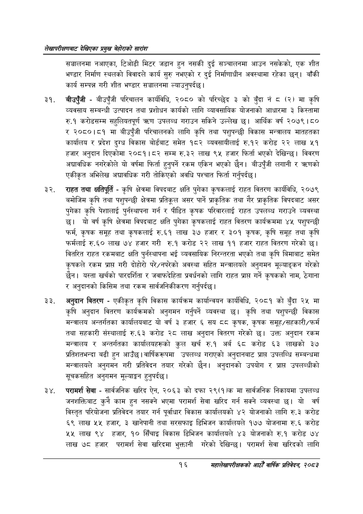

# Page 36 QA

## Rendered page


## Extracted text

```text
लेखापरीक्षणबाट देखिएका प्रमुख बेहोराको सारांश
सञ्चालनमा नआएका, टिओडी मिटर जडान हुन नसकी दुई सञ्चालनमा आउन नसकेको, एक शीत भण्डार निर्माण स्थलको विवादले कार्य सुरु नभएको र दुई निर्माणाधीन अवस्थामा रहेका छन्‌। बाँकी कार्य सम्पन्न गरी शीत भण्डार सञ्चालनमा ल्याउनुपर्दछ।
बीउपुँजी -बीउपुँजी परिचालन कार्यविधि, २०८० को परिच्छेद ३ को बुँदा नं ८ (२) मा कृषि व्यवसाय सम्बन्धी उत्पादन तथा प्रशोधन कार्यको लागि व्यावसायिक योजनाको आधारमा ३ किस्तामा रु.१ करोडसम्म सहुलियतपूर्ण ० उपलब्ध गराउन सकिने उल्लेख छ। आर्थिक वर्ष २०७९।८० र २०८०।८१ मा बीउपुँजी परिचालनको लागि कृषि तथा पशुपन्छी विकास मन्त्रालय मातहतका कार्यालय र प्रदेश दुग्ध विकास बोर्डबाट समेत १८२ व्यवसायीलाई रु.१२ करोड २२ लाख ५१ हजार अनुदान दिएकोमा २०८१।८२ सम्म रु.३२ लाख ९५ हजार फिर्ता भएको देखिन्छ। विवरण अद्यावधिक नगरेकोले यो वर्षमा फिर्ता हुनुपर्ने रकम एकिन भएको छैन। बीउपुँजी लगानी र एकीकृत अभिलेख अद्यावधिक गरी तोकिएको अवधि पश्चात फिर्ता गर्नुपर्दछ |
राहत तथा क्षतिपूर्ति -कृषि क्षेत्रमा विपदबाट क्षति पुगेका कृषकलाई राहत वितरण कार्यविधि, २०७९ बमोजिम कृषि तथा पशुपन्छी क्षेत्रमा प्रतिकूल असर पार्ने प्राकृतिक तथा गैर प्राकृतिक विपदबाट असर पुगेका कृषि पेशालाई पुर्नस्थापना गर्न र पीडित कृषक परिवारलाई राहत उपलब्ध गराउने व्यवस्था छ। यो वर्ष कृषि क्षेत्रमा विपदबाट क्षति पुगेका कृषकलाई राहत वितरण कार्यक्रममा ४५ पशुपन्छी फर्म, कृषक समूह तथा कृषकलाई रु.६१ लाख ३७ हजार र ३०१ कृषक, कृषि समूह तथा कृषि फर्मलाई रु.६० लाख ७४ हजार गरी रु.१ करोड २२ लाख ११ हजार राहत वितरण गरेको छ। वितरित राहत रकमबाट क्षति पुर्नस्थापना भई व्यवसायिक निरन्तरता भएको तथा कृषि बिमाबाट समेत कृषकले रकम प्राप्त गरी दोहोरो परे/नपरेको अवस्था सहित मन्त्रालयले अनुगमन मूल्याङ्कन गरेको छैन। यस्ता खर्चको पारदर्शिता र जवाफदेहिता प्रवर्धनको लागि राहत प्राप्त गर्ने कृषकको नाम, ठेगाना र अनुदानको किसिम तथा रकम सार्वजनिकीकरण गर्नुपर्दछ |
अनुदान वितरण -एकीकृत कृषि विकास कार्यक्रम कार्यान्वयन कार्यविधि, २०८१ को बुँदा २५ मा कृषि अनुदान वितरण कार्यक्रमको अनुगमन गर्नुपर्ने व्यवस्था छ। कृषि तथा पशुपन्छी विकास मन्त्रालय अन्तर्गतका कार्यालयबाट यो वर्ष ३ हजार ६ सय ठव कृषक, कृषक समूह/सहकारी/फर्म तथा सहकारी संस्थालाई रु.६३ करोड २८ लाख अनुदान वितरण गरेको छ। उक्त अनुदान रकम मन्त्रालय र अन्तर्गतका कार्यालयहरूको कुल खर्च रु.१ अर्ब ६८ करोड ६३ लाखको ३७ प्रतिशतभन्दा बढी हुन आउँछ। वार्षिकरूपमा उपलब्ध गराएको अनुदानबाट प्राप्त उपलब्धि सम्बन्धमा मन्त्रालयले अनुगमन गरी प्रतिवेदन तयार गरेको छैन। अनुदानको उपयोग र प्राप्त उपलब्धीको सूचकसहित अनुगमन मूल्याङ्कन हुनुपर्दछ |
परामर्श सेवा -सार्वजनिक खरिद ऐन, २०६३ को दफा २९(१)क मा सार्वजनिक निकायमा उपलब्ध जनशक्तिबाट कुनै काम हुन नसक्ने भएमा परामर्श सेवा खरिद गर्न सक्ने व्यवस्था छ। यो वर्ष विस्तृत परियोजना प्रतिवेदन तयार गर्न पूर्वाधार विकास कार्यालयको ४२ योजनाको लागि रु.३ करोड ६९ लाख ५५ हजार, २ खानेपानी तथा सरसफाइ डिभिजन कार्यालयले १७७ योजनामा रु.६ करोड ४५ लाख ९४ हजार, १० सिँचाइ विकास डिभिजन कार्यालयले ४३ योजनाको रु.१ करोड ७४ लाख ७८ हजार परामर्श सेवा खरिदमा भुक्तानी गरेको देखिन्छ। परामर्श सेवा खरिदको लागि
१६
महालेखापरीक्षकको आठौं वाषिकि प्रतिवेदन २०८२
```

## Flags
- None
