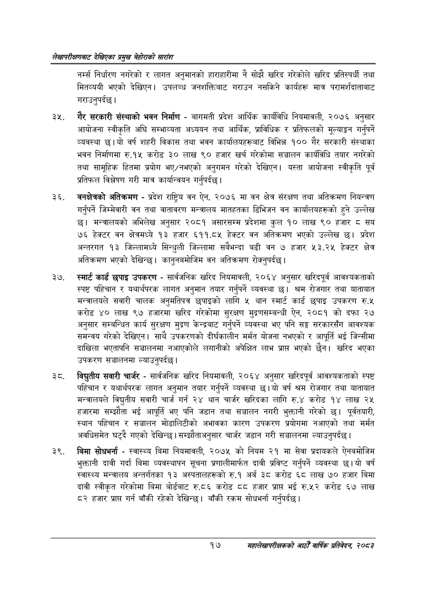

# Page 37 QA

## Rendered page


## Extracted text

```text
लेखापरीक्षणबाट देखिएका प्रमुख बेहोराको सारांश
नर्म्स निर्धारण नगरेको र लागत अनुमानको हाराहारीमा नै सोझै खरिद गरेकोले खरिद प्रतिस्पर्धी तथा मितव्ययी भएको देखिएन। उपलब्ध जनशक्तिबाट गराउन नसकिने कार्यहरू मात्र परामर्शदाताबाट गराउनुपर्दछ।
गैर सरकारी संस्थाको भवन निर्माण -बागमती प्रदेश आर्थिक कार्यविधि नियमावली, २०७६ अनुसार आयोजना स्वीकृति अघि सम्भाव्यता अध्ययन तथा आर्थिक, प्राविधिक र प्रतिफलको मूल्याङ्कन गर्नुपर्ने व्यवस्था छ। यो वर्ष शहरी विकास तथा भवन कार्यालयहरूबाट विभिन्न १०० गैर सरकारी संस्थाका भवन निर्माणमा रु.१५ करोड ३० लाख ९० हजार खर्च गरेकोमा सञ्चालन कार्यविधि तयार नगरेको तथा सामूहिक हितमा प्रयोग भए/नभएको अनुगमन गरेको देखिएन। यस्ता आयोजना स्वीकृति पूर्व प्रतिफल विश्लेषण गरी मात्र कार्यान्वयन गर्नुपर्दछ।
वनक्षेत्रको अतिक्रमण -प्रदेश राष्ट्रिय वन ऐन, २०७६ मा वन क्षेत्र संरक्षण तथा अतिक्रमण नियन्त्रण गर्नुपर्ने जिम्मेवारी वन तथा वातावरण मन्त्रालय मातहतका डिभिजन वन कार्यालयहरूको हुने उल्लेख छ। मन्त्रालयको अभिलेख अनुसार २०८१ असारसम्म प्रदेशमा कुल १० लाख ९० हजार ८ सय ७६ हेक्टर वन क्षेत्रमध्ये ९३ हजार ६११.८५ हेक्टर वन अतिक्रमण भएको उल्लेख छ। प्रदेश अन्तरगत १३ जिल्लामध्ये सिन्धुली जिल्लामा सबैभन्दा बढी वन ७ हजार ५३.२५ हेक्टर क्षेत्र अतिक्रमण भएको देखिन्छ। कानुनबमोजिम वन अतिक्रमण रोक्नुपर्दछ।
स्मार्ट कार्ड छपाइ उपकरण -सार्वजनिक खरिद नियमावली, २०६४ अनुसार खरिदपूर्व आवश्यकताको स्पष्ट पहिचान र यथार्थपरक लागत अनुमान तयार गर्नुपर्ने व्यवस्था छ। श्रम रोजगार तथा यातायात मन्त्रालयले सवारी चालक अनुमतिपत्र छपाइको लागि ५ थान स्मार्ट कार्ड छपाइ उपकरण रु.५ करोड ४० लाख ९७ हजारमा खरिद गरेकोमा सुरक्षण मुद्रणसम्बन्धी ऐन, २०८१ को दफा २७ अनुसार सम्बन्धित कार्य सुरक्षण मुद्रण केन्द्रबाट गर्नुपर्ने व्यवस्था भए पनि सङ्घ सरकारसँग आवश्यक समन्वय गरेको देखिएन। साथै उपकरणको दीर्घकालीन मर्मत योजना नभएको र आपूर्ति भई जिन्सीमा दाखिला भएतापनि सञ्चालनमा नआएकोले लगानीको अपेक्षित लाभ प्रापत भएको छैन। खरिद भएका उपकरण सञ्चालनमा ल्याउनुपर्दछ।
विद्युतीय सवारी चार्जर -सार्वजनिक खरिद नियमावली, २०६४ अनुसार खरिदपूर्व आवश्यकताको स्पष्ट पहिचान र यथार्थपरक लागत अनुमान तयार गर्नुपर्ने व्यवस्था छ। यो वर्ष श्रम रोजगार तथा यातायात मन्त्रालयले विद्युतीय सवारी चार्ज गर्न २४ थान चार्जर खरिदका लागि रु.४ करोड १४ लाख २५ हजारमा सम्झौता भई आपूर्ति भए पनि जडान तथा सञ्चालन नगरी भुक्तानी गरेको छ। पूर्वतयारी, स्थान पहिचान र सञ्चालन मोडालिटीको अभावका कारण उपकरण प्रयोगमा नआएको तथा मर्मत अवधिसमेत घट्दै गएको देखिन्छ। सम्झौताअनुसार चार्जर जडान गरी सञ्चालनमा ल्याउनुपर्दछ।
बिमा सोधभर्ना -स्वास्थ्य बिमा नियमावली, २०७५ को नियम २१ मा सेवा प्रदायकले ऐनबमोजिम भुक्तानी दावी गर्दा बिमा व्यवस्थापन सूचना प्रणालीमार्फत दावी प्रविष्ट गर्नुपर्ने व्यवस्था छ।यो वर्ष स्वास्थ्य मन्त्रालय अन्तर्गतका १३ अस्पतालहरूको रु.१ अर्ब ३८ करोड ६८ लाख ७० हजार बिमा दावी स्वीकृत गरेकोमा बिमा बोर्डबाट रु.८६ करोड ८८ हजार प्राप्त भई रु.५२ करोड ६७ लाख ८२ हजार प्राप्त गर्न बाँकी रहेको देखिन्छ। बाँकी रकम सोधभर्ना गर्नुपर्दछ।
१७
महालेखापरीक्षकको आठौं वाषिकि प्रतिवेदन २०८२
```

## Flags
- None
