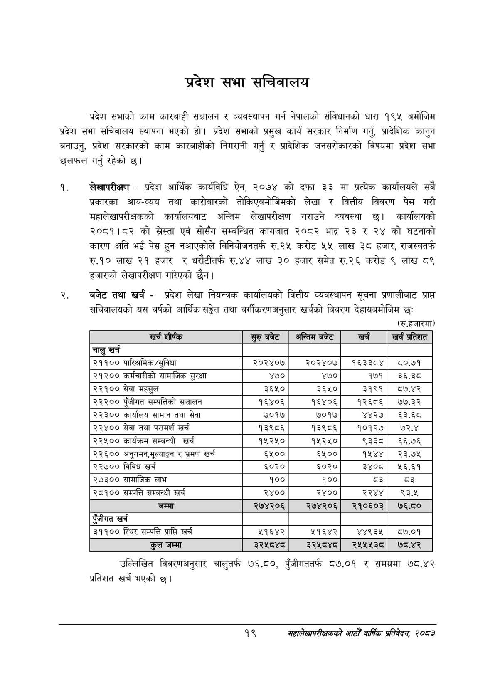

# Page 41 QA

## Rendered page


## Extracted text

```text
प्रदेश सभा सचिवालय
प्रदेश सभाको काम कारबाही सञ्चालन र व्यवस्थापन गर्न नेपालको संविधानको धारा १९५ बमोजिम प्रदेश सभा सचिवालय स्थापना भएको हो। प्रदेश सभाको प्रमुख कार्य सरकार निर्माण गर्नु, प्रादेशिक कानुन बनाउनु, प्रदेश सरकारको काम कारबाहीको निगरानी गर्नु र प्रादेशिक जनसरोकारको विषयमा प्रदेश सभा छलफल गर्नु रहेको छ।
लेखापरीक्षण -प्रदेश आर्थिक कार्यविधि ऐन, २०७४ को दफा ३३ मा प्रत्येक कार्यालयले सबै प्रकारका आय-व्यय तथा कारोबारको तोकिएबमोजिमको लेखा र वित्तीय विवरण पेस गरी महालेखापरीक्षकको कार्यालयबाट अन्तिम लेखापरीक्षण गराउने व्यवस्था छ। कार्यालयको २०८१।८२ को स्रेस्ता एवं सोसँग सम्बन्धित कागजात २०८२ भाद्र २३ र २४ को घटनाको कारण क्षति भई पेस हुन नआएकोले विनियोजनतर्फ रु.२५ करोड ५५ लाख ३८ हजार, राजस्वतर्फ रु.१० लाख २१ हजार र धरौटीतर्फ रु.४४ लाख ३० हजार समेत रु.२६ करोड ९ लाख ८९ हजारको लेखापरीक्षण गरिएको छैन |
बजेट तथा खर्च -प्रदेश लेखा नियन्त्रक कार्यालयको वित्तीय व्यवस्थापन सूचना प्रणालीबाट प्राप्त सचिवालयको यस वर्षको आर्थिक सङ्ेत तथा वर्गीकरणअनुसार खर्चको विवरण देहायबमोजिम छः
(रु.हजारमा)
उल्लिखित विवरणअनुसार चालुतर्फ ७६.८०, पुँजीगततर्फ ८७.०१ र समग्रमा ७८.४२ प्रतिशत खर्च भएको छ।
१९
महालेखापरीक्षकको आठौ वाषिकि प्रतिवेदन २०८२

| खर शीर्षक | सुरु बबेट | अन्तिम बजेट | खर्च | खच प्रतेशत |
| --- | --- | --- | --- | --- |
| चालु खर्च |  |  |  |  |
| २११०० पारिश्रमिक /सुविधा | २०२४०७ | र२०२४०७ | १६३३८४ | ८०.७१ |
| २९३०० कर्मचारीको सामाजिक सुरक्षा | ४७० | ४७० | १७१ | ३६.३८ |
| २२१०० सेवा महसुल | ३६५० | ३६५० | ३१९१ | ८७.४२ |
| २२२०० पुँजीगत सम्पत्तिको सञ्चालन | १६४०६ | १६४०६ | १२६८६ | ७७.३२ |
| २२३०० कार्यालष सामान तथा सेवा | ७०१७ | ७०१७ | ४४२७ | ६३.६८ |
| २२४०० सेवा तथा परामर्श खर्च | १३९८६ | १३९८६ | १०१२७ | ७२.४ |
| २२५०० कार्यक्रम सम्बन्धी खर्च | १५२४५० | १५२५० | ९३३८ | ६६.७६ |
| २२६०० अनुगमन,१०४।ङ७ र भ्रमण खर्च | ६५०० | ६५०० | १५४४ | २३.७५ |
| २२७०० विविध खर्च | ६०२० | ६०२० | ३४०८ | १६.६१ |
| २७३०० सामाजिक लाभ | १०० | १०० | द३ | द३ |
| २८१०० सम्पत्ति सम्बन्धी खर्च | २४०० | २४०० | २२४४ | ९३.५ |
| जम्मा | २७४२०६ | २७४२०६ | २१०६०३ | ७६.८० |
| एंजीगत खर्च |  |  |  |  |
| ३११०० स्थिर सम्पत्ति प्राप्ति खर्च | २१६४२ | ५१६४२ | ४४९३५ | ठ०७.०१ |
| कुल जम्मा | ३२५८४८ठ | रे२४५८४८ | र२४५५४५३८० | ७८.४२ |
```

## Flags
- table_page
- medium_quality_table
