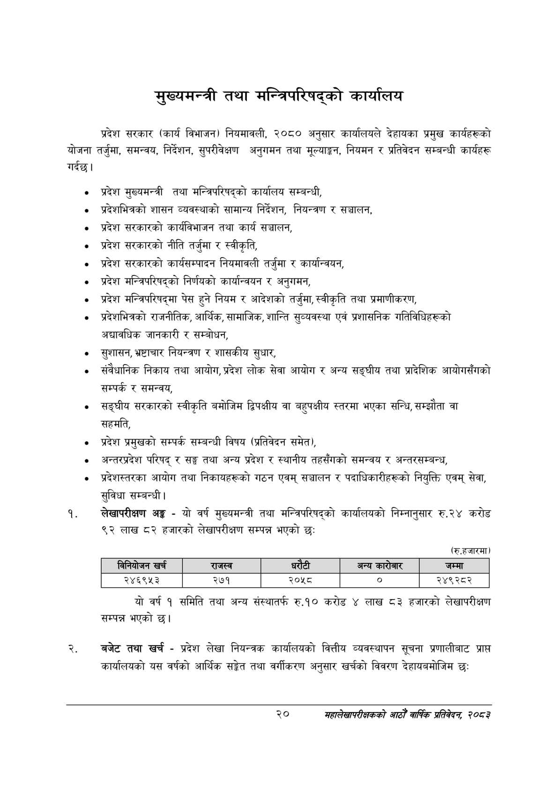

# Page 42 QA

## Rendered page


## Extracted text

```text
मुख्यमन्त्री तथा मन्त्रिपरिषद्को कार्यालय
प्रदेश सरकार (कार्य विभाजन) नियमावली, २०८० अनुसार कार्यालयले देहायका प्रमुख कार्यहरूको योजना तर्जुमा, समन्वय, निर्देशन, सुपरीवेक्षण अनुगमन तथा मूल्याङ्कन, नियमन र प्रतिवेदन सम्बन्धी कार्यहरू गर्दछ।
० प्रदेश मुख्यमन्त्री तथा मन्त्रिपरिषद्को कार्यालय सम्बन्धी,
० प्रदेशभित्रको शासन व्यवस्थाको सामान्य निर्देशन, नियन्त्रण र सञ्चालन,
प्रदेश सरकारको कार्यविभाजन तथा कार्य सञ्चालन,
० प्रदेश सरकारको नीति तर्जुमा र स्वीकृति,
० प्रदेश सरकारको कार्यसम्पादन नियमावली तर्जुमा र कार्यान्वयन,
प्रदेश मन्त्रिपरिषद्को निर्णयको कार्यान्वयन र अनुगमन,
प्रदेश मन्त्रिपरिषद्मा पेस हुने नियम र आदेशको तर्जुमा, स्वीकृति तथा प्रमाणीकरण,
प्रदेशभित्रको राजनीतिक, आर्थिक, सामाजिक, शान्ति सुव्यवस्था एवं प्रशासनिक गतिविधिहरूको अद्यावधिक जानकारी र सम्बोधन,
० सुशासन, भ्रष्टाचार नियन्त्रण र शासकीय सुधार,
संवैधानिक निकाय तथा आयोग, प्रदेश लोक सेवा आयोग र अन्य सङ्घीय तथा प्रादेशिक आयोगसँगको सम्पर्क र समन्वय,
सङ्घीय सरकारको स्वीकृति बमोजिम द्विपक्षीय वा बहुपक्षीय स्तरमा भएका सन्धि, सम्झौता वा सहमति,
प्रदेश प्रमुखको सम्पर्क सम्बन्धी विषय (प्रतिवेदन समेत),
अन्तरप्रदेश परिषद्‌ र सङ्ग तथा अन्य प्रदेश र स्थानीय तहसँगको समन्वय र अन्तरसम्बन्ध,
० प्रदेशस्तरका आयोग तथा निकायहरूको गठन एवम्‌ सञ्चालन र पदाधिकारीहरूको नियुक्ति एवम्‌ सेवा, सुविधा सम्बन्धी |
लेखापरीक्षण अङ्ग -यो वर्ष मुख्यमन्त्री तथा मन्त्रिपरिषद्को कार्यालयको निम्नानुसार रु.२४ करोड ९२ लाख ८२ हजारको लेखापरीक्षण सम्पन्न भएको छ:
(रु.हजारमा)
यो वर्ष १ समिति तथा अन्य संस्थातर्फ रु.१० करोड ४ लाख ८३ हजारको लेखापरीक्षण सम्पन्न भएको छ।
बजेट तथा खर्च -प्रदेश लेखा नियन्त्रक कार्यालयको वित्तीय व्यवस्थापन सूचना प्रणालीबाट प्राप्त कार्यालयको यस वर्षको आर्थिक सङ्गेत तथा वर्गीकरण अनुसार खर्चको विवरण देहायबमोजिम छः
२०
महालेखापरीक्षकको आठौँ वाषिकि प्रतिवेदन २०८२

|  |  | बिनियोजन खरी |  | राजस्व |  | धरटी | अन्य कारोबार | जम्मा |
| --- | --- | --- | --- | --- | --- | --- | --- | --- |
|  |  | २४६९५३ |  | २७१ | २०५८ |  | ० | २४९२८२ |
```

## Flags
- table_page
- medium_quality_table
