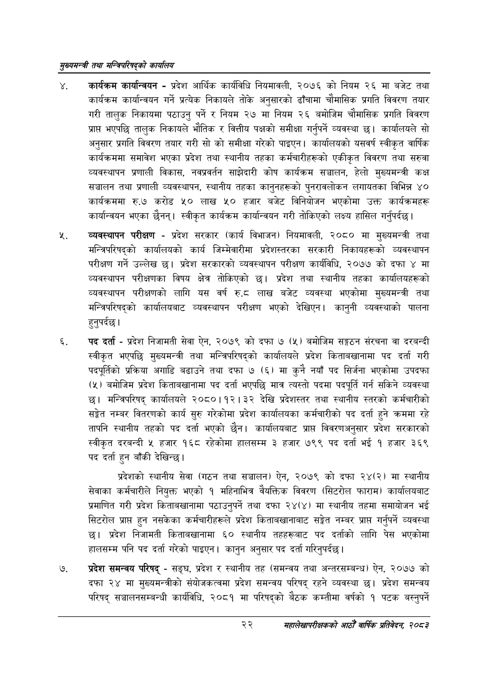

# Page 44 QA

## Rendered page


## Extracted text

```text
सुख्यसन्त्री तथा सन्बिपरिषद्को का्यलिय
कार्यक्रम कार्यान्वयन -प्रदेश आर्थिक कार्यविधि नियमावली, २०७६ को नियम २६ मा बजेट तथा कार्यक्रम कार्यान्वयन गर्ने प्रत्येक निकायले तोके अनुसारको ढाँचामा चौमासिक प्रगति विवरण तयार गरी तालुक निकायमा पठाउनु पर्ने र नियम २७ मा नियम २६ बमोजिम चौमासिक प्रगति विवरण प्रापत भएपछि तालुक निकायले भौतिक र वित्तीय पक्षको समीक्षा गर्नुपर्ने व्यवस्था छ। कार्यालयले सो अनुसार प्रगति विवरण तयार गरी सो को समीक्षा गरेको पाइएन। कार्यालयको यसवर्ष स्वीकृत वार्षिक कार्यक्रममा समावेश भएका प्रदेश तथा स्थानीय तहका कर्मचारीहरूको एकीकृत विवरण तथा सरुवा व्यवस्थापन प्रणाली विकास, नवप्रवर्तन साझेदारी कोष कार्यक्रम सञ्चालन, हेलो मुख्यमन्त्री कक्ष सञ्चालन तथा प्रणाली व्यवस्थापन, स्थानीय तहका कानुनहरूको पुनरावलोकन लगायतका विभिन्न ४० कार्यक्रममा रु.७ करोड ५० लाख हजार बजेट विनियोजन भएकोमा उक्त कार्यक्रमहरू कार्यान्वयन भएका छैनन्‌। स्वीकृत कार्यक्रम कार्यान्वयन गरी तोकिएको लक्ष्य हासिल गर्नुपर्दछ |
व्यवस्थापन परीक्षण -प्रदेश सरकार (कार्य विभाजन) नियमावली, २०८० मा मुख्यमन्त्री तथा मन्त्रिपरिषद्को कार्यालयको कार्य जिम्मेवारीमा प्रदेशस्तरका सरकारी निकायहरूको व्यवस्थापन परीक्षण गर्ने उल्लेख छ। प्रदेश सरकारको व्यवस्थापन परीक्षण कार्यविधि, २०७७ को दफा ४ मा व्यवस्थापन परीक्षणका विषय क्षेत्र तोकिएको छ। प्रदेश तथा स्थानीय तहका कार्यालयहरूको व्यवस्थापन परीक्षणको लागि यस वर्ष रु.ट लाख बजेट व्यवस्था भएकोमा मुख्यमन्त्री तथा मन्त्रिपरिषद्को कार्यालयबाट व्यवस्थापन परीक्षण भएको देखिएन। कानुनी व्यवस्थाको पालना हुनुपर्दछ।
पद दर्ता -प्रदेश निजामती सेवा ऐन, २०७९ को दफा ७ (५) बमोजिम सङ्गठन संरचना वा दरबन्दी स्वीकृत भएपछि मुख्यमन्त्री तथा मन्त्रिपरिषद्को कार्यालयले प्रदेश किताबखानामा पद दर्ता गरी पदपूर्तिको प्रक्रिया अगाडि बढाउने तथा दफा ७ (६) मा कुनै नयाँ पद सिर्जना भएकोमा उपदफा (५) बमोजिम प्रदेश कितावखानामा पद दर्ता भएपछि मात्र त्यस्तो पदमा पदपूर्ति गर्न सकिने व्यवस्था छ। मन्त्रिपरिषद्‌ कार्यालयले २०८०।१२। ३२ देखि प्रदेशस्तर तथा स्थानीय स्तरको कर्मचारीको सङ्ेत नम्बर वितरणको कार्य सुरु गरेकोमा प्रदेश कार्यालयका कर्मचारीको पद दर्ता हुने क्रममा रहे तापनि स्थानीय तहको पद दर्ता भएको | कार्यालयबाट प्राप्त विवरणअनुसार प्रदेश सरकारको स्वीकृत दरबन्दी ५ हजार १६८ रहेकोमा हालसम्म ३ हजार ७९९ पद दर्ता भई १ हजार ३६९ पद दर्ता हुन बाँकी देखिन्छ |
प्रदेशको स्थानीय सेवा (गठन तथा सञ्चालन) ऐन, २०७९ को दफा २४(२) मा स्थानीय सेवाका कर्मचारीले नियुक्त भएको १ महिनाभित्र वैयक्तिक विवरण (सिटरोल फाराम) कार्यालयबाट प्रमाणित गरी प्रदेश किताबखानामा पठाउनुपर्ने तथा दफा २४(४) मा स्थानीय तहमा समायोजन भई सिटरोल प्राप्त हुन नसकेका कर्मचारीहरूले प्रदेश किताबखानाबाट सङ्गेत नम्बर प्राप्त गर्नुपर्ने व्यवस्था छ। प्रदेश निजामती किताबखानामा ६० स्थानीय तहहरूबाट पद दर्ताको लागि पेस भएकोमा हालसम्म पनि पद दर्ता गरेको पाइएन। कानुन अनुसार पद दर्ता गरिनुपर्दछ |
प्रदेश समन्वय परिषद्‌ -सङ्घ, प्रदेश र स्थानीय तह (समन्वय तथा अन्तरसम्बन्ध) ऐन, २०७७ को दफा २४ मा मुख्यमन्त्रीको संयोजकत्वमा प्रदेश समन्वय परिषद्‌ रहने व्यवस्था छ। प्रदेश समन्वय परिषद्‌ सञ्चालनसम्बन्धी कार्यविधि, २०८१ मा परिषद्को बैठक कम्तीमा वर्षको १ पटक बस्नुपर्ने
२२
महालेखापरीक्षकको आठौँ वाषिकि प्रतिवेदन २०८२
```

## Flags
- None
