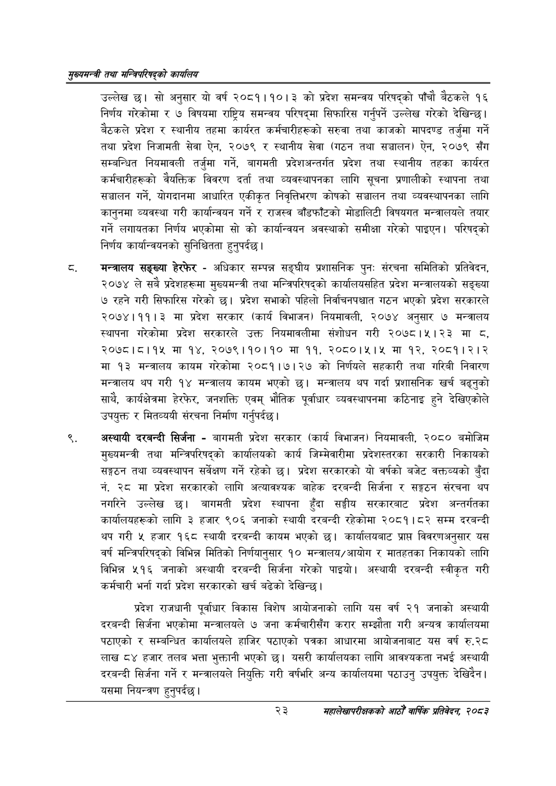

# Page 45 QA

## Rendered page


## Extracted text

```text
सुख्यसन्त्री तथा सन्बिपरिषद्को का्यलिय
उल्लेख छ। सो अनुसार यो वर्ष २०८१।१०।३ को प्रदेश समन्वय परिषद्को पाँचौ बैठकले १६ निर्णय गरेकोमा र ७ विषयमा राष्ट्रिय समन्वय परिषद्मा सिफारिस गर्नुपर्ने उल्लेख गरेको देखिन्छ। बैठकले प्रदेश र स्थानीय तहमा कार्यरत कर्मचारीहरूको सरुवा तथा काजको मापदण्ड तर्जुमा गर्ने तथा प्रदेश निजामती सेवा ऐन, २०७९ र स्थानीय सेवा (गठन तथा सञ्चालन) ऐन, २०७९ सँग सम्बन्धित नियमावली तर्जुमा गर्ने, बागमती प्रदेशअन्तर्गत प्रदेश तथा स्थानीय तहका कार्यरत कर्मचारीहरूको वैयक्तिक विवरण दर्ता तथा व्यवस्थापनका लागि सूचना प्रणालीको स्थापना तथा सञ्चालन गर्ने, योगदानमा आधारित एकीकृत निवृत्तिभरण कोषको सञ्चालन तथा व्यवस्थापनका लागि कानुनमा व्यवस्था गरी कार्यान्वयन गर्ने र राजस्व बाँडफाँटको मोडालिटी विषयगत मन्त्रालयले तयार गर्ने लगायतका निर्णय भएकोमा सो को कार्यान्वयन अवस्थाको समीक्षा गरेको पाइएन। परिषद्को निर्णय कार्यान्वयनको सुनिश्चितता हुनुपर्दछ |
मन्त्रालय सङ्ख्या हेरफेर -अधिकार सम्पन्न सङ्घीय प्रशासनिक पुनः संरचना समितिको प्रतिवेदन, २०७४ ले सबै प्रदेशहरूमा मुख्यमन्त्री तथा मन्त्रिपरिषद्को कार्यालयसहित प्रदेश मन्त्रालयको सङ्ख्या ७ रहने गरी सिफारिस गरेको छ। प्रदेश सभाको पहिलो निर्वाचनपश्चात गठन भएको प्रदेश सरकारले २०७४।११। ३ मा प्रदेश सरकार (कार्य विभाजन) नियमावली, २०७४ अनुसार ७ मन्त्रालय स्थापना गरेकोमा प्रदेश सरकारले उक्त नियमावलीमा संशोधन गरी २०७८।५।२३ मा , २०७८।८।१५ मा १४, २०७९।११०।१० मा ९९, २०८०।:५।५ मा १२, २०८१।२।२ मा ९३ मन्त्रालय कायम गरेकोमा २०८१।७।२७ को निर्णयले सहकारी तथा गरिबी निवारण मन्त्रालय थप गरी १४ मन्त्रालय कायम भएको छ। मन्त्रालय थप गर्दा प्रशासनिक खर्च बढ्नुको साथै, कार्यक्षेत्रमा हेरफेर, जनशक्ति एवम्‌ भौतिक पूर्वाधार व्यवस्थापनमा कठिनाइ हुने देखिएकोले उपयुक्त र मितव्ययी संरचना निर्माण गर्नुपर्दछ |
अस्थायी दरबन्दी सिर्जना -बागमती प्रदेश सरकार (कार्य विभाजन) नियमावली, २०८० बमोजिम मुख्यमन्त्री तथा मन्त्रिपरिषद्को कार्यालयको कार्य जिम्मेवारीमा प्रदेशस्तरका सरकारी निकायको सङ्गठन तथा व्यवस्थापन सर्वेक्षण गर्ने रहेको छ। प्रदेश सरकारको यो वर्षको बजेट वक्तव्यको बुँदा नं. २८ मा प्रदेश सरकारको लागि अत्यावश्यक बाहेक दरबन्दी सिर्जना र सङ्गठन संरचना थप नगरिने उल्लेख छ। बागमती प्रदेश स्थापना हुँदा सङ्घीय सरकारबाट प्रदेश अन्तर्गतका कार्यालयहरूको लागि ३ हजार ९०६ जनाको स्थायी दरबन्दी रहेकोमा २०८१।८२ सम्म दरबन्दी थप गरी ५ हजार १६८ स्थायी दरबन्दी कायम भएको छ। कार्यालयबाट प्राप्त विवरणअनुसार यस वर्ष मन्त्रिपरिषद्को विभिन्न मितिको निर्णयानुसार १० मन्त्रालय/आयोग र मातहतका निकायको लागि विभिन्न ५१६ जनाको अस्थायी दरबन्दी सिर्जना गरेको पाइयो। अस्थायी दरबन्दी स्वीकृत गरी कर्मचारी भर्ना गर्दा प्रदेश सरकारको खर्च बढेको देखिन्छ |
प्रदेश राजधानी पूर्वाधार विकास विशेष आयोजनाको लागि यस वर्ष २१ जनाको अस्थायी दरबन्दी सिर्जना भएकोमा मन्त्रालयले ७ जना कर्मचारीसँग करार सम्झौता गरी अन्यत्र कार्यालयमा पठाएको र सम्बन्धित कार्यालयले हाजिर पठाएको पत्रका आधारमा आयोजनाबाट यस वर्ष रु.२८ लाख ८४ हजार तलब भत्ता भुक्तानी भएको छ। यसरी कार्यालयका लागि आवश्यकता नभई अस्थायी दरबन्दी सिर्जना गर्ने र मन्त्रालयले नियुक्ति गरी वर्षभरि अन्य कार्यालयमा पठाउनु उपयुक्त देखिदैन। यसमा नियन्त्रण हुनुपर्दछ |
२३
महालेखापरीक्षकको आठौँ वाषिकि प्रतिवेदन २०८२
```

## Flags
- None
