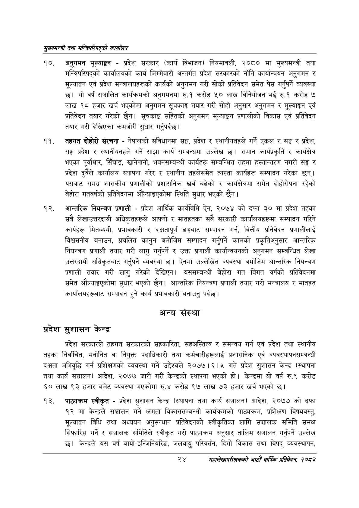

# Page 46 QA

## Rendered page


## Extracted text

```text
सुख्यसन्त्री तथा सन्बिपरिषद्को का्यलिय
अनुगमन मूल्याङ्कन -प्रदेश सरकार (कार्य विभाजन) नियमावली, २०८० मा मुख्यमन्त्री तथा मन्त्रिपरिषद्को कार्यालयको कार्य जिम्मेवारी अन्तर्गत प्रदेश सरकारको नीति कार्यान्वयन अनुगमन र मूल्याङ्कन एवं प्रदेश मन्त्रालयहरूको कार्यको अनुगमन गरी सोको प्रतिवेदन समेत पेस गर्नुपर्ने व्यवस्था छ। यो वर्ष सञ्चालित कार्यक्रमको अनुगमनमा रु.१ करोड ५० लाख विनियोजन भई रु.१ करोड ७ लाख १८ हजार खर्च भएकोमा अनुगमन सूचकाङ्क तयार गरी सोही अनुसार अनुगमन र मूल्याङ्कन एवं प्रतिवेदन तयार गरेको छैन। सूचकाङ्क सहितको अनुगमन मूल्याङ्कन प्रणालीको विकास एवं प्रतिवेदन तयार गरी देखिएका कमजोरी सुधार गर्नुपर्दछ |
तहगत दोहोरो संरचना -नेपालको संविधानमा सङ्ग, प्रदेश र स्थानीयतहले गर्ने एकल र सङ्घ र प्रदेश, सङ्ग प्रदेश र स्थानीयतहले गर्ने साझा कार्य सम्बन्धमा उल्लेख छ। समान कार्यप्रकृति र कार्यक्षेत्र भएका पूर्वाधार, सिँचाइ, खानेपानी, भवनसम्बन्धी कार्यहरू सम्बन्धित तहमा हस्तान्तरण नगरी सङ्ग र प्रदेश दुवैले कार्यालय स्थापना गरेर र स्थानीय तहलेसमेत त्यस्ता कार्यहरू सम्पादन गरेका छन्‌। यसबाट समग्र शासकीय प्रणालीको प्रशासनिक खर्च बढेको र कार्यक्षेत्रमा समेत दोहोरोपना रहेको बेहोरा गतवर्षको प्रतिवेदनमा औँल्याइएकोमा स्थिति सुधार भएको छैन।
आन्तरिक नियन्त्रण प्रणाली -प्रदेश आर्थिक कार्यविधि ऐन, २०७४ को दफा ३० मा प्रदेश तहका सबै लेखाउत्तरदायी अधिकृतहरूले आफ्नो र मातहतका सबै सरकारी कार्यालयहरूमा सम्पादन गरिने कार्यहरू मितव्ययी, प्रभावकारी र दक्षतापूर्ण ढङ्गबाट सम्पादन गर्न, वित्तीय प्रतिवेदन प्रणालीलाई विश्वसनीय बनाउन, प्रचलित कानुन बमोजिम सम्पादन गर्नुपर्ने कामको प्रकृतिअनुसार आन्तरिक नियन्त्रण प्रणाली तयार गरी लागु गर्नुपर्ने र उक्त प्रणाली कार्यान्वयनको अनुगमन सम्बन्धित लेखा उत्तरदायी अधिकृतबाट गर्नुपर्ने व्यवस्था छ। ऐनमा उल्लेखित व्यवस्था बमोजिम आन्तरिक नियन्त्रण प्रणाली तयार गरी लागु गरेको देखिएन। यससम्बन्धी बेहोरा गत विगत वर्षको प्रतिवेदनमा समेत औंल्याइएकोमा सुधार भएको छैन। आन्तरिक नियन्त्रण प्रणाली तयार गरी मन्त्रालय र मातहत कार्यालयहरूवाट सम्पादन हुने कार्य प्रभावकारी बनाउनु पर्दछ।
अन्य
संस्था
प्रदेश सुशासन केन्द्र
प्रदेश सरकारले तहगत सरकारको सहकारिता, सहअस्तित्व र समन्वय गर्न एवं प्रदेश तथा स्थानीय तहका निर्वाचित, मनोनित वा नियुक्त पदाधिकारी तथा कर्मचारीहरूलाई प्रशासनिक एवं व्यवस्थापनसम्बन्धी दक्षता अभिवृद्धि गर्न प्रशिक्षणको व्यवस्था गर्ने उद्देश्यले २०७७।६। ५ गते प्रदेश सुशासन केन्द्र (स्थापना तथा कार्य सञ्चालन) आदेश, २०७७ जारी गरी केन्द्रको स्थापना भएको हो। केन्द्रमा यो वर्ष रु.९ करोड ६० लाख ९३ हजार बजेट व्यवस्था भएकोमा रु.४ करोड ९७ लाख ७३ हजार खर्च भएको छ।
पाठ्यक्रम स्वीकृत -प्रदेश सुशासन केन्द्र (स्थापना तथा कार्य सञ्चालन) आदेश, २०७७ को दफा १२ मा केन्द्रले सञ्चालन गर्ने क्षमता विकाससम्बन्धी कार्यक्रमको पाट्यक्रम, प्रशिक्षण विषयवस्तु, मूल्याङ्कन विधि तथा अध्ययन अनुसन्धान प्रतिवेदनको स्वीकृतिका लागि सञ्चालक समिति समक्ष सिफारिस गर्ने र सञ्चालक समितिले स्वीकृत गरी पाठ्यक्रम अनुसार तालिम सञ्चालन गर्नुपर्ने उल्लेख छ। केन्द्रले यस वर्ष बायो-इन्जिनियरिङ, जलवायु परिवर्तन, दिगो विकास तथा विपद्‌ व्यवस्थापन,
२४
महालेखापरीक्षकको आठौँ वाषिकि प्रतिवेदन २०८२
```

## Flags
- None
