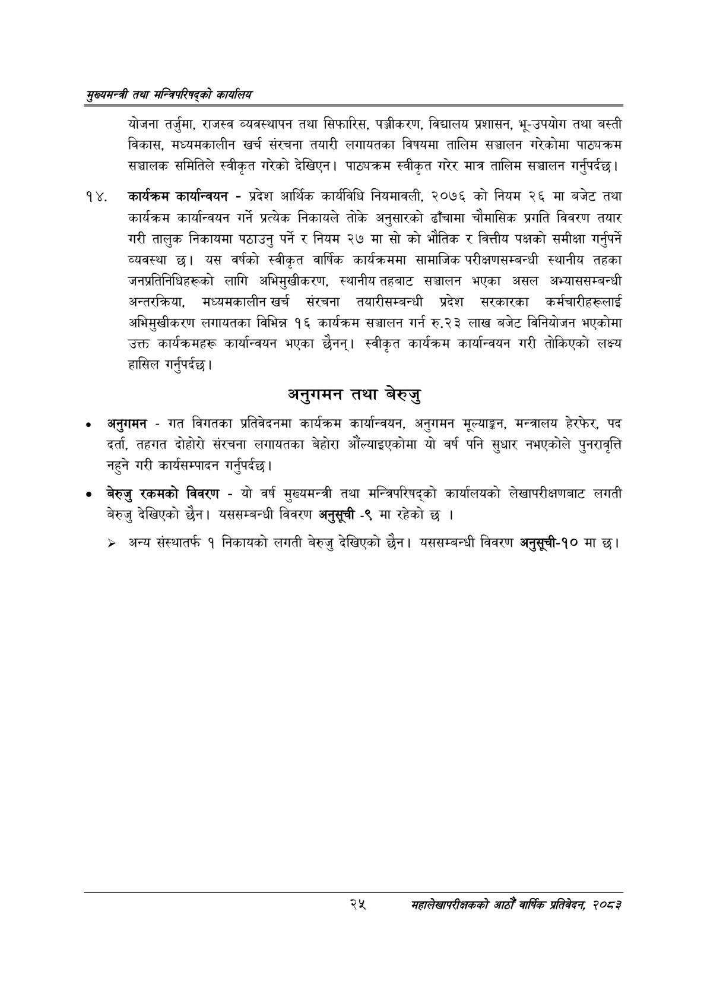

# Page 47 QA

## Rendered page


## Extracted text

```text
सुख्यसन्त्री तथा सन्बिपरिषद्को का्यलिय
योजना तर्जुमा, राजस्व व्यवस्थापन तथा सिफारिस, पञ्जीकरण, विद्यालय प्रशासन, भू-उपयोग तथा बस्ती विकास, मध्यमकालीन खर्च संरचना तयारी लगायतका विषयमा तालिम सञ्चालन गरेकोमा पाट्यक्रम सञ्चालक समितिले स्वीकृत गरेको देखिएन। पाठ्यक्रम स्वीकृत गरेर मात्र तालिम सञ्चालन गर्नुपर्दछ |
कार्यक्रम कार्यान्वयन -प्रदेश आर्थिक कार्यविधि नियमावली, २०७६ को नियम २६ मा बजेट तथा कार्यक्रम कार्यान्वयन गर्ने प्रत्येक निकायले तोके अनुसारको ढाँचामा चौमासिक प्रगति विवरण तयार गरी तालुक निकायमा पठाउनु पर्ने र नियम २७ मा सो को भौतिक र वित्तीय पक्षको समीक्षा गर्नुपर्ने व्यवस्था | यस वर्षको स्वीकृत वार्षिक कार्यक्रममा सामाजिक परीक्षणसम्बन्धी स्थानीय तहका जनप्रतिनिधिहरूको लागि अभिमुखीकरण, स्थानीय तहबाट सञ्चालन भएका असल अभ्याससम्बन्धी अन्तरक्रिया, मध्यमकालीन खर्च संरचना तयारीसम्बन्धी प्रदेश सरकारका कर्मचारीहरूलाई अभिमुखीकरण लगायतका विभिन्न १६ कार्यक्रम सञ्चालन गर्न रु.२३ लाख बजेट विनियोजन भएकोमा उक्त कार्यक्रमहरू कार्यान्वयन भएका छैनन्‌। स्वीकृत कार्यक्रम कार्यान्वयन गरी तोकिएको लक्ष्य हासिल गर्नुपर्दछ।
अनुगमन तथा बेरुजु
अनुगमन -गत विगतका प्रतिवेदनमा कार्यक्रम कार्यान्वयन, अनुगमन मूल्याङ्कन, मन्त्रालय हेरफेर, पद दर्ता, तहगत दोहोरो संरचना लगायतका बेहोरा औंल्याइएकोमा यो वर्ष पनि सुधार नभएकोले पुनरावृत्ति नहुने गरी कार्यसम्पादन गर्नुपर्दछ |
बेरुजु रकमको विवरण -यो वर्ष मुख्यमन्त्री तथा मन्त्रिपरिषद्को कार्यालयको लेखापरीक्षणबाट लगती बेरुजु देखिएको छैन। यससम्बन्धी विवरण अनुसूची -९ मा रहेको छ |
> अन्य संस्थातर्फ १ निकायको लगती बेरुजु देखिएको छैन। यससम्बन्धी विवरण अनुसूची-१० मा |
२५
महालेखापरीक्षकको आठौँ वाषिकि प्रतिवेदन २०८२
```

## Flags
- None
