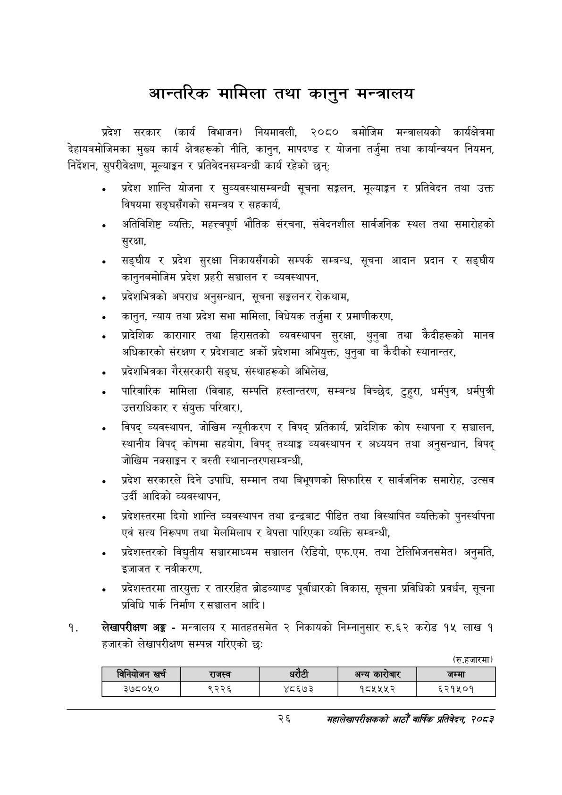

# Page 48 QA

## Rendered page


## Extracted text

```text
आन्तरिक मामिला तथा कानुन मन्त्रालय
प्रदेश सरकार (कार्य विभाजन) नियमावली, २०८० बमोजिम मन्त्रालयको कार्यक्षेत्रमा देहायबमोजिमका मुख्य कार्य क्षेत्रहरूको नीति, कानुन, मापदण्ड र योजना तर्जुमा तथा कार्यान्वयन नियमन, निर्देशन, सुपरीवेक्षण, मूल्याङ्कन र प्रतिवेदनसम्बन्धी कार्य रहेको छन्‌ः
प्रदेश शान्ति योजना र सुव्यवस्थासम्बन्धी सूचना सङ्कलन, मूल्याङ्गन र प्रतिवेदन तथा उक्त विषयमा सङ्घसँगको समन्वय र सहकार्य,
अतिविशिष्ट व्यक्ति, महत्त्वपूर्ण भौतिक संरचना, संवेदनशील सार्वजनिक स्थल तथा समारोहको सुरक्षा,
सङ्घीय र प्रदेश सुरक्षा निकायसँगको सम्पर्क सम्बन्ध, सूचना आदान प्रदान र सङ्घीय कानुनबमोजिम प्रदेश प्रहरी सञ्चालन र व्यवस्थापन,
प्रदेशभित्रको अपराध अनुसन्धान, सूचना सङ्गलनर रोकथाम,
कानुन, न्याय तथा प्रदेश सभा मामिला, विधेयक तर्जुमा र प्रमाणीकरण,
प्रादेशिक कारागार तथा हिरासतको व्यवस्थापन सुरक्षा, थुनुवा तथा केदीहरूको मानव अधिकारको संरक्षण र प्रदेशबाट अर्को प्रदेशमा अभियुक्त, थुनुवा वा कैदीको स्थानान्तर,
प्रदेशभित्रका गैरसरकारी सङ्घ, संस्थाहरूको अभिलेख,
पारिवारिक मामिला (विवाह, सम्पत्ति हस्तान्तरण, सम्बन्ध विच्छेद, टुहुरा, धर्मपुत्र, धर्मपुत्री उत्तराधिकार र संयुक्त परिवार),
विपद्‌ व्यवस्थापन, जोखिम न्यूनीकरण र विपद्‌ प्रतिकार्य, प्रादेशिक कोष स्थापना र सञ्चालन, स्थानीय विपद्‌ कोषमा सहयोग, विपद्‌ तथ्याङ्क व्यवस्थापन र अध्ययन तथा अनुसन्धान, विपद्‌ जोखिम नक्साङ्गन र बस्ती स्थानान्तरणसम्बन्धी,
प्रदेश सरकारले दिने उपाधि, सम्मान तथा बिभृषणको सिफारिस र सार्वजनिक समारोह, उत्सव उर्दी आदिको व्यवस्थापन,
प्रदेशस्तरमा दिगो शान्ति व्यवस्थापन तथा द्वन्द्वबाट पीडित तथा विस्थापित व्यक्तिको पुनर्स्थापना एवं सत्य निरूपण तथा मेलमिलाप र बेपत्ता पारिएका व्यक्ति सम्बन्धी,
प्रदेशस्तरको विद्युतीय सञ्चारमाध्यम सञ्चालन (रेडियो, एफ.एम. तथा टेलिभिजनसमेत) अनुमति, इजाजत र नवीकरण,
प्रदेशस्तरमा ताय्युक्त र ताररहित ब्रोडब्याण्ड पूर्वाधारको विकास, सूचना प्रविधिको प्रवर्धन, सूचना प्रविधि पार्क निर्माण र सञ्चालन आदि।
लेखापरीक्षण अङ्ग -मन्त्रालय र मातहतसमेत २ निकायको निम्नानुसार रु.६२ करोड १५ लाख १ हजारको लेखापरीक्षण सम्पन्न गरिएको छः:
(रु.हजारमा)
२६
महालेखापरीक्षकको आठौँ वाषिकि प्रतिवेदन २०८२

|  |  | ।नानवोजन खची |  | राजस्व |  |  | अन्य कारोबार | जम्मा |
| --- | --- | --- | --- | --- | --- | --- | --- | --- |
|  |  | ३७८०५० |  | ९२२६ | ४८६७३ |  | १८५५५२ | ६२१५०१ |
```

## Flags
- table_page
- medium_quality_table
