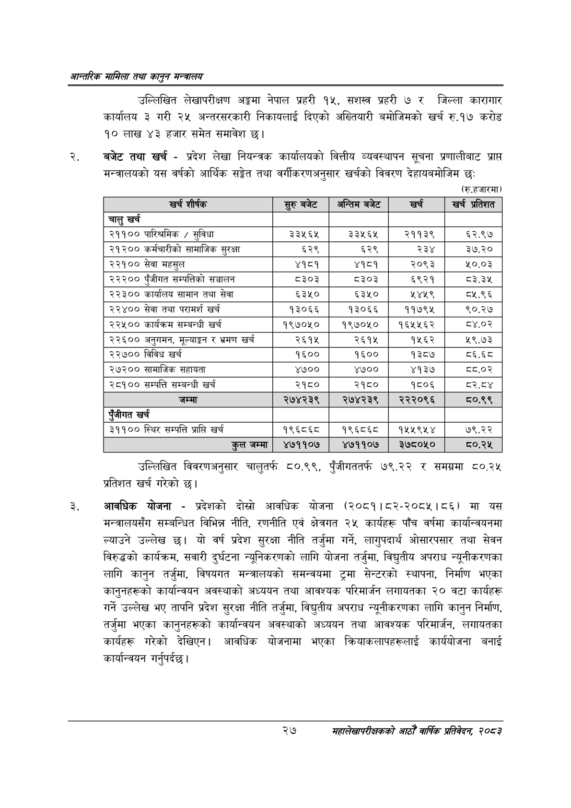

# Page 49 QA

## Rendered page


## Extracted text

```text
आन्तरिक मामिला तथा कालुन सन्बालय
उल्लिखित लेखापरीक्षण अङ्गमा नेपाल प्रहरी १५, सशस्त्र प्रहरी ७ र जिल्ला कारागार कार्यालय ३ गरी २४ अन्तरसरकारी निकायलाई दिएको अख्तियारी बमोजिमको खर्च रु.१७ करोड ९० लाख ४३ हजार समेत समावेश छ।
बजेट तथा खर्च -प्रदेश लेखा नियन्त्रक कार्यालयको वित्तीय व्यवस्थापन सूचना प्रणालीबाट प्राप्त मन्त्रालयको यस वर्षको आर्थिक सङ्गेत तथा वर्गीकरणअनुसार खर्चको विवरण देहायबमोजिम छः
(रु.हजारमा)
उल्लिखित विवरणअनुसार चालुतर्फ ८०.९९, पुँजीगततर्फ ७९.२२ र समग्रमा ८०.२५ प्रतिशत खर्च गरेको छ।
आवधिक योजना -प्रदेशको दोस्रो आवधिक योजना (२०८१।८२-२०८५।८६) मा यस मन्त्रालयसँग सम्बन्धित विभिन्न नीति, रणनीति एवं क्षेत्रगत २५ कार्यहरू पाँच वर्षमा कार्यान्वयनमा ल्याउने उल्लेख छ। यो वर्ष प्रदेश सुरक्षा नीति तर्जुमा गर्ने, लागुपदार्थ ओसारपसार तथा सेवन विरुद्धको कार्यक्रम, सवारी दुर्घटना न्यूनिकरणको लागि योजना तर्जुमा, विद्युतीय अपराध न्यूनीकरणका लागि कानुन तर्जुमा, विषयगत मन्त्रालयको समन्वयमा ट्रमा सेन्टरको स्थापना, निर्माण भएका कानुनहरूको कार्यान्वयन अवस्थाको अध्ययन तथा आवश्यक परिमार्जन लगायतका २० वटा कार्यहरू गर्ने उल्लेख भए तापनि प्रदेश सुरक्षा नीति तर्जुमा, विद्युतीय अपराध न्यूनीकरणका लागि कानुन निर्माण, तर्जुमा भएका कानुनहरूको कार्यान्वयन अवस्थाको अध्ययन तथा आवश्यक परिमार्जन, लगायतका कार्यहरू गरेको देखिएन। आवधिक योजनामा भएका क्रियाकलापहरूलाई कार्ययोजना बनाई कार्यान्वयन गर्नुपर्दछ |
२७
महालेखापरीक्षकको आठौँ वाषिकि प्रतिवेदन २०८२

| खर शीर्षक | सुरु बबेट | अन्तिम बजेट | खर्च | खर्च प्रतिशत |
| --- | --- | --- | --- | --- |
| चालु खर्च |  |  |  |  |
| २११०० पारिश्रमिक / सुविधा | ३३५६४५ | ३३५६५ | २११३९ | ६२.९७ |
| २१२०० कर्मचारीको सामाजिक सुरक्षा | ६२९ | ६२९ | २३४ | ३७.२० |
| २२१०० सेवा महसुल | ४१८१ | ४१८१ | २०९३ | ५०.०३ |
| २२२०० पुँजीगत सम्पत्तिको सञ्चालन | ८३०३ | ८३०३ | ६९२१ | ८३.३५ |
| २२३०० कार्यालष सामान तथा सेवा | ६३५० | ६३५० | ५४५९ | ८५.९६ |
| २२४०० सेवा तथा परामर्श खर्च | १३०६६ | १३०६६ | ११७९५ | ९०.२७ |
| २२५०० कार्यक्रम सम्बन्धी खर्च | १९७०५० | १९७०५० | १६५५६२ | ८४.०२ |
| २२६०० अनुगमन, मूल्याङ्कन र भ्रमण खर्च | २६१५ | २६१५ | १५६२ | २९.७३ |
| २२७०० विविध खर्च | १६०० | १६०० | १३८७ | ८६.६८ |
| २७२०० सामाजिक सहायता | ४७०० | ४७०० | ४१३७ | घव.०२ |
| २८१०० सम्पत्ति सम्बन्धी खर्च | २१८० | २१८० | १८०६ | ८र२.८४ |
| जम्मा | २७४२३९ | २७४२३९ | २२२०९६ | ८०.९९ |
| पूँजीगत खर्च |  |  |  |  |
| ३११०० स्थिर सम्पत्ति प्राप्ति खर्च | १९६८६८ | १९६८६८० | ११५५९५४ | ७९.२२ |
| उल जम्मा | ४७११०७ | ४७११०७ | ३े७८०५० | घ०.२५ |
```

## Flags
- table_page
- medium_quality_table
