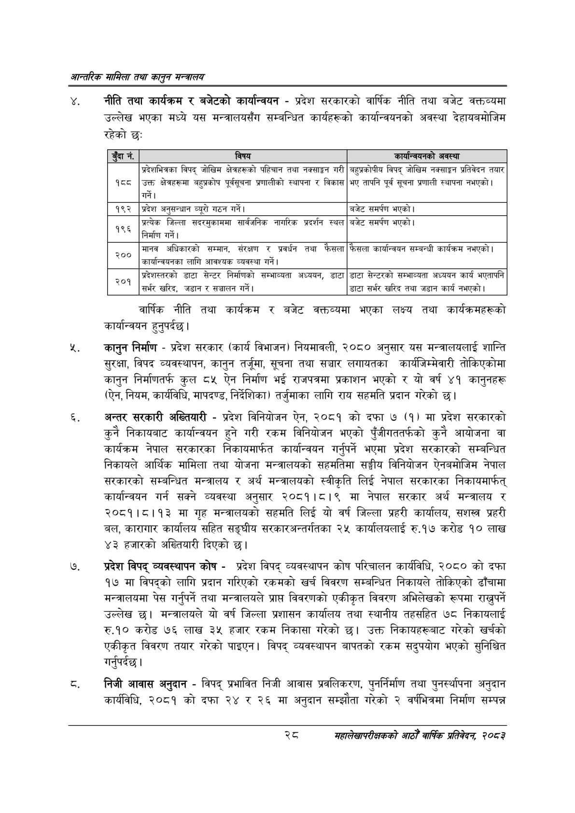

# Page 50 QA

## Rendered page


## Extracted text

```text
आन्तरिक मामिला तथा कालुन सन्बालय
नीति तथा कार्यक्रम र बजेटको कार्यान्वयन -प्रदेश सरकारको वार्षिक नीति तथा बजेट वक्तव्यमा उल्लेख भएका मध्ये यस मन्त्रालयसँग सम्बन्धित कार्यहरूको कार्यान्वयनको अवस्था देहायबमोजिम रहेको छः
वार्षिक नीति तथा कार्यक्रम र बजेट वक्तव्यमा भएका लक्ष्य तथा कार्यक्रमहरूको कार्यान्वयन हुनुपर्दछ |
कानुन निर्माण -प्रदेश सरकार (कार्य विभाजन) नियमावली, २०८० अनुसार यस मन्त्रालयलाई शान्ति सुरक्षा, विपद व्यवस्थापन, कानुन तर्जुमा, सूचना तथा सञ्चार लगायतका कार्यजिम्मेवारी तोकिएकोमा कानुन निर्माणतर्फ कुल ८५ ऐन निर्माण भई राजपत्रमा प्रकाशन भएको र यो वर्ष ४१ कानुनहरू (ऐन, नियम, कार्यविधि, मापदण्ड, निर्देशिका) तर्जुमाका लागि राय सहमति प्रदान गरेको छ।
अन्तर सरकारी अख्तियारी -प्रदेश विनियोजन ऐन, २०८१ को दफा ७ (१) मा प्रदेश सरकारको कुनै निकायबाट कार्यान्वयन हुने गरी रकम विनियोजन भएको पुँजीगततर्फको कुनै आयोजना वा कार्यक्रम नेपाल सरकारका निकायमार्फत कार्यान्वयन गर्नुपर्ने भएमा प्रदेश सरकारको सम्बन्धित निकायले आर्थिक मामिला तथा योजना मन्त्रालयको सहमतिमा सङ्घीय विनियोजन ऐनबमोजिम नेपाल सरकारको सम्बन्धित मन्त्रालय र अर्थ मन्त्रालयको स्वीकृति लिई नेपाल सरकारका निकायमार्फत्‌ कार्यान्वयन गर्न सक्ने व्यवस्था अनुसार २०८१।८।९ मा नेपाल सरकार अर्थ मन्त्रालय र २०८१।८।१३ मा गृह मन्त्रालयको सहमति लिई यो वर्ष जिल्ला प्रहरी कार्यालय, सशस्त्र प्रहरी बल, कारागार कार्यालय सहित सङ्घीय सरकारअन्तर्गतका २५ कार्यालयलाई रु.१७ करोड १० लाख ४३ हजारको अख्तियारी दिएको छ।
प्रदेश विपद्‌ व्यवस्थापन कोष -प्रदेश विपद्‌ व्यवस्थापन कोष परिचालन कार्यविधि, २०८० को दफा १७ मा विपद्को लागि प्रदान गरिएको रकमको खर्च विवरण सम्बन्धित निकायले तोकिएको ढाँचामा मन्त्रालयमा पेस गर्नुपर्ने तथा मन्त्रालयले प्रापत विवरणको एकीकृत विवरण अभिलेखको रूपमा राख्नुपर्ने उल्लेख छ। मन्त्रालयले यो वर्ष जिल्ला प्रशासन कार्यालय तथा स्थानीय तहसहित ७८ निकायलाई रु.१० करोड ७६ लाख ३५ हजार रकम निकासा गरेको छ। उक्त निकायहरूबाट गरेको खर्चको एकीकृत विवरण तयार गरेको पाइएन। विपद्‌ व्यवस्थापन बापतको रकम सदुपयोग भएको सुनिश्चित गर्नुपर्दछ |
निजी आवास अनुदान -विपद्‌ प्रभावित निजी आवास प्रवलिकरण, पुनर्निर्माण तथा पुनर्स्थापना अनुदान कार्यविधि, २०८१ को दफा २४ र २६ मा अनुदान सम्झौता गरेको २ वर्षभित्रमा निर्माण सम्पन्न
महालेखापरीक्षकको आठौँ वाषिकि प्रतिवेदन २०८२

| ड्दार्न, | विषय | कार्यान्वयनको अवस्था |
| --- | --- | --- |
| १८८ | प्रदेशभित्रका विपद्‌ जोखिम क्षेत्रहरूको पहिचान तथा नक्साङ्कगण गरी उक्त क्षेत्रहरूमा बहुत्रकोष पूर्वचूचना ्रणालीको स्थापना र विकास गर्ने। | बहुत्रकोपीच विपद्‌ जोखिम नक्ताङ्गण प्रतिवेदन तयार भए तापनि पूर्व सूचना प्रणाली स्थापना नभएको \| |
| १९२ | प्रदेश अनुसन्धान व्युरो गठन गर्ने। | बजेट समर्पण भएको \| |
| ६ | प्रत्येक जिल्ला सदरमुकाममा सार्वजनिक नागरिक प्रदर्शन स्थल निर्माण गर्ने। | बजेट समर्पण भएको \| |
| २०० | मानव अधिकारको सम्मान, संरक्षण र प्रवर्धन तथा फैसला कार्ान्वबनका लागि आवश्यक व्यवस्था गर्ने \| | फैसला कार्यान्वयन सम्बन्धी कार्यक्रम नभएको \| |
| २०१ | श्रदेशह्तरको डाटा सेन्टर निर्माणको सम्भाव्यता अध्ययन, डाटा सर्भर खरिद, जडान र सञ्चालन गर्ने। | डाटा सेन्टरको सम्भाव्यता अध्ययन कार्य भएतापनि डाटा सर्भर खरिद तथा जडान कार्य नभएको \| |
```

## Flags
- table_page
- medium_quality_table
