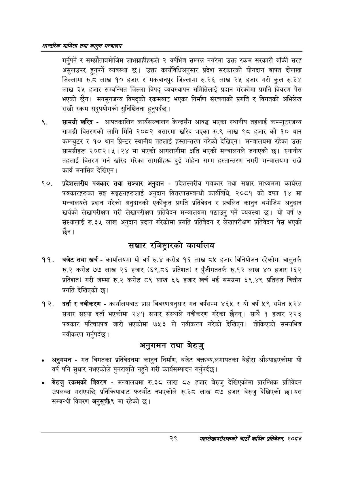

# Page 51 QA

## Rendered page


## Extracted text

```text
आन्तरिक मामिला तथा कालुन सन्बालय
गर्नुपर्ने र सम्झौताबमोजिम लाभग्राहीहरूले २ वर्षभित्र सम्पन्न नगरेमा उक्त रकम सरकारी बाँकी सरह असुलउपर हुनुपर्ने व्यवस्था | उक्त कार्यविधिअनुसार प्रदेश सरकारको योगदान बापत दोलखा जिल्लामा रु.८ठ लाख १० हजार र मकवानपुर जिल्लामा रु.२६ लाख २५ हजार गरी कुल रु.३४ लाख ३५ हजार सम्बन्धित जिल्ला विपद्‌ व्यवस्थापन समितिलाई प्रदान गरेकोमा प्रगति विवरण पेस भएको छैन। मनसुनजन्य विपद्को रकमबाट भएका निर्माण संरचनाको प्रगति र विगतको अभिलेख राखी रकम सदुपयोगको सुनिश्चितता हुनुपर्दछ |
सामग्री खरिद -आपतकालिन कार्यसञ्चालन केन्द्रसँग आवद्ध भएका स्थानीय तहलाई कम्प्युटरजन्य सामग्री वितरणको लागि मिति २०८२ असारमा खरिद भएका रु.९ लाख ९८ हजार को १० थान कम्प्युटर र १० थान प्रिन्टर स्थानीय तहलाई हस्तान्तरण गरेको देखिएन। मन्त्रालयमा रहेका उक्त सामग्रीहरू २०८२।५। २४ मा भएको आगलागीमा क्षति भएको मन्त्रालयले जनाएको छ। स्थानीय तहलाई वितरण गर्न खरिद गरेका सामग्रीहरू दुई महिना सम्म हस्तान्तरण नगरी मन्त्रालयमा राख्ने कार्य मनासिव देखिएन |
प्रदेशस्तरीय पत्रकार तथा सञ्चार अनुदान -प्रदेशस्तरीय पत्रकार तथा सञ्चार माध्यममा कार्यरत पत्रकारहरूका सङ्घ सङ्गठनहरूलाई अनुदान वितरणसम्बन्धी कार्यविधि, २०८१ को दफा १४ मा मन्त्रालयले प्रदान गरेको अनुदानको एकीकृत प्रगति प्रतिवेदन र प्रचलित कानुन बमोजिम अनुदान खर्चको लेखापरीक्षण गरी लेखापरीक्षण प्रतिवेदन मन्त्रालयमा पठाउनु पर्ने व्यवस्था यो वर्ष ७ संस्थालाई रु.३५ लाख अनुदान प्रदान गरेकोमा प्रगति प्रतिवेदन र लेखापरीक्षण प्रतिवेदन पेस भएको छैन।
सञ्चार रजिष्ट्रारको कार्यालय
बजेट तथा खर्च -कार्यालयमा यो वर्ष रु.४ करोड १६ लाख ८५ हजार विनियोजन रहेकोमा चालुतर्फ रु.२ करोड ७७ लाख २६ हजार (६९.८६ प्रतिशत) र पुँजीगततर्फ रु.१२ लाख ४० हजार (६२ प्रतिशत) गरी जम्मा करोड ८९ लाख ६६ हजार खर्च भई समग्रमा ६९.४९ प्रतिशत वित्तीय प्रगति देखिएको |
दर्ता र नवीकरण -कार्यालयबाट प्राप्त विवरणअनुसार गत वर्षसम्म ४६५ र यो वर्ष ५९ समेत ५२४ सञ्चार संस्था दर्ता भएकोमा २४१ सञ्चार संस्थाले नवीकरण गरेका छैनन्‌। साथै १ हजार २२३ पत्रकार परिचयपत्र जारी भएकोमा ७५३ ले नवीकरण गरेको देखिएन। तोकिएको समयभित्र नवीकरण।
अनुगमन तथा बेरुजु
अनुगमन -गत विगतका प्रतिवेदनमा कानुन निर्माण, बजेट वक्तव्य,लगायतका बेहोरा औंल्याइएकोमा यो वर्ष पनि सुधार नभएकोले पुनरावृत्ति नहुने गरी कार्यसम्पादन गर्नुपर्दछ |
बेरुजु रकमको विवरण -मन्त्रालयमा रु.३८ लाख ८७ हजार बेरुजु देखिएकोमा प्रारम्भिक प्रतिवेदन उपलब्ध गराएपछि प्रतिक्रियाबाट फस्यौट नभएकोले रु.३८ लाख ८७ हजार बेरुजु देखिएको छ। यस सम्बन्धी विवरण अनुसूची(९ मा रहेको छ।
गर्नुपर्दछ
२९
महालेखापरीक्षकको आठौँ वाषिकि प्रतिवेदन २०८२
```

## Flags
- None
