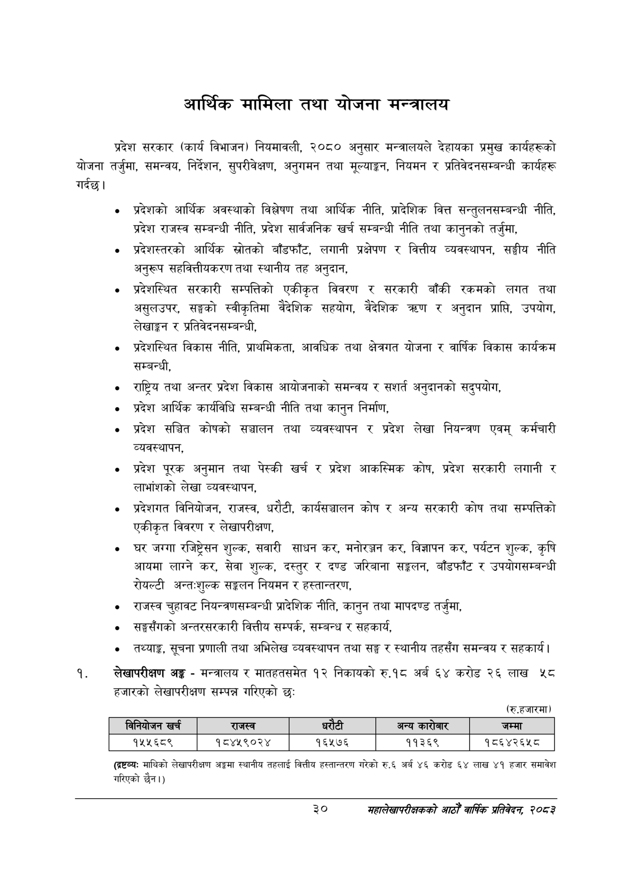

# Page 52 QA

## Rendered page


## Extracted text

```text
आर्थिक मामिला तथा योजना मन्त्रालय
गर्दछ | प्रदेश सरकार (कार्य विभाजन) नियमावली, २०८० अनुसार मन्त्रालयले देहायका प्रमुख कार्यहरूको योजना तर्जुमा, समन्वय, निर्देशन, सुपरीवेक्षण, अनुगमन तथा मूल्याङ्कन, नियमन र प्रतिवेदनसम्बन्धी कार्यहरू
प्रदेशको आर्थिक अवस्थाको विश्लेषण तथा आर्थिक नीति, प्रादेशिक वित्त सन्तुलनसम्बन्धी नीति, प्रदेश राजस्व सम्बन्धी नीति, प्रदेश सार्वजनिक खर्च सम्बन्धी नीति तथा कानुनको तर्जुमा,
प्रदेशस्तरको आर्थिक स्रोतको बाँडफाँट, लगानी प्रक्षेपण र वित्तीय व्यवस्थापन, सङ्घीय नीति अनुरूप सहवित्तीयकरण तथा स्थानीय तह अनुदान,
प्रदेशस्थित सरकारी सम्पत्तिको एकीकृत विवरण र सरकारी बाँकी रकमको लगत तथा असुलउपर, सङ्घको स्वीकृतिमा वैदेशिक सहयोग, वैदेशिक त्रहण र अनुदान प्राप्ति, उपयोग, लेखाङ्गन र प्रतिवेदनसम्बन्धी,
प्रदेशस्थित विकास नीति, प्राथमिकता, आवधिक तथा क्षेत्रगत योजना र वार्षिक विकास कार्यक्रम सम्बन्धी,
राष्ट्रिय तथा अन्तर प्रदेश विकास आयोजनाको समन्वय र सशर्त अनुदानको सदुपयोग,
प्रदेश आर्थिक कार्यविधि सम्बन्धी नीति तथा कानुन निर्माण,
प्रदेश सञ्चित कोषको सञ्चालन तथा व्यवस्थापन र प्रदेश लेखा नियन्त्रण एवम्‌ कर्मचारी व्यवस्थापन,
प्रदेश पूरक अनुमान तथा पेस्की खर्च र प्रदेश आकस्मिक कोष, प्रदेश सरकारी लगानी र लाभांशको लेखा व्यवस्थापन,
प्रदेशगत विनियोजन, राजस्व, धरौटी, कार्यसञ्चालन कोष र अन्य सरकारी कोष तथा सम्पत्तिको एकीकृत विवरण र लेखापरीक्षण,
घर जग्गा रजिष्ट्रेसस शुल्क, सवारी साधन कर, मनोरञ्जन कर, विज्ञापन कर, पर्यटन शुल्क, कृषि आयमा लाग्ने कर, सेवा शुल्क, दस्तुर र दण्ड जरिबाना सङ्कलन, बाँडफाँट र उपयोगसम्बन्धी रोयल्टी अन्तःशुल्क सङ्कलन नियमन र हस्तान्तरण,
राजस्व चुहावट नियन्त्रणसम्बन्धी प्रादेशिक नीति, कानुन तथा मापदण्ड तर्जुमा,
सङ्घसँगको अन्तरसरकारी वित्तीय सम्पर्क, सम्बन्ध र सहकार्य,
तथ्याङ्क, सूचना प्रणाली तथा अभिलेख व्यवस्थापन तथा सङ्घ र स्थानीय तहसँग समन्वय र सहकार्य |
लेखापरीक्षण अङ्ग -मन्त्रालय र मातहतसमेत १२ निकायको रु.१८ अर्ब ६४ करोड २६ लाख ५८ हजारको लेखापरीक्षण सम्पन्न गरिएको छः:
(रु.हजारमा)
(द्र्टव्यः माथिको लेखापरीक्षण अङ्गमा स्थानीय तहलाई वित्तीय हस्तान्तरण गरेको रु.६ अर्ब ४६ करोड ६४ लाख ४१ हजार समावेश गरिएको छैन।)
३०
महालेखापरीक्षकको आठौँ वाषिकि प्रतिवेदन २०८२

|  |  | व्यय निनबोजन खर्च | राजस्व | छ धरेटी |  | ~ अन्य कारोबार | जम्मा |
| --- | --- | --- | --- | --- | --- | --- | --- |
|  |  | १५५६८९ | १८४४५९०२४ | १६५७६ |  | ११३६९ | १८६४२६५८ |
```

## Flags
- table_page
- medium_quality_table
