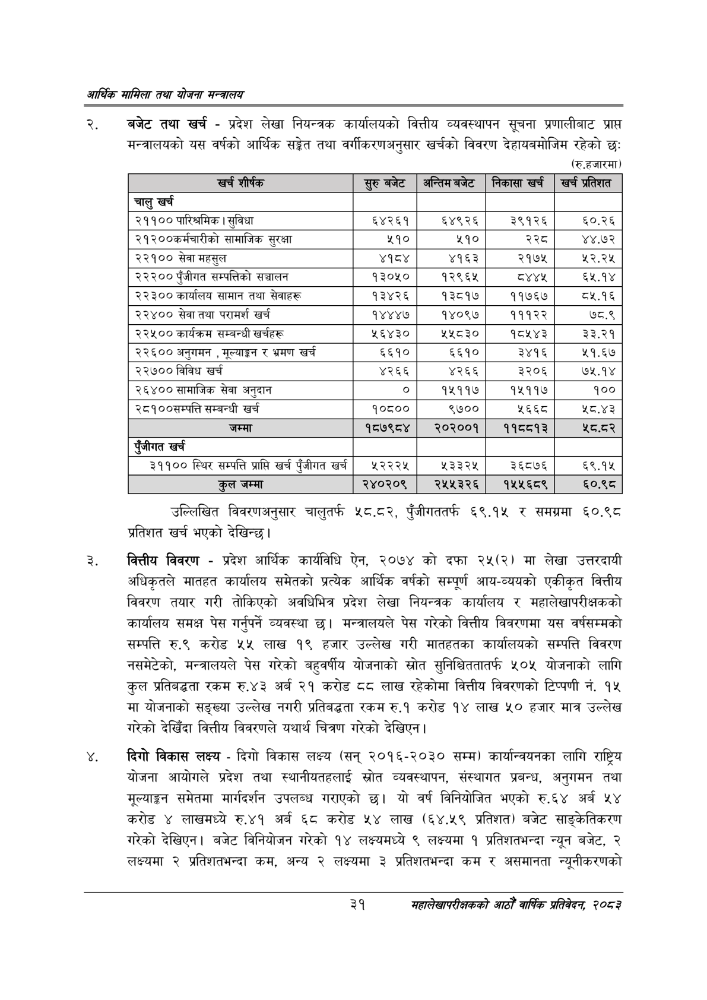

# Page 53 QA

## Rendered page


## Extracted text

```text
आर्थिक मामिला तथा योजना सन्चबालय
बजेट तथा खर्च -प्रदेश लेखा नियन्त्रक कार्यालयको वित्तीय व्यवस्थापन सूचना प्रणालीबाट प्राप्त मन्त्रालयको यस वर्षको आर्थिक सङ्ेत तथा वर्गीकरणअनुसार खर्चको विवरण देहायबमोजिम रहेको छः:
(रु.हजारमा)
उल्लिखित विवरणअनुसार चालुतर्फ ५८.८२, पुँजीगततर्फ ६९.१५ र समग्रमा ६०.९८ प्रतिशत खर्च भएको देखिन्छ |
वित्तीय विवरण -प्रदेश आर्थिक कार्यविधि ऐन, २०७४ को दफा ) मा लेखा उत्तरदायी अधिकृतले मातहत कार्यालय समेतको प्रत्येक आर्थिक वर्षको सम्पूर्ण आय-व्ययको एकीकृत वित्तीय विवरण तयार गरी तोकिएको अवधिभित्र प्रदेश लेखा नियन्त्रक कार्यालय र महालेखापरीक्षकको कार्यालय समक्ष पेस गर्नुपर्ने व्यवस्था छ। मन्त्रालयले पेस गरेको वित्तीय विवरणमा यस वर्षसम्मको सम्पत्ति रु.९ करोड ५५ लाख १९ हजार उल्लेख गरी मातहतका कार्यालयको सम्पत्ति विवरण नसमेटेको, मन्त्रालयले पेस गरेको बहुवर्षीय योजनाको स्रोत सुनिश्चिततातर्फ ५०५ योजनाको लागि कुल प्रतिबद्धता रकम रु.४३ अर्ब २१ करोड ८८ लाख रहेकोमा वित्तीय विवरणको टिप्पणी नं. १५ मा योजनाको सङ्ख्या उल्लेख नगरी प्रतिबद्धता रकम रु.१ करोड १४ लाख ५० हजार मात्र उल्लेख गरेको देखिँदा वित्तीय विवरणले यथार्थ चित्रण गरेको देखिएन।
दिगो विकास लक्ष्य -दिगो विकास लक्ष्य (सन्‌ २०१६-२०३० सम्म) कार्यान्वयनका लागि राष्ट्रिय योजना आयोगले प्रदेश तथा स्थानीयतहलाई स्रोत व्यवस्थापन, संस्थागत प्रबन्ध, अनुगमन तथा मूल्याङ्कन समेतमा मार्गदर्शन उपलब्ध गराएको छ। यो वर्ष विनियोजित भएको रु.६४ अर्ब ५४ करोड ४ लाखमध्ये रु.४१ अर्ब ६८ करोड ५४ लाख (६४.५९ प्रतिशत) बजेट साङ्केतिकरण गरेको देखिएन। बजेट विनियोजन गरेको १४ लक्ष्यमध्ये ९ लक्ष्यमा १ प्रतिशतभन्दा न्यून बजेट, २ लक्ष्यमा २ प्रतिशतभन्दा कम, अन्य २ लक्ष्यमा ३ प्रतिशतभन्दा कम र असमानता न्यूनीकरणको
३१
महालेखापरीक्षकको आठौँ वाषिकि प्रतिवेदन २०८२

| शी |  |  | १ |  |
| --- | --- | --- | --- | --- |
|  | उ |  |  |  |
| चालु खर्च |  |  |  |  |
| २११०० पारिश्रमिक। सुविधा | ६४२६१ | ६४९२६ | ३९१२६ | ६०.२६ |
| २१२००कर्मचारीको सामाजिक सुरक्षा | ५१० | २५१० | २२८ | ४४.७२ |
| २२१०० सेवा महसुल | ४१८४ | ४१६३ | २१७५ | २२.२५ |
| २२२०० पुँजीगत सम्पतिको सञ्चालन | १३०५० | १२९६४ | व्श्थ्श | ६५.१४ |
| २२३०० कार्यालय सामान तथा सेवाहरू | १३४२६ | १३८१७ | ११७६७ | ८५.१६ |
| २२४०० सेवा तथा परामर्श खर्च | १४४४७ | १४०९७ | १११२२ | ७८.९ |
| २२४५०० कार्यक्रम सम्बन्धी खर्चहरू | ५६४३० | ५४५८३० | १८५४३ | ३३.२१ |
| २२६०० अनुभमन, मूल्याङ्कन र भ्रमण खर्च | ६६१० | ६६१० | ३४१६ | ५१.६७ |
| २२७०० विविध खर्च | ४२६६ | ४२६६ | ३२०६ | ७५.१४ |
| २६४०० सामाजिक सेवा अनुदान |  | १५११७ | १५११७ | १०० |
| २८१००सम्पत्ति सम्बन्धी खर्च | १०८०० | ९७०० | ५६६८ | ४५.३ |
| जम्मा | १८७९८४ | २०२००१ | ११८८१३ | श्ठ.दर |
| रंजीगत खर्च |  |  |  |  |
| ३११०० स्थिर सम्पत्ति प्राप्ति खर्च पंजीगत खर्च | ५२२२५ | ५३३२५ | ३६८७६ | ६९.१५ |
| तल जम्मा | २४०२०९ | २५५३२६ | १५५६८९ | ६०.९८ |
```

## Flags
- table_page
- medium_quality_table
