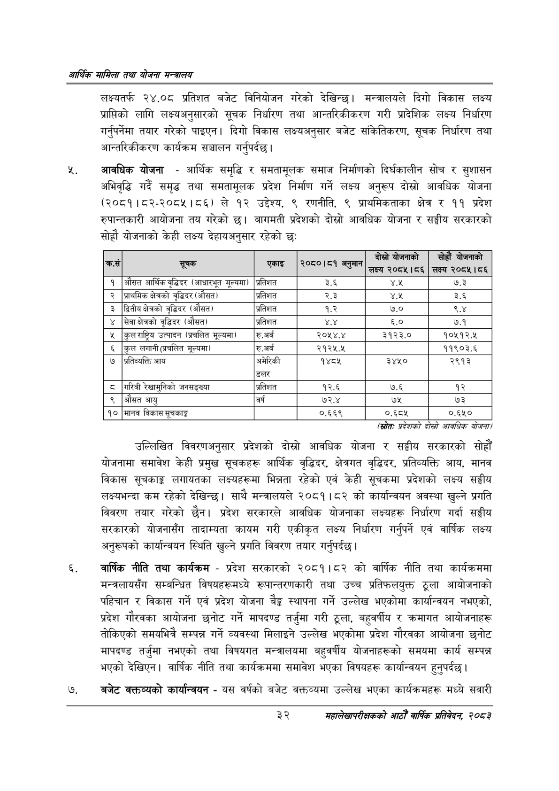

# Page 54 QA

## Rendered page


## Extracted text

```text
आर्थिक मामिला तथा योजना सन्चबालय
लक्ष्यतर्फ २४.०८ प्रतिशत बजेट विनियोजन गरेको देखिन्छ। मन्त्रालयले दिगो विकास लक्ष्य प्राप्तिको लागि लक्ष्यअनुसारको सूचक निर्धारण तथा आन्तरिकीकरण गरी प्रादेशिक लक्ष्य निर्धारण गर्नुपर्नेमा तयार गरेको पाइएन। दिगो विकास लक्ष्यअनुसार बजेट सांकिेतिकरण, सूचक निर्धारण तथा आन्तरिकीकरण कार्यक्रम सञ्चालन गर्नुपर्दछ |
आवधिक योजना -आर्थिक समृद्धि र समतामूलक समाज निर्माणको दिर्घकालीन सोच र सुशासन अभिवृद्धि गर्दै समृद्ध तथा समतामूलक प्रदेश निर्माण गर्ने लक्ष्य अनुरूप दोस्रो आवधिक योजना (२०८१।८२-२०८५।८६) ले १२ उद्देश्य, ९ रणनीति, ९ प्राथमिकताका क्षेत्र र ११ प्रदेश रुपान्तकारी आयोजना तय गरेको | बागमती प्रदेशको दोस्रो आवधिक योजना र सङ्घीय सरकारको सोह्रौ योजनाको केही लक्ष्य देहायअनुसार रहेको छः
(स्रोतः प्रदेशको दोस्रो आवधिक योजना/
उल्लिखित विवरणअनुसार प्रदेशको दोस्रो आवधिक योजना र सङ्घीय सरकारको सोहौं योजनामा समावेश केही प्रमुख सूचकहरू आर्थिक वृद्धिदर, क्षेत्रगत वृद्धिदर, प्रतिव्यक्ति आय, मानव विकास सूचकाङ्ग लगायतका लक्ष्यहरूमा भिन्नता रहेको एवं केही सूचकमा प्रदेशको लक्ष्य सङ्घीय लक्ष्यभन्दा कम रहेको देखिन्छ। साथै मन्त्रालयले २०८१।८२ को कार्यान्वयन अवस्था खुल्ने प्रगति विवरण तयार गरेको छैन। प्रदेश सरकारले आवधिक योजनाका लक्ष्यहरू निर्धारण गर्दा सङ्घीय सरकारको योजनासँग तादाम्यता कायम गरी एकीकृत लक्ष्य निर्धारण गर्नुपर्ने एवं वार्षिक लक्ष्य अनुरूपको कार्यान्वयन स्थिति खुल्ने प्रगति विवरण तयार गर्नुपर्दछ |
वार्षिक नीति तथा कार्यक्रम -प्रदेश सरकारको २०८१।८२ को वार्षिक नीति तथा कार्यक्रममा मन्त्रलायसँग सम्बन्धित विषयहरूमध्ये रूपान्तरणकारी तथा उच्च प्रतिफलयुक्त ठूला आयोजनाको पहिचान र विकास गर्ने एवं प्रदेश योजना बेङ्ग स्थापना गर्ने उल्लेख भएकोमा कार्यान्वयन नभएको, प्रदेश गौरवका आयोजना छनोट गर्ने मापदण्ड तर्जुमा गरी ठूला, बहुवर्षीय र क्रमागत आयोजनाहरू तोकिएको समयभित्रै सम्पन्न गर्ने व्यवस्था मिलाइने उल्लेख भएकोमा प्रदेश गौरवका आयोजना छनोट मापदण्ड तर्जुमा नभएको तथा विषयगत मन्त्रालयमा बहुवर्षीय योजनाहरूको समयमा कार्य सम्पन्न भएको देखिएन। वार्षिक नीति तथा कार्यक्रममा समावेश भएका विषयहरू कार्यान्वयन हुनुपर्दछ |
बजेट वक्तव्यको कार्यान्वयन -यस वर्षको बजेट वक्तव्यमा उल्लेख भएका कार्यक्रमहरू मध्ये सवारी
३२
महालेखापरीक्षकको आठौँ वाषिकि प्रतिवेदन २०८२

| क्रस |  | एकाइ | २०८०।८१ अनुमान | दोस्रो पोणनाको लक्ष्य २०८५।८६ | सोह पोजनाको लक्ष्य २०८५।८६ |
| --- | --- | --- | --- | --- | --- |
| १ | औसत आर्थिक वृद्धिदर (आधारभूत मूल्यमा) | प्रतिशत | ३.६ |  | ७.३ |
| २ | प्राथमिक क्षेत्रको वृद्धिदर (औसत) | प्रतिशत | २.३ | ४.५ | ३.६ |
| ३ | डितीय क्षेत्रको वृद्धिदर (औसत) | प्रतिशत | १.२ | ७.० | ९.४ |
| ४ | सेवा क्षेत्रको वृद्धिदर (औसत) | प्रतिशत |  | ६.० | ७.१ |
| ५ | कुलराष्ट्रिय उत्पादन (प्रचलित मूल्यमा) | रु.अर्ब | २०५४.४ | ३१२३.० | १०५१२.४५ |
| ६ | कुल लगानी (प्रचलित मूल्यमा) | रु.अर्ब |  |  | ११९०३.६ |
| ७ | प्रतिव्यक्ति आय | अमेरिकी डलर | १४८५ | ३४५० | २९१३ |
| ८ | गरिबी रखासुनिको जनसङ्ख्या | प्रतिशत | १२.६ | ७.६ | १२ |
| ९ | औसत आयु | वर्ष | ७२.४ | ७५ | ७३ |
| १० | मानव विकास सूचकाङ्क |  | ०.६६९ | ०.६८५ | ०.६१० |
```

## Flags
- table_page
- medium_quality_table
