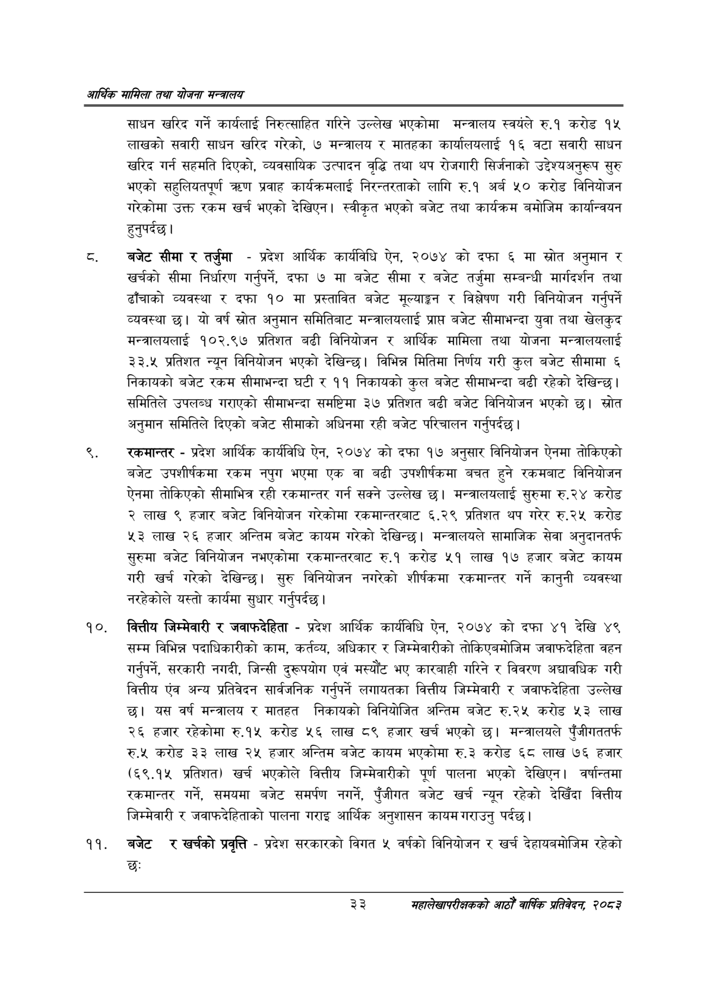

# Page 55 QA

## Rendered page


## Extracted text

```text
आर्थिक मामिला तथा योजना सन्चबालय
साधन खरिद गर्ने कार्यलाई निरुत्साहित गरिने उल्लेख भएकोमा मन्त्रालय स्वयंले रु.१ करोड १५ लाखको सवारी साधन खरिद गरेको, ७ मन्त्रालय र मातहका कार्यालयलाई १६ वटा सवारी साधन खरिद गर्न सहमति दिएको, व्यवसायिक उत्पादन वृद्धि तथा थप रोजगारी सिर्जनाको उद्देश्यअनुरूप सुरु भएको सहुलियतपूर्ण त्रण प्रवाह कार्यक्रमलाई निरन्तरताको लागि रु.१ अर्ब ५० करोड विनियोजन गरेकोमा उक्त रकम खर्च भएको देखिएन। स्वीकृत भएको बजेट तथा कार्यक्रम बमोजिम कार्यान्वयन हुनुपर्दछ।
बजेट सीमा र तर्जुमा -प्रदेश आर्थिक कार्यविधि ऐन, २०७४ को दफा ६ मा स्रोत अनुमान र खर्चको सीमा निर्धारण गर्नुपर्ने, दफा ७ मा बजेट सीमा र बजेट तर्जुमा सम्बन्धी मार्गदर्शन तथा ढाँचाको व्यवस्था र दफा १० मा प्रस्तावित बजेट मूल्याङ्कन र विश्लेषण गरी विनियोजन गर्नुपर्ने व्यवस्था छ। यो वर्ष स्रोत अनुमान समितिबाट मन्त्रालयलाई प्राप्त बजेट सीमाभन्दा युवा तथा खेलकुद मन्त्रालयलाई १०२.९७ प्रतिशत बढी विनियोजन र आर्थिक मामिला तथा योजना मन्त्रालयलाई ३३.५ प्रतिशत न्यून विनियोजन भएको देखिन्छ। विभिन्न मितिमा निर्णय गरी कुल बजेट सीमामा ६ निकायको बजेट रकम सीमाभन्दा घटी र ११ निकायको कुल बजेट सीमाभन्दा बढी रहेको देखिन्छ। समितिले उपलब्ध गराएको सीमाभन्दा समष्टिमा ३७ प्रतिशत बढी बजेट विनियोजन भएको छ। स्रोत अनुमान समितिले दिएको बजेट सीमाको अधिनमा रही बजेट परिचालन गर्नुपर्दछ |
रकमान्तर -प्रदेश आर्थिक कार्यविधि ऐन, २०७४ को दफा १७ अनुसार विनियोजन ऐनमा तोकिएको बजेट उपशीर्षकमा रकम नपुग भएमा एक वा बढी उपशीर्षकमा बचत हुने रकमबाट विनियोजन ऐनमा तोकिएको सीमाभित्र रही रकमान्तर गर्न सक्ने उल्लेख छ। मन्त्रालयलाई सुरुमा रु.२४ करोड २ लाख ९ हजार बजेट विनियोजन गरेकोमा रकमान्तरबाट ६.२९ प्रतिशत थप गरेर रु.२५ करोड ३ लाख २६ हजार अन्तिम बजेट कायम गरेको देखिन्छ। मन्त्रालयले सामाजिक सेवा अनुदानतर्फ सुरुमा बजेट विनियोजन नभएकोमा रकमान्तरबाट रु.१ करोड ५१ लाख १७ हजार बजेट कायम गरी खर्च गरेको देखिन्छ। सुरु विनियोजन नगरेको शीर्षकमा रकमान्तर गर्ने कानुनी व्यवस्था नरहेकोले यस्तो कार्यमा सुधार गर्नुपर्दछ |
वित्तीय जिम्मेवारी र जवाफदेहिता -प्रदेश आर्थिक कार्यविधि ऐन, २०७४ को दफा ४१ देखि ४९ सम्म विभिन्न पदाधिकारीको काम, कर्तव्य, अधिकार र जिम्मेवारीको तोकिएबमोजिम जवाफदेहिता वहन गर्नुपर्ने, सरकारी नगदी, जिन्सी दुरूपयोग एवं मस्यौट भए कारबाही गरिने र विवरण अद्यावधिक गरी वित्तीय एंव अन्य प्रतिवेदन सार्वजनिक गर्नुपर्ने लगायतका वित्तीय जिम्मेवारी र जवाफदेहिता उल्लेख छ। यस वर्ष मन्त्रालय र मातहत निकायको विनियोजित अन्तिम बजेट रु.२४ करोड ३ लाख २६ हजार रहेकोमा रु.१५ करोड ५२६ लाख ८९ हजार खर्च भएको छ। मन्त्रालयले पुँजीगततर्फ रु.४५ करोड ३३ लाख २५ हजार अन्तिम बजेट कायम भएकोमा रु.३ करोड ६८ लाख ७६ हजार (६९.१५ प्रतिशत) खर्च भएकोले वित्तीय जिम्मेवारीको पूर्ण पालना भएको देखिएन। वर्षान्तमा रकमान्तर गर्ने, समयमा बजेट समर्पण नगर्ने, पुँजीगत बजेट खर्च न्यून रहेको देखिँदा वित्तीय जिम्मेवारी र जवाफदेहिताको पालना गराइ आर्थिक अनुशासन कायम गराउनु पर्दछ।
बजेट र खर्चको प्रवृत्ति -प्रदेश सरकारको विगत ५ वर्षको विनियोजन र खर्च देहायबमोजिम रहेको छः
३३
महालेखापरीक्षकको आठौँ वाषिकि प्रतिवेदन २०८२
```

## Flags
- None
