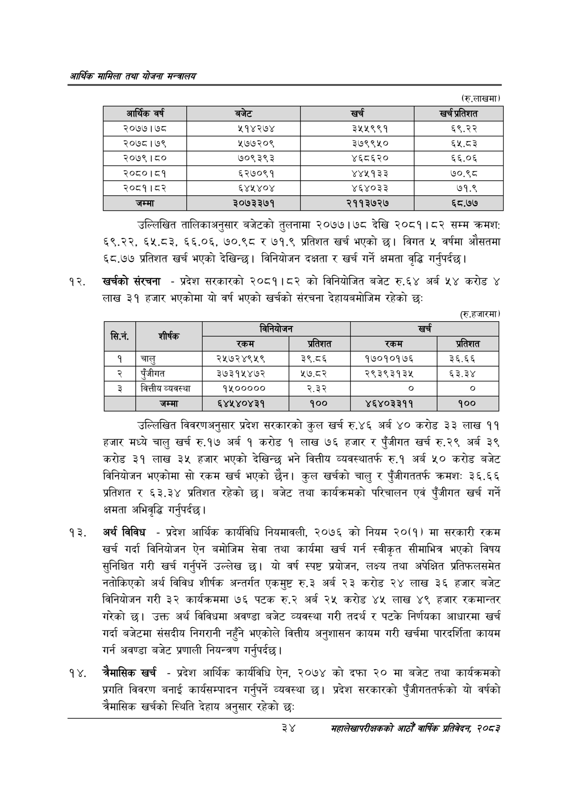

# Page 56 QA

## Rendered page


## Extracted text

```text
आर्थिक मामिला तथा योजना सन्चबालय
(रु.लाखमा)
उल्लिखित तालिकाअनुसार बजेटको तुलनामा मा २०७७। ७८ देखि २०८१।८२ सम्म क्रमश: ६९.२२, ६५.८३, ६६.०६, ७०.९८ र ७१.९ प्रतिशत खर्च भएको छ। विगत ५ वर्षमा औसतमा ६८.७७ प्रतिशत खर्च भएको देखिन्छ। विनियोजन दक्षता र खर्च गर्ने क्षमता वृद्धि गर्नुपर्दछ |
खर्चको संरचना -प्रदेश सरकारको २०८१।८२ को विनियोजित बजेट रु.६४ अर्ब ५४ करोड ४ लाख ३९ हजार भएकोमा यो वर्ष भएको खर्चको संरचना देहायबमोजिम रहेको छ:
(रु.हजारमा)
उल्लिखित विवरणअनुसार प्रदेश सरकारको कुल खर्च रु.४६ अर्ब ४० करोड ३३ लाख ११ हजार मध्ये चालु खर्च रु.१७ अर्ब १ करोड १ लाख ७६ हजार र पुँजीगत खर्च रु.२९ अर्ब ३९ करोड ३१ लाख ३५ हजार भएको देखिन्छ भने वित्तीय व्यवस्थातर्फ रु.१ अर्ब ५० करोड बजेट विनियोजन भएकोमा सो रकम खर्च भएको छैन। कुल खर्चको चालु र पुँजीगततर्फ क्रमशः ३६.६६ प्रतिशत र ६३.३४ प्रतिशत रहेको छ। बजेट तथा कार्यक्रमको परिचालन एवं पुँजीगत खर्च गर्ने क्षमता अभिवृद्धि गर्नुपर्दछ |
अर्थ विविध -प्रदेश आर्थिक कार्यविधि नियमावली, २०७६ को नियम २०(१) मा सरकारी रकम खर्च गर्दा विनियोजन ऐन बमोजिम सेवा तथा कार्यमा खर्च गर्न स्वीकृत सीमाभित्र भएको विषय सुनिश्चित गरी खर्च गर्नुपर्ने उल्लेख छ। यो वर्ष स्पष्ट प्रयोजन, लक्ष्य तथा अपेक्षित प्रतिफलसमेत नतोकिएको अर्थ विविध शीर्षक अन्तर्गत एकमुष्ट रु.३ अर्ब २३ करोड २४ लाख ३६ हजार बजेट विनियोजन गरी ३२ कार्यक्रममा ७६ पटक रु.२ अर्ब २५ करोड ४५ लाख ४९ हजार रकमान्तर गरेको छ। उक्त अर्थ विविधमा अवण्डा बजेट व्यवस्था गरी तदर्थ र पटके निर्णयका आधारमा खर्च गर्दा बजेटमा संसदीय निगरानी नहुँने भएकोले वित्तीय अनुशासन कायम गरी खर्चमा पारदर्शिता कायम गर्न अवण्डा बजेट प्रणाली नियन्त्रण गर्नुपर्दछ |
चैमासिक खर्च -प्रदेश आर्थिक कार्यविधि ऐन, २०७४ को दफा २० मा बजेट तथा कार्यक्रमको प्रगति विवरण बनाई कार्यसम्पादन गर्नुपर्ने व्यवस्था छ। प्रदेश सरकारको पुँजीगततर्फको यो वर्षको चैमासिक खर्चको स्थिति देहाय अनुसार रहेको छः
२४
महालेखापरीक्षकको आठौँ वाषिकि प्रतिवेदन २०८२

| आशिक वर्ष | बजेट | खच | खर प्रतिशत |
| --- | --- | --- | --- |
| २०७७।७८ | २१४२७४ | ३५५९९१ | ६९.२२ |
| २०७८।७९ | १७७२०९ | ३७९९५० | ६५.८३ |
| २०७९।८० | ७०९३९३ | ४६८६२० | ६६.०६ |
| २०८०।८१ | ६२७०९१ | ४४५१३३ | ७०.९८ |
| २०८१।८२ | ६४५४०४ | ४६४०३३ | ७१.९ |
| जम्मा | ३०७३३७१ | २११३७२७ | ६८.७७ |

| छि |  | [ननिवोजन |  | खर्च |  |
| --- | --- | --- | --- | --- | --- |
|  | छी | रकम | प्रतिशत | रकम | प्रतिशत |
| १ | चालु | २५७२४९५९ | ३९.८६ | १७०१०१७६ | ३६.६६ |
| २ | पुँजीगत | ३७३१५४७२ | ५७.८२ | २९३९३१३४५ | ६३.३४ |
| ३ | वित्तीय व्यवस्था | १५००००० | २.३२ |  | ० |
|  | जम्मा | ६४५४०४३१ | १०० | ४६४०३३११ | १०० |
```

## Flags
- table_page
- medium_quality_table
