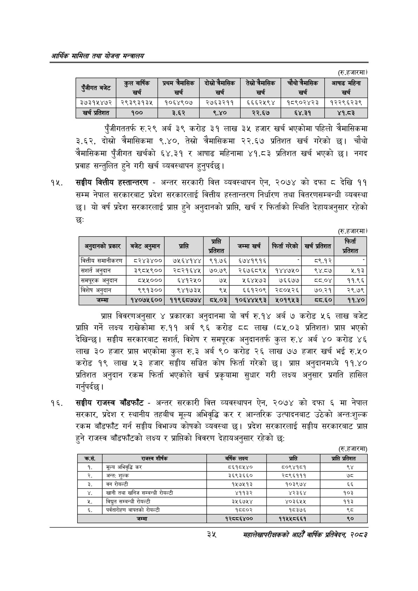

# Page 57 QA

## Rendered page


## Extracted text

```text
आर्थिक मामिला तथा योजना सन्चबालय
(रु.हजारमा)
पुँजीगततर्फ रु.२९ अर्ब ३९ करोड ३१ लाख ३५ हजार खर्च भएकोमा पहिलो त्रैमासिकमा ३.६२, दोस्रो त्रैमासिकमा ९.४०, तेस्रो त्रैमासिकमा २२.६७ प्रतिशत खर्च गरेको चौथो चैमासिकमा पुँजीगत खर्चको ६४.३१ र आषाढ महिनामा ४१.८३ प्रतिशत खर्च भएको नगद प्रवाह सन्तुलित हुने गरी खर्च व्यवस्थापन हुनुपर्दछ |
सङ्घीय वित्तीय हस्तान्तरण -अन्तर सरकारी वित्त व्यवस्थापन ऐन, २०७४ को दफा © देखि ९९ सम्म नेपाल सरकारबाट प्रदेश सरकारलाई वित्तीय हस्तान्तरण निर्धारण तथा वितरणसम्बन्धी व्यवस्था छ। यो वर्ष प्रदेश सरकारलाई प्राप्त हुने अनुदानको प्राप्ति, खर्च र फिर्ताको स्थिति देहायअनुसार रहेको छः
(रु.हजारमा)
प्रापत विवरणअनुसार ४ प्रकारका अनुदानमा यो वर्ष रु.१४ अर्ब ७ करोड ५६ लाख बजेट प्राप्ति गर्ने लक्ष्य राखेकोमा रु.११ अर्ब ९६ करोड ६ लाख (८५.०३ प्रतिशत) प्राप भएको देखिन्छ। सङ्घीय सरकारबाट सशर्त, विशेष र समपूरक अनुदानतर्फ कुल रु.४ अर्ब ४० करोड ४६ लाख ३० हजार प्राप्त भएकोमा कुल रु.३ अर्ब ९० करोड २६ लाख ७७ हजार खर्च भई रु.५० करोड १९ लाख ५३ हजार सङ्घीय सञ्चित कोष फिर्ता गरेको छ। प्राप्त अनुदानमध्ये ११.४० प्रतिशत अनुदान रकम फिर्ता भएकोले खर्च प्रकृयामा सुधार गरी लक्ष्य अनुसार प्रगति हासिल गर्नुपर्दछ |
सङ्घीय राजस्व बाँडफाँट -अन्तर सरकारी वित्त व्यवस्थापन ऐन, २०७४ को दफा मा नेपाल सरकार, प्रदेश र स्थानीय तहबीच मूल्य अभिवृद्धि कर र आन्तरिक उत्पादनबाट उठेको अन्तशुल्क रकम बाँडफाँट गर्न सङ्घीय विभाज्य कोषको व्यवस्था छ। प्रदेश सरकारलाई सङ्घीय सरकारबाट प्राप्त हुने राजस्व बाँडफाँटको लक्ष्य र प्राप्तिको विवरण देहायअनुसार रहेको छ:
(रु.हजारमा)
३२५
महालेखापरीक्षकको आठौँ वाषिकि प्रतिवेदन २०८२

| रजीगत बजेट | खर्च | प्रथम जनासिक खर्च | दोस्रो जनासिक खर्च | तेख्रो नेनासिक खर्च | नेनासिक खर्च | आषाढ महिना खर्च |
| --- | --- | --- | --- | --- | --- | --- |
| ३७३१५४७२ | २९३९३१३५ | १०६४९०७ | २७६३२११ | ६६६२५९४ | १८९०२४२३ | १२२९६२३९ |
| खर्च प्रतिशत | १०० | ३.६२ | ९,४० | २२.६७ | ६४.३१ | ९.५३ |

| अनुकानको प्रकार | बजेट अनुमान | प्रासति | पि | जम्मा खर्च | फिर्ता गरेको | खर्च प्रतिशत | पा |
| --- | --- | --- | --- | --- | --- | --- | --- |
| वित्तीय समानीकरण | ८र२४३४०० | ७५६४१४४ | ९१.७६ | ६७४१९१६ |  | ८९.१२ |  |
| सशर्त अनुदान | ३९८५९०० | २८२१६४५ | ७०.७९ | २६७६८९५ | १४४७५० | १४.८७ | €९३ |
| खमपूरक अनुदान | ८५५००० | ६५४१२५० | ७५ | ५६४५७३ | ७६६७४ | दय.०४ | ११.९६ |
| विशेष अनुदान | ९९१३०० | ९४१७३५ | ९५ | ६६१२०९ | २८०५२६ | ७०.२१ | २९.७९ |
| जम्मा | १४०७५६०० | ११९६८७७४ | ८५.०३ | १०६४४५९३ | २५०१९५३ | घ्य.६० | ११.४० |

|  | राजस्व शीर्षक | वर्षिक लक्ष्य | प्राप्ति | प्रापि प्रतिशत |
| --- | --- | --- | --- | --- |
| १. | मूल्य अभिवृद्धि कर | ८६१८५४० | ८०९४१८१ | ९४ |
| २. | अन्त: शुल्क | ३६९३६६० | २८९६१११ |  |
| डे. | बन रोयल्टी | १५७५१३ | १०३९७४ | ६६ |
| ४. | खानी तथा खनिज सम्बन्धी रोयल्टी | ४११३२ | ४२३६४ | १०३ |
| ९. | विद्युत सम्बन्धी रोयल्टी | ३५६७५४ | ४०३६५५ | ११३ |
| ६. | पर्वतारोहण बापतको रोयल्टी | १८८०२ | १८३७६ | २५ |
|  | जम्मा | १२८८६४०० | ११५४५८६६१ | ९० |
```

## Flags
- table_page
- medium_quality_table
