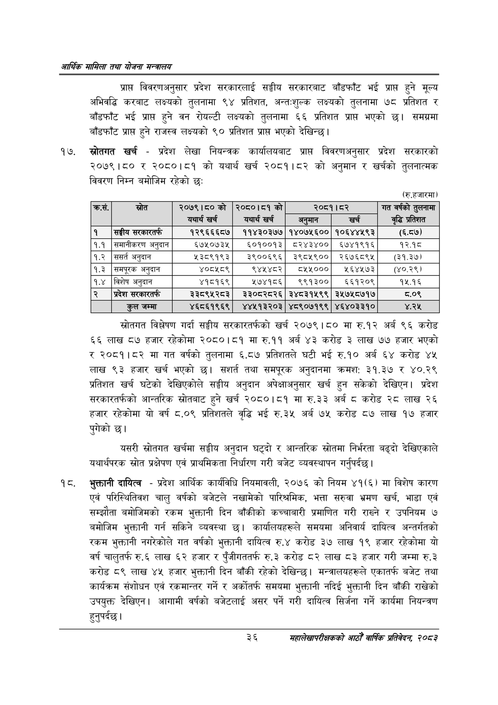

# Page 58 QA

## Rendered page


## Extracted text

```text
आर्थिक मामिला तथा योजना सन्चबालय
प्रापत विवरणअनुसार प्रदेश सरकारलाई सङ्घीय सरकारबाट बाँडफाँट भई प्राप्त हुने मूल्य अभिवद्धि करबाट लक्ष्यको तुलनामा ९४ प्रतिशत, अन्तःशुल्क लक्ष्यको तुलनामा ७८ प्रतिशत र बाँडफाँट भई प्राप्त हुने वन रोयल्टी लक्ष्यको तुलनामा ६६ प्रतिशत भएको छ। समग्रमा बाँडफाँट प्राप्त हुने राजस्व लक्ष्यको ९० प्रतिशत प्राप्त भएको देखिन्छ।
स्रोतगत खर्च -प्रदेश लेखा नियन्त्रक कार्यालयबाट प्राप्त विवरणअनुसार प्रदेश सरकारको २०७९।८० र २०८०।८१ को यथार्थ खर्च २०८१।८२ को अनुमान र खर्चको तुलनात्मक विवरण निम्न बमोजिम रहेको छ:
(रुू.हजारमा)
स्रोतगत विश्लेषण गर्दा सङ्घीय सरकारतर्फको खर्च २०७९।८० रु.१२ अर्ब ९६ करोड ६६ लाख ८७ हजार रहेकोमा २०८०।८१ मा रु.११ अर्ब ४३ करोड ३ लाख ७७ हजार भएको र २०८१।८२ मा गत वर्षको तुलनामा ६.८७ प्रतिशतले घटी भई रु.१० अर्ब ६४ करोड ४५ लाख ९३ हजार खर्च भएको | तथा समपूरक अनुदानमा क्रमश: ३१.३७ ४०.२९ प्रतिशत खर्च घटेको देखिएकोले सङ्घीय अनुदान अपेक्षाअनुसार खर्च हुन सकेको देखिएन। प्रदेश सरकारतर्फको आन्तरिक स्रोतबाट हुने खर्च २०८०।८१ मा रु.३३ अर्ब ८ करोड २८ लाख २६ हजार रहेकोमा यो वर्ष ८.०९ प्रतिशतले वृद्धि भई रु.३५ अर्ब ७५ करोड ८७ लाख १७ हजार पुगेको छ।
यसरी स्रोतगत खर्चमा सङ्घीय अनुदान घट्दो र आन्तरिक स्रोतमा निर्भरता बढ्दो देखिएकाले यथार्थपरक स्रोत प्रक्षेपण एवं प्राथमिकता निर्धारण गरी बजेट व्यवस्थापन गर्नुपर्दछ |
१८, भुक्तानी दायित्व -प्रदेश आर्थिक कार्यविधि नियमावली, २०७६ को नियम ४१(६) मा विशेष कारण एवं परिस्थितिवश चालु वर्षको बजेटले नखामेको पारिश्रमिक, भत्ता सरुवा भ्रमण खर्च, भाडा एवं सम्झौता बमोजिमको रकम भुक्तानी दिन बाँकीको कच्चाबारी प्रमाणित गरी राख्ने र उपनियम ७ बमोजिम भुक्तानी गर्न सकिने व्यवस्था छ। कार्यालयहरूले समयमा अनिवार्य दायित्व अन्तर्गतको रकम भुक्तानी नगरेकोले गत वर्षको भुक्तानी दायित्व रु.४ करोड ३७ लाख १९ हजार रहेकोमा यो वर्ष चालुतर्फ रु.६ लाख ६२ हजार र पुँजीगततर्फ रु.३ करोड ८२ लाख ८३ हजार गरी जम्मा रु.३ करोड ८९ लाख ४५ हजार भुक्तानी दिन बाँकी रहेको देखिन्छ। मन्त्रालयहरूले एकातर्फ बजेट तथा कार्यक्रम संशोधन एवं रकमान्तर गर्ने र अर्कोतर्फ समयमा भुक्तानी नदिई भुक्तानी दिन बाँकी राखेको उपयुक्त देखिएन। आगामी वर्षको बजेटलाई असर पर्ने गरी दायित्व सिर्जना गर्ने कार्यमा नियन्त्रण हुनुपर्दछ।
३६
महालेखापरीक्षकको आठौँ वाषिकि प्रतिवेदन २०८२

| क्रस. | स्रोत | २०७९।८०को यथार्थ खर्च | २०८०।८१ को यथार्थ खर्च | अनुमान | २०८१।८२ खर्च | गत वर्षको पुसनामा वृद्धि प्रतिशत |
| --- | --- | --- | --- | --- | --- | --- |
| १ | सङ्घीय सरकारतर्फ | १२९६६६८७ | ११४३०३७७ | १४०७५६०० | १०६४४५९३ | (६.८७) |
| १.१ | समानीकरण अनुदान | ६७५०७३५ | ६०१००१३ | ८२४३४०० | ६७४१९१६ | १२.१८ |
| १.२ | ससर्त अनुदान | ५३८९१९३ | ३९००६९६ | ३९८५९०० | २६७६८९५ | (३१.३७) |
| १.३ | चभपूरक अनुदान | ४०८५८९ | ९४४५४८२ | ८४२४५००० | २५६४५७३ | (०.३%) |
| १.४ | विशेष अनुदान | ४१८१६९ | २७४१८६ | ९९१३०० | ६६१२०९ | १५.१६ |
| २ | प्रदेश सरकारतर्फ | ३३८९५२८३ | ३३०८२८२६ | ३४८३१५९९ | ३५७५८७१७ | ८.०९ |
|  | कुल जम्मा | ४६८६१९६९ | ४४५१३२०३ | ४८९०७१९९ | ४६४०३३१० | ४.२५ |
```

## Flags
- table_page
- medium_quality_table
