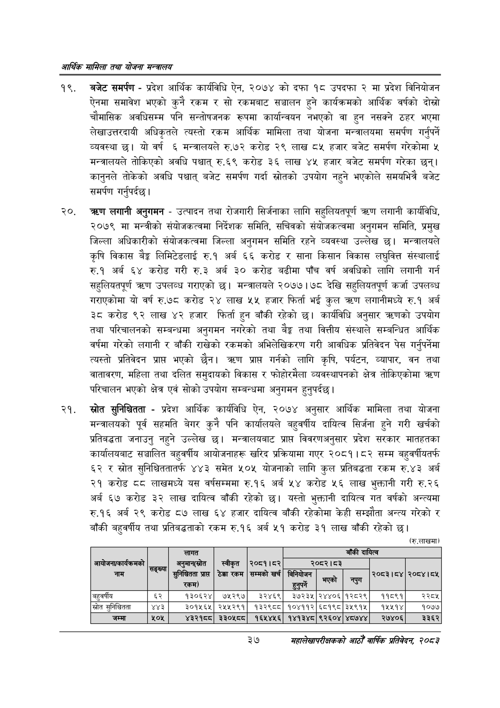

# Page 59 QA

## Rendered page


## Extracted text

```text
आर्थिक मामिला तथा योजना सन्चबालय
बजेट समर्पण -प्रदेश आर्थिक कार्यविधि ऐन, २०७४ को दफा १८ उपदफा २ मा प्रदेश विनियोजन ऐनमा समावेश भएको कुनै रकम र सो रकमबाट सञ्चालन हुने कार्यक्रमको आर्थिक वर्षको दोस्रो चौमासिक अवधिसम्म पनि सन्तोषजनक रूपमा कार्यान्वयन नभएको वा हुन नसक्ने ठहर भएमा लेखाउत्तरदायी अधिकृतले त्यस्तो रकम आर्थिक मामिला तथा योजना मन्त्रालयमा समर्पण गर्नुपर्ने व्यवस्था | यो वर्ष ६ मन्त्रालयले रु.७२ करोड २९ लाख ८५ हजार बजेट समर्पण गरेकोमा ५ मन्त्रालयले तोकिएको अवधि पश्चात्‌ रु.६९ करोड ३६ लाख ४५ हजार बजेट समर्पण गरेका छन्‌। कानुनले तोकेको अवधि पश्चात्‌ बजेट समर्पण गर्दा स्रोतको उपयोग नहुने भएकोले समयभित्रै बजेट समर्पण गर्नुपर्दछ |
करण लगानी अनुगमन -उत्पादन तथा रोजगारी सिर्जनाका लागि सहुलियतपूर्ण तरण लगानी कार्यविधि, २०७९ मा मन्त्रीको संयोजकत्वमा निर्देशक समिति, सचिवको संयोजकत्वमा अनुगमन समिति, प्रमुख जिल्ला अधिकारीको संयोजकत्वमा जिल्ला अनुगमन समिति रहने व्यवस्था उल्लेख छ। मन्त्रालयले कृषि विकास ३ लिमिटेडलाई रु.१ अर्ब ६६ करोड र साना किसान विकास लघुवित्त संस्थालाई रु.१ अर्ब ६४ करोड गरी रु.३ अर्ब ३० करोड बढीमा पाँच वर्ष अवधिको लागि लगानी गर्न सहुलियतपूर्ण त्रधण उपलव्ध गराएको छ। मन्त्रालयले २०७७।७८ देखि सहुलियतपूर्ण कर्जा उपलब्ध गराएकोमा यो वर्ष रु.७८ करोड २४ लाख ५५ हजार फिर्ता भई कुल लगानीमध्ये रु.१ अर्ब ३ेट करोड ९२ लाख ४२ हजार फिर्ता हुन बाँकी रहेको छ। कार्यविधि अनुसार त्रहणको उपयोग तथा परिचालनको सम्बन्धमा अनुगमन नगरेको तथा ९३ तथा वित्तीय संस्थाले सम्बन्धित आर्थिक वर्षमा गरेको लगानी र बाँकी राखेको रकमको अभिलेखिकरण गरी आवधिक प्रतिवेदन पेस गर्नुपर्नेमा त्यस्तो प्रतिवेदन प्राप्त भएको छैन। तरण प्राप्त गर्नको लागि कृषि, पर्यटन, व्यापार, वन तथा वातावरण, महिला तथा दलित समुदायको विकास र फोहोरमैला व्यवस्थापनको क्षेत्र तोकिएकोमा तरण परिचालन भएको क्षेत्र एवं सोको उपयोग सम्बन्धमा अनुगमन हुनुपर्दछ |
ख्रोत सुनिश्चितता -प्रदेश आर्थिक कार्यविधि ऐन, २०७४ अनुसार आर्थिक मामिला तथा योजना मन्त्रालयको पूर्व सहमति बेगर कुनै पनि कार्यालयले बहुवर्षीय दायित्व सिर्जना हुने गरी खर्चको प्रतिबद्धता जनाउनु नहुने उल्लेख छ। मन्त्रालयबाट प्राप्त विवरणअनुसार प्रदेश सरकार मातहतका कार्यालयबाट सञ्चालित बहुवर्षीय आयोजनाहरू खरिद प्रक्रियामा गएर २०८१।८२ सम्म बहुवर्षीयतर्फ ६२ र स्रोत सुनिश्चिततातर्फ ४४३ समेत ५०५ योजनाको लागि कुल प्रतिबद्धता रकम रु.४३ अर्ब २१ करोड ८८ लाखमध्ये यस वर्षसम्ममा रु.१६ अर्ब ५४ करोड ५६ लाख भुक्तानी गरी रु.२६ अर्ब ६७ करोड ३२ लाख दायित्व बाँकी रहेको छ। यस्तो भुक्तानी दायित्व गत वर्षको अन्त्यमा रु.१६ अर्ब २९ करोड ८७ लाख ६४ हजार दायित्व बाँकी रहेकोमा केही सम्झौता अन्त्य गरेको र बाँकी बहुवर्षीय तथा प्रतिबद्धताको रकम रु.१६ अर्ब ५१ करोड ३१ लाख बाँकी रहेको छ।
(रु.लाखमा)
३७
महालेखापरीक्षकको आठौँ वाषिकि प्रतिवेदन २०८२

|  |  | लागत |  |  |  |  | बाँकी | दायित्व |  |
| --- | --- | --- | --- | --- | --- | --- | --- | --- | --- |
| आवोजनएकार्वनःलको नाम | सङ्ख्या [ | भनुभान(कोत प्राप्त रकम) | स्वीकृत ठेक्का रकम | २०८१।८२ सम्मको खर्च | (ननिबोजन = | २०८२।८३ भएको | नपुग | २०८३।८४ | २०८४।८४५ |
| जहुवर्षीय | ६२ | १३०६२४ | ७५२९७ | ३२४६९ | ३७२३५ | २४४०६ | १२८२९ | ११८९१ | २२८४ |
| स्रोत सुनिश्चितता | ४४३ | ३०१५६५ | २५५२९१ | १३२९८८ | १०४११२ | ६८१९८ | ३५९१५ | १४५५१४ | १०७४ |
| जम्मा | ५०५ | ४३२१ | ३३०४५५ | १६५४५६ | १४१३४८ | ९२६०४ | ४८७४४ | २७४०६ | ३३६२ |
```

## Flags
- table_page
- medium_quality_table
