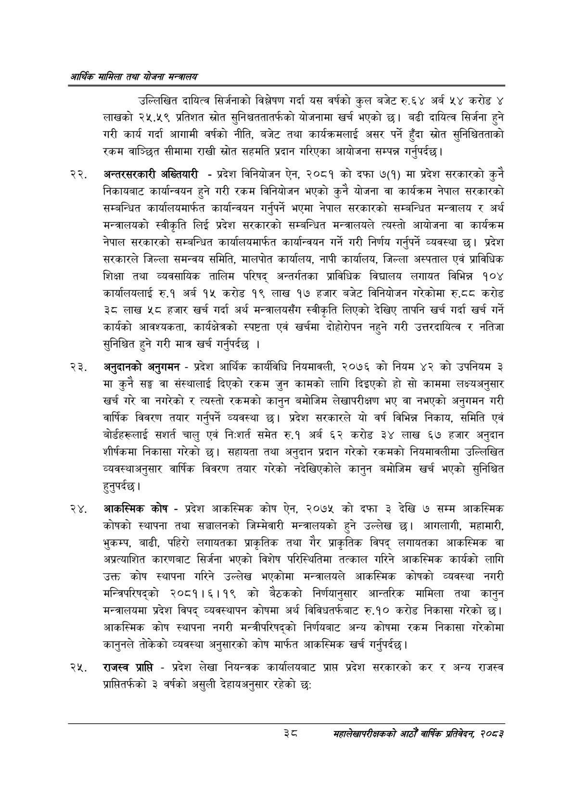

# Page 60 QA

## Rendered page


## Extracted text

```text
आर्थिक मामिला तथा योजना सन्चबालय
उल्लिखित दायित्व सिर्जनाको विश्लेषण गर्दा यस वर्षको कुल बजेट रु.६४ अर्ब ५४ करोड ४ लाखको २५.५९ प्रतिशत स्रोत सुनिश्चततातर्फको योजनामा खर्च भएको | बढी दायित्व सिर्जना हुने गरी कार्य गर्दा आगामी वर्षको नीति, बजेट तथा कार्यक्रमलाई असर पर्ने हुँदा स्रोत सुनिश्चितताको रकम वाञ्छित सीमामा राखी स्रोत सहमति प्रदान गरिएका आयोजना सम्पन्न गर्नुपर्दछ |
अन्तरसरकारी अख्तियारी -प्रदेश विनियोजन ऐन, २०८१ को दफा ७(१) मा प्रदेश सरकारको कुनै निकायबाट कार्यान्वयन हुने गरी रकम विनियोजन भएको कुनै योजना वा कार्यक्रम नेपाल सरकारको सम्बन्धित कार्यालयमार्फत कार्यान्वयन गर्नुपर्ने भएमा नेपाल सरकारको सम्बन्धित मन्त्रालय र अर्थ मन्त्रालयको स्वीकृति लिई प्रदेश सरकारको सम्बन्धित मन्त्रालयले त्यस्तो आयोजना वा कार्यक्रम नेपाल सरकारको सम्बन्धित कार्यालयमार्फत कार्यान्वयन गर्ने गरी निर्णय गर्नुपर्ने व्यवस्था छ। प्रदेश सरकारले जिल्ला समन्वय समिति, मालपोत कार्यालय, नापी कार्यालय, जिल्ला अस्पताल एवं प्राविधिक शिक्षा तथा व्यवसायिक तालिम परिषद्‌ अन्तर्गतका प्राविधिक विद्यालय लगायत विभिन्न १०४ कार्यालयलाई रु.१ अर्ब १५ करोड १९ लाख १७ हजार बजेट विनियोजन गरेकोमा रु.दटद करोड ३८ लाख ५८ हजार खर्च गर्दा अर्थ मन्त्रालयसँग स्वीकृति लिएको देखिए तापनि खर्च गर्दा खर्च गर्ने कार्यको आवश्यकता, कार्यक्षेत्रको स्पष्टता एवं खर्चमा दीहोरोपन नहुने गरी उत्तरदायित्व र नतिजा सुनिश्चित हुने गरी मात्र खर्च गर्नुपर्दछ।
अनुदानको अनुगमन -प्रदेश आर्थिक कार्यविधि नियमावली, २०७६ को नियम ४२ को उपनियम ३ मा कुनै सङ्घ वा संस्थालाई दिएको रकम जुन कामको लागि दिइएको हो सो काममा लक्ष्यअनुसार खर्च गरे वा नगरेको र त्यस्तो रकमको कानुन बमोजिम लेखापरीक्षण भए वा नभएको अनुगमन गरी वार्षिक विवरण तयार गर्नुपर्ने व्यवस्था छ। प्रदेश सरकारले यो वर्ष विभिन्न निकाय, समिति एवं बोर्डहरूलाई सशार्त चालु एवं निःशर्त समेत रु.१ अर्ब ६२ करोड ३४ लाख ६७ हजार अनुदान शीर्षकमा निकासा गरेको छ। सहायता तथा अनुदान प्रदान गरेको रकमको नियमावलीमा उल्लिखित व्यवस्थाअनुसार वार्षिक विवरण तयार गरेको नदेखिएकोले कानुन बमोजिम खर्च भएको सुनिश्चित हुनुपर्दछ |
आकस्मिक कोष -प्रदेश आकस्मिक कोष ऐन, २०७५ को दफा ३ देखि ७ सम्म आकस्मिक कोषको स्थापना तथा सञ्चालनको जिम्मेवारी मन्त्रालयको हुने उल्लेख छ। आगलागी, महामारी, भुकम्प, बाढी, पहिरो लगायतका प्राकृतिक तथा गैर प्राकृतिक विपद्‌ लगायतका आकस्मिक वा अप्रत्याशित कारणबाट सिर्जना भएको विशेष परिस्थितिमा तत्काल गरिने आकस्मिक कार्यको लागि उक्त कोष स्थापना गरिने उल्लेख भएकोमा मन्त्रालयले आकस्मिक कोषको व्यवस्था नगरी मन्त्रिपरिषद्को २०८१।६११९ को बैठकको निर्णयानुसार आन्तरिक मामिला तथा कानुन मन्त्रालयमा प्रदेश विपद्‌ व्यवस्थापन कोषमा अर्थ विविधतर्फबाट रु.१० करोड निकासा गरेको आकस्मिक कोष स्थापना नगरी मन्त्रीपरिषद्को निर्णयबाट अन्य कोषमा रकम निकासा गरेकोमा कानुनले तोकेको व्यवस्था अनुसारको कोष मार्फत आकस्मिक खर्च गर्नुपर्दछ |
राजस्व प्राप्ति -प्रदेश लेखा नियन्त्रक कार्यालयबाट प्राप्त प्रदेश सरकारको कर र अन्य राजस्व प्राप्तितर्फको ३ वर्षको असुली देहायअनुसार रहेको छ:
्ट
महालेखापरीक्षकको आठौँ वाषिकि प्रतिवेदन २०८२
```

## Flags
- None
