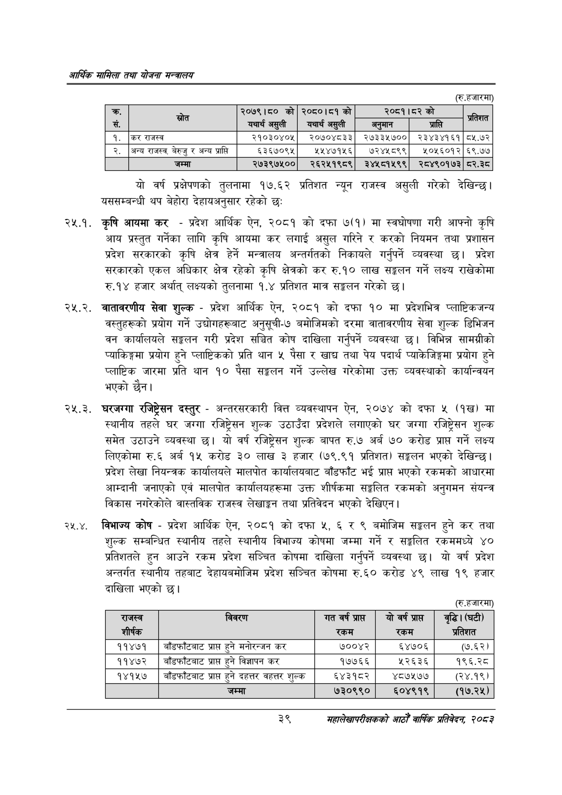

# Page 61 QA

## Rendered page


## Extracted text

```text
आर्थिक मामिला तथा योजना सन्चबालय
(रु.हजारमा)
यो वर्ष प्रक्षेपणको तुलनामा १७.६२ प्रतिशत न्यून राजस्व असुली गरेको देखिन्छ। यससम्बन्धी थप बेहोरा देहायअनुसार रहेको छः
२२५.१. कृषि आयमा कर -प्रदेश आर्थिक ऐन, २०८१ को दफा ७(१) मा स्वघोषणा गरी आफ्नो कृषि आय प्रस्तुत गर्नेका लागि कृषि आयमा कर लगाई असुल गरिने र करको नियमन तथा प्रशासन प्रदेश सरकारको कृषि क्षेत्र हेर्ने मन्त्रालय अन्तर्गतको निकायले गर्नुपर्ने व्यवस्था छ। प्रदेश सरकारको एकल अधिकार क्षेत्र रहेको कृषि क्षेत्रको कर रु.१० लाख सङ्कलन गर्ने लक्ष्य राखेकोमा रु.१४ हजार अर्थात्‌ लक्ष्यको तुलनामा १.४ प्रतिशत मात्र सङ्कलन गरेको |
२५.२. वातावरणीय सेवा शुल्क -प्रदेश आर्थिक ऐन, २०८१ को दफा १० मा प्रदेशभित्र प्लाष्टिकजन्य वस्तुहरूको प्रयोग गर्ने उद्योगहरूबाट अनुसूची-७ बमोजिमको दरमा वातावरणीय सेवा शुल्क डिभिजन वन कार्यालयले सङ्कलन गरी प्रदेश सञ्चित कोष दाखिला गर्नुपर्ने व्यवस्था छ। विभिन्न सामग्रीको प्याकिङ्गमा प्रयोग हुने प्लाष्टिकको प्रति थान ५ पैसा र खाद्य तथा पेय पदार्थ प्याकेजिङ्गमा प्रयोग हुने प्लाष्टिक जारमा प्रति थान १० पैसा सङ्कलन गर्ने उल्लेख गरेकोमा उक्त व्यवस्थाको कार्यान्वयन भएको छैन।
२२५.३. घरजग्गा रजिष्ट्रेसन दस्तुर -अन्तरसरकारी वित्त व्यवस्थापन ऐन, २०७४ को दफा ५ (१ख) मा स्थानीय तहले घर जग्गा रजिष्ट्रेसन शुल्क उठाउँदा प्रदेशले लगाएको घर जग्गा रजिष्ट्रेसन शुल्क समेत उठाउने व्यवस्था | यो वर्ष रजिष्ट्रेसन शुल्क बापत रु.७ अर्ब ७० करोड प्राप्त गर्ने लक्ष्य लिएकोमा रु.६ अर्ब १५ करोड ३० लाख ३ हजार (७९.९१ प्रतिशत) भएको देखिन्छ। प्रदेश लेखा नियन्त्रक कार्यालयले मालपोत कार्यालयबाट बाँडफाँट भई प्रापत भएको रकमको आधारमा आम्दानी जनाएको एवं मालपोत कार्यालयहरूमा उक्त शीर्षकमा सङ्कलित रकमको अनुगमन संयन्त्र विकास नगरेकोले वास्तविक राजस्व लेखाङ्गन तथा प्रतिवेदन भएको देखिएन |
२५.४, विभाज्य कोष -प्रदेश आर्थिक ऐन, २०८१ को दफा ५, ६ र ९ बमोजिम सङ्कलन हुने कर तथा शुल्क सम्बन्धित स्थानीय तहले स्थानीय विभाज्य कोषमा जम्मा गर्ने र सङ्कलित रकममध्ये प्रतिशतले हुन आउने रकम प्रदेश सञ्चित कोषमा दाखिला गर्नुपर्ने व्यवस्था छ। यो वर्ष प्रदेश अन्तर्गत स्थानीय तहबाट देहायबमोजिम प्रदेश सञ्चित कोषमा रु.६० करोड ४९ लाख १९ हजार दाखिला भएको छ।
(रु.हजारमा)
३९
महालेखापरीक्षकको आठौँ वाषिकि प्रतिवेदन २०८२

| रस. | स्रोत | २०७९।८० को यथार्थ असुली | २०८०।८१ को यथार्थ असुली | ३०५९१५३ अनुमान | को प्राप्ति | प्रतिशत |
| --- | --- | --- | --- | --- | --- | --- |
| १. | कर राजस्व | २१०३०४०५ | २०७०४८३३ | २७३३५७०० | २३४३४१६१ | ८५.७२ |
| २. | अन्य राजस्व, बेरुजु र अन्य प्राप्त | ६३६७०९४५ | २२४७१५६ | ७२४५८९९ | २०५६०१२ | ६९.७७ |
|  | जम्मा | २७३९७५०० | २६२५१९८९ | ३४४५८१५९९ | २८४९०१७३ | .३ |

| राजस्व शीर्षक | विवरण | गत वर्ष प्रा रकम | योर्क प्राप रकम | वृद्धि। (घटी) प्रतिशत |
| --- | --- | --- | --- | --- |
| ११४७१ | नाँडफाँटबाट प्राप्त हुने मनोरन्जन कर | ७००४२ | ६४७०६ | (७.६५२। |
| ११४७२ | नाँडफाँटबाट प्राप्त हुने विज्ञापन कर | १७७६६ | २२६३६ | १९६.२८ |
| १४१५७ | नाँडफाँटबाट प्राप्त हुने दहत्तर वहत्तर शुल्क | ६४३१८२ | ४८७५७७ | (२४.१९) |
|  | जम्मा | ७३०९९० | ६०४९१९ | (१७.२५) |
```

## Flags
- table_page
- medium_quality_table
