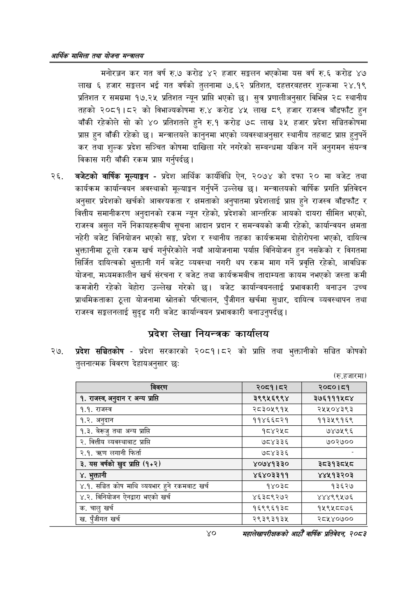

# Page 62 QA

## Rendered page


## Extracted text

```text
आर्थिक मामिला तथा योजना सन्चबालय
मनोरञ्जन कर गत वर्ष रु.७ करोड ४२ हजार सङ्कलन भएकोमा यस वर्ष रु.६ करोड ४७ लाख ६ हजार सङ्गलन भई गत वर्षको तुलनामा ७.६२ प्रतिशत, दहत्तरबहत्तर शुल्कमा २४.१९ प्रतिशत र समग्रमा १७.२५ प्रतिशत न्यून प्राप्ति भएको छ। सुत्र प्रणालीअनुसार विभिन्न २८ स्थानीय तहको २०८१।८२ को विभाज्यकोषमा रु.४ करोड ४५ लाख ८९ हजार राजस्व बाँडफाँट हुन बाँकी रहेकोले सो को ४० प्रतिशतले हुने रु.१ करोड ७८ लाख ३५ हजार प्रदेश सञ्चितकोषमा प्राप्त हुन बाँकी रहेको | मन्त्रालयले कानुनमा भएको व्यवस्थाअनुसार स्थानीय तहबाट प्राप्त हुनुपर्ने कर तथा शुल्क प्रदेश सञ्चित कोषमा दाखिला गरे नगरेको सम्बन्धमा यकिन गर्ने अनुगमन संयन्त्र विकास गरी बाँकी रकम प्राप्त गर्नुपर्दछ।
बजेटको वार्षिक मूल्याङ्गन -प्रदेश आर्थिक कार्यविधि ऐन, २०७४ को दफा २० मा बजेट तथा कार्यक्रम कार्यान्वयन अवस्थाको मूल्याङ्कन गर्नुपर्ने उल्लेख | मन्त्रालयको वार्षिक प्रगति प्रतिवेदन अनुसार प्रदेशको खर्चको आवश्यकता र क्षमताको अनुपातमा प्रदेशलाई प्राप्त हुने राजस्व बाँडफाँट र वित्तीय समानीकरण अनुदानको रकम न्युन रहेको, प्रदेशको आन्तरिक आयको दायरा सीमित भएको, राजस्व असुल गर्ने निकायहरूबीच सूचना आदान प्रदान र समन्वयको कमी रहेको, कार्यान्वयन क्षमता नहेरी बजेट विनियोजन भएको सङ्ग, प्रदेश र स्थानीय तहका कार्यक्रममा दोहोरोपना भएको, दायित्व भुक्तानीमा ठूलो रकम खर्च गर्नुपरेकोले नयाँ आयोजनामा पर्याप्त विनियोजन हुन नसकेको र विगतमा सिर्जित दायित्वको भुक्तानी गर्न बजेट व्यवस्था नगरी थप रकम माग गर्ने प्रवृत्ति रहेको, आवधिक योजना, मध्यमकालीन खर्च संरचना र बजेट तथा कार्यक्रमबीच तादाम्यता कायम नभएको जस्ता कमी कमजोरी रहेको बेहोरा उल्लेख गरेको छ। बजेट कार्यान्वयनलाई प्रभावकारी बनाउन उच्च प्राथमिकताका ठूला योजनामा स्रोतको परिचालन, पुँजीगत खर्चमा सुधार, दायित्व व्यवस्थापन तथा राजस्व सङ्कलनलाई सुदृढ गरी बजेट कार्यान्वयन प्रभावकारी बनाउनुपर्दछ |
प्रदेश लेखा नियन्त्रक कार्यालय
२७, प्रदेश सञ्चितकोष -प्रदेश सरकारको २०८१।८२ को प्राप्ति तथा भुक्तानीको सञ्चित कोषको तुलनात्मक विवरण देहायअनुसार छः
(रु.हजारमा)
४०
महालेखापरीक्षकको आठौँ वाषिकि प्रतिवेदन २०८२

| विवरण | २०८१।८२ | २०८०।८१ |
| --- | --- | --- |
| १. राजस्व, अनुदान र अन्य प्राप्ति | ३९९५६९९४ | ३७६१११५८४ |
| १.१. राजस्व | २८३०५९१५ | २५५०४३९३ |
| १.२. अनुदान | ११४६६८२१ | ११३५९१६९ |
| १.३. बेरूजु तथा अन्य प्राप्ति | १८४२५८ | ७४७५९६ |
| २. वित्तीय व्यवस्थाबाट प्राप्ति | ७८४३३६ | ७०२७०० |
| २.१. लगानी फिर्ता | ७८४३३६ |  |
| ३. यस वर्षको खुद प्राप्ति (१५२) | ४०७४१३३० | ३५३९३५४५ |
| ४. भुक्तानी | ४६४०३३११ | ४४५१३२०३ |
| ४.१. सञ्चित कोष माथि व्ययभार हुने ९क४१।८ खर्च | १४०३८ | १३६२७ |
| ४.२. विनिबोजन ऐनद्वारा भएको खर्च | ४६३८९२७२ | ४४४९९५७६ |
| 'क. चालु खर्च | १६९९६१३८ | १५९५८८७६ |
| 'ख. पुँजीगत खर्च | २९३९३१३४५ | २८५४०७०० |
```

## Flags
- table_page
- medium_quality_table
