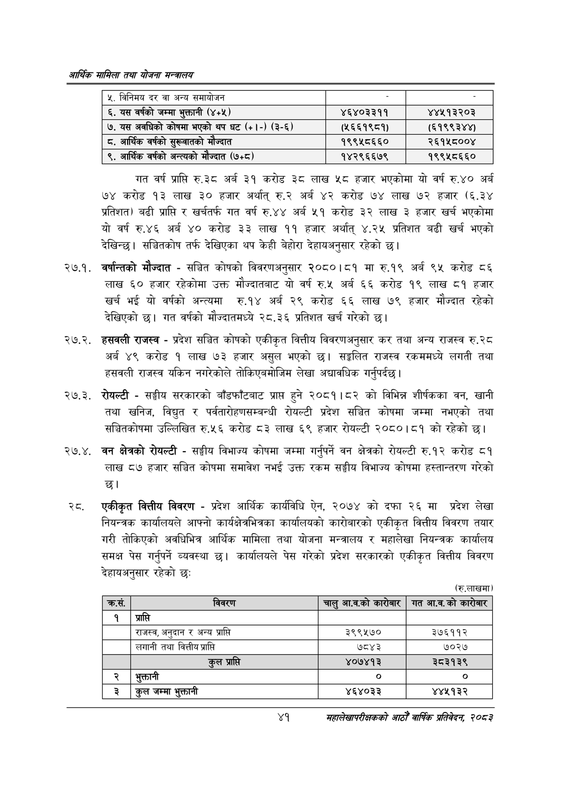

# Page 63 QA

## Rendered page


## Extracted text

```text
आर्थिक मामिला तथा योजना सन्चबालय
गत वर्ष प्राप्ति रु.३८ अर्ब ३१ करोड ३८ लाख ५८ हजार भएकोमा यो वर्ष रु.४० अर्ब ७४ करोड ९३ लाख ३० हजार अर्थात्‌ रु.२ अर्ब करोड ७४ लाख ७२ हजार (६.३४ प्रतिशत) बढी प्राप्ति र खर्चतर्फ गत वर्ष रु.४४ अर्ब ५१ करोड ३२ लाख ३ हजार खर्च भएकोमा यो वर्ष रु.४६ अर्ब ४० करोड ३३ लाख ११ हजार अर्थात्‌ ४.२५ प्रतिशत बढी खर्च भएको देखिन्छ। सञ्चितकोष तर्फ देखिएका थप केही बेहोरा देहायअनुसार रहेको |
२७.१. वर्षान्तको मौज्दात -सञ्चित कोषको विवरणअनुसार २०८०।८१ मा रु.१९ अर्ब ९५ करोड ८६ लाख ६० हजार रहेकोमा उक्त मौज्दातबाट यो वर्ष रु.५ अर्ब ६६ करोड १९ लाख ८१ हजार खर्च भई यो वर्षको अन्त्यमा रु.१४ अर्ब २९ करोड ६६ लाख ७९ हजार मौज्दात रहेको देखिएको छ। गत वर्षको मौज्दातमध्ये २८.३६ प्रतिशत खर्च गरेको
२७.२. हसवली राजस्व -प्रदेश सञ्चित कोषको एकीकृत वित्तीय विवरणअनुसार कर तथा अन्य राजस्व रु.२८ अर्ब ४९ करोड १ लाख ७३ हजार असुल भएको | सङ्गलित राजस्व रकममध्ये लगती तथा हसवली राजस्व यकिन नगरेकोले तोकिएबमोजिम लेखा अद्यावधिक गर्नुपर्दछ।
३. रोयल्टी -सङ्घीय सरकारको बाँडफाँटबाट प्राप्त हुने २०८१।८२ को विभिन्न शीर्षकका वन, खानी तथा खनिज, विद्युत र पर्वतारोहणसम्बन्धी रोयल्टी प्रदेश सञ्चित कोषमा जम्मा नभएको तथा सञ्चितकोषमा उल्लिखित रु.५६ करोड ८३ लाख ६९ हजार रोयल्टी २०८०।८१ को रहेको छ।
२७.४. वन क्षेत्रको रोयल्टी -सङ्घीय विभाज्य कोषमा जम्मा गर्नुपर्ने वन क्षेत्रको रोयल्टी रु.१२ करोड ८१ लाख ८७ हजार सञ्चित कोषमा समावेश नभई उक्त रकम सङ्घीय विभाज्य कोषमा हस्तान्तरण गरेको छ।
रट. एकीकृत वित्तीय विवरण -प्रदेश आर्थिक कार्यविधि ऐन, २०७४ को दफा २६ मा प्रदेश लेखा नियन्त्रक कार्यालयले आफ्नो कार्यक्षेत्रभित्रका कार्यालयको कारोबारको एकीकृत वित्तीय विवरण तयार गरी तोकिएको अवधिभित्र आर्थिक मामिला तथा योजना मन्त्रालय र महालेखा नियन्त्रक कार्यालय समक्ष पेस गर्नुपर्ने व्यवस्था छ। कार्यालयले पेस गरेको प्रदेश सरकारको एकीकृत वित्तीय विवरण देहायअनुसार रहेको छः
(रु.लाखमा)
४१
महालेखापरीक्षकको आठौँ वाषिकि प्रतिवेदन २०८२

| ५, विनिमय दर वा अन्य समाचीजन |  |  |
| --- | --- | --- |
| ६. यस वर्षको जम्मा भृक्तानी (४५५) | ४६४०३३११ | ४४५१३२०३ |
| ७. यस अवधिको कोषमा भएको थप घट (+१-) (३-६) | (५६६१९८१) | (६१९९३४४) |
| ८. आर्थिक वर्षको सुरूवातको मंज्दात | १९९५८६६० | २६१५८००४ |
| ९, आर्थिक वर्षको अन्त्यको मेज्दात (७४८) | १४२९६६७९ | १९९५८६६० |

| क्रस. | विवरण | चाट आ.व.को कारेजार | गत आ.व.को कारोबार |
| --- | --- | --- | --- |
| १ | प्राप्ति |  |  |
|  | राजस्व, अनुदान र अन्य प्राप्ति | ३९९५७० | ३७६११२ |
|  | लगानी तथा वित्तीय प्राप्ति | ७८४३ | ७०२७ |
|  | उल प्राप्ति | ४०७४१३ | ३८३१३९ |
| २ | शुक्तानी |  | ० |
| ३ | कुल जम्मा भुक्तानी | ४६४०३३ | ४४५१३२ |
```

## Flags
- table_page
- medium_quality_table
