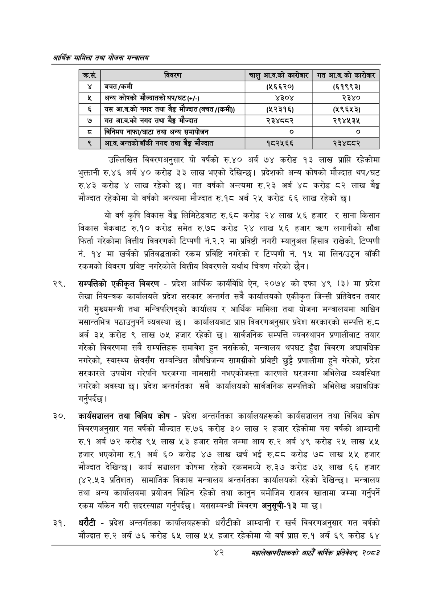

# Page 64 QA

## Rendered page


## Extracted text

```text
आर्थिक मामिला तथा योजना सन्चबालय
उल्लिखित विवरणअनुसार यो वर्षको रु.४० अर्ब ७४ करोड १३ लाख प्राप्ति रहेकोमा भुक्तानी रु.४६ अर्ब ४० करोड ३३ लाख भएको देखिन्छ। प्रदेशको अन्य कोषको मौज्दात थप/घट रु.४३ करोड लाख रहेको गत वर्षको अन्त्यमा रु.२३ अर्ब ४८ करोड ८२ लाख % मौज्दात रहेकोमा यो वर्षको अन्त्यमा मौज्दात रु.१८ अर्ब २५ करोड ६६ लाख रहेको छ।
यो वर्ष कृषि विकास ३ लिमिटेडबाट रु.६८ करोड २४ लाख ५६ हजार र साना किसान विकास बैंकबाट रु.१० करोड समेत रु.७८ करोड २४ लाख ५६ हजार लगानीको साँवा फिर्ता गरेकोमा वित्तीय विवरणको टिप्पणी नं.२.२ मा प्रविष्टी नगरी म्यानुअल हिसाव राखेको, टिप्पणी नं. १४ मा खर्चको प्रतिबद्धताको रकम प्रविष्टि नगरेको र टिप्पणी नं. १५ मा लिन/उठ्न बाँकी रकमको विवरण प्रविष्ट नगरेकोले वित्तीय विवरणले यर्थाथ चित्रण गरेको छैन।
सम्पत्तिको एकीकृत विवरण -प्रदेश आर्थिक कार्यविधि ऐन, २०७४ को दफा ४९ (३) मा प्रदेश लेखा नियन्त्रक कार्यालयले प्रदेश सरकार अन्तर्गत सबै कार्यालयको एकीकृत जिन्सी प्रतिवेदन तयार गरी मुख्यमन्त्री तथा मन्त्रिपरिषद्को कार्यालय र आर्थिक मामिला तथा योजना मन्त्रालयमा आधिन मसान्तभित्र पठाउनुपर्ने व्यवस्था छ। कार्यालयबाट प्राप्त विवरणअनुसार प्रदेश सरकारको सम्पत्ति रु.८ अर्ब ३५ करोड ९ लाख ७५ हजार रहेको छ। सार्वजनिक सम्पत्ति व्यवस्थापन प्रणालीबाट तयार गरेको विवरणमा सबै सम्पत्तिहरू समावेश हुन नसकेको, मन्त्रालय थपघट हुँदा विवरण अद्यावधिक नगरेको, स्वास्थ्य क्षेत्रसँग सम्बन्धित औषधिजन्य सामग्रीको प्रविष्टी छुट्टै प्रणालीमा हुने गरेको, प्रदेश सरकारले उपयोग गरेपनि घरजग्गा नामसारी नभएकोजस्ता कारणले घरजग्गा अभिलेख व्यवस्थित नगरेको अवस्था | प्रदेश अन्तर्गतका सबै कार्यालयको सार्वजनिक सम्पत्तिको अभिलेख अद्यावधिक गर्नुपर्दछ |
कार्यसञ्चालन तथा विविध कोष -प्रदेश अन्तर्गतका कार्यालयहरूको कार्यसञ्चालन तथा विविध कोष विवरणअनुसार गत वर्षको मौज्दात रु.७६ करोड ३० लाख २ हजार रहेकोमा यस वर्षको आम्दानी रु.१ अर्ब ७२ करोड ९४ लाख ५३ हजार समेत जम्मा आय रु.२ अर्ब ४९ करोड २५ लाख ५५ हजार भएकोमा रु.१ अर्ब ६० करोड ४७ लाख खर्च भई रु.द८द करोड ७८ लाख ५५ हजार मौज्दात देखिन्छ। कार्य सञ्चालन कोषमा रहेको रकममध्ये रु.३७ करोड ७५ लाख ६६ हजार (४२.४३ प्रतिशत) सामाजिक विकास मन्त्रालय अन्तर्गतका कार्यालयको रहेको देखिन्छ। मन्त्रालय तथा अन्य कार्यालयमा प्रयोजन विहिन रहेको तथा कानुन बमोजिम राजस्व खातामा जम्मा गर्नुपर्ने रकम यकिन गरी सदरस्याहा गर्नुपर्दछ। यससम्बन्धी विवरण अनुसूची-१३ मा छ।
धरौटी -प्रदेश अन्तर्गतका कार्यालयहरूको धरौटीको आम्दानी र खर्च विवरणअनुसार गत वर्षको मौज्दात रु.२ अर्ब ७६ करोड ६५ लाख ५५ हजार रहेकोमा यो वर्ष प्राप्त रु.१ अर्ब ६९ करोड ६४
४२
महालेखापरीक्षकको आठौँ वाषिकि प्रतिवेदन २०८२

| क्रस. | विवरण | चालु आ.व.को कारोबार | गत आ.व.को कारोबार |
| --- | --- | --- | --- |
|  | बचत/कमी | (२६६२०) | (६१९९३) |
| ५ | अन्य कोषको भ्दातको थप/घट(४/- | ४३०४ | २३४० |
| ६ | यस आ.व.को नगद तथा बेङ्ग मं ज्दात (बचत /(कमी)) | (५२३१६) | (५९६५३) |
| ७ | गत आ.व.को नगद तथा मंज्दात | २३४८८२ | २९४५३५ |
| ८ | निनिमष नाफा/घाटा तथा अन्य समाचोजन | ० | ० |
| ९ | आ.व. अन्तको बाँकी नगद तथा टङ्ग ज्यात | १८२५६६ | २३४८०२ |
```

## Flags
- table_page
- medium_quality_table
