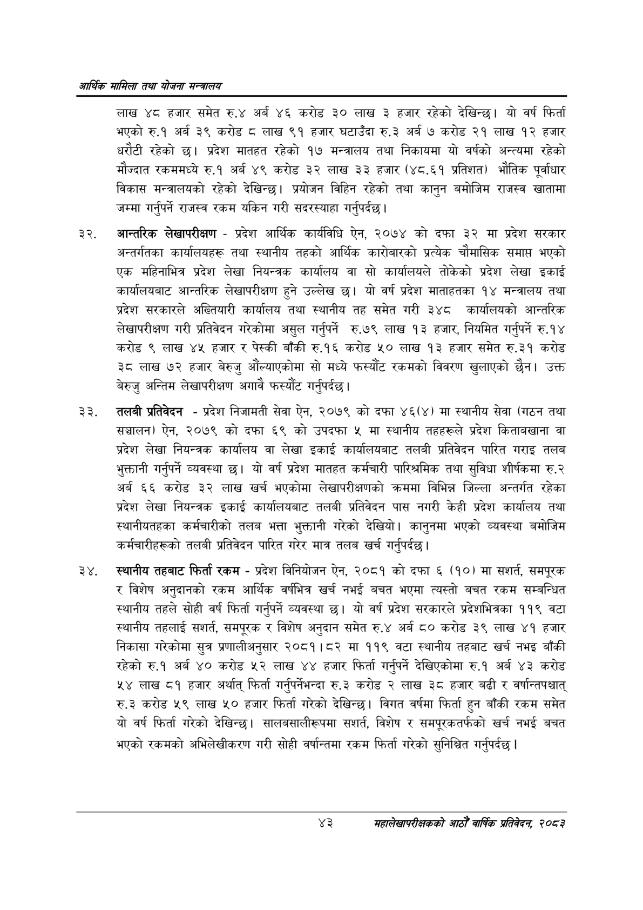

# Page 65 QA

## Rendered page


## Extracted text

```text
आर्थिक मामिला तथा योजना सन्चबालय
लाख ४८ हजार समेत रु.४ अर्ब ४६ करोड ३० लाख ३ हजार रहेको देखिन्छ। यो वर्ष फिर्ता भएको रु.१ अर्ब ३९ करोड ८ लाख ९१ हजार घटाउँदा रु.३ अर्ब ७ करोड २१ लाख १२ हजार धरौटी रहेको छ। प्रदेश मातहत रहेको १७ मन्त्रालय तथा निकायमा यो वर्षको अन्त्यमा रहेको मौज्दात रकममध्ये रु.१ अर्ब ४९ करोड ३२ लाख ३३ हजार (४८.६१ प्रतिशत) भौतिक पूर्वाधार विकास मन्त्रालयको रहेको देखिन्छ। प्रयोजन विहिन रहेको तथा कानुन बमोजिम राजस्व खातामा जम्मा गर्नुपर्ने राजस्व रकम यकिन गरी सदरस्याहा गर्नुपर्दछ।
आन्तरिक लेखापरीक्षण -प्रदेश आर्थिक कार्यविधि ऐन, २०७४ को दफा ३२ मा प्रदेश सरकार अन्तर्गतका कार्यालयहरू तथा स्थानीय तहको आर्थिक कारोबारको प्रत्यक चौमासिक समाप्त भएको एक महिनाभित्र प्रदेश लेखा नियन्त्रक कार्यालय वा सो कार्यालयले तोकेको प्रदेश लेखा इकाई कार्यालयबाट आन्तरिक लेखापरीक्षण हुने उल्लेख छ। यो वर्ष प्रदेश माताहतका १४ मन्त्रालय तथा प्रदेश सरकारले अख्तियारी कार्यालय तथा स्थानीय तह समेत गरी ३४८ कार्यालयको आन्तरिक लेखापरीक्षण गरी प्रतिवेदन गरेकोमा असुल गर्नुपर्ने रु.७९ लाख १३ हजार, नियमित गर्नुपर्ने रु.१४ करोड ९ लाख ४५ हजार र पेस्की बाँकी रु.१६ करोड ५० लाख १३ हजार समेत रु.३१ करोड ३८ लाख ७२ हजार बेरुजु औंल्याएकोमा सो मध्ये फस्यौट रकमको विवरण खुलाएको छैन। उक्त बेरुजु अन्तिम लेखापरीक्षण अगावै फस्यौंट गर्नुपर्दछ |
तलबी प्रतिवेदन -प्रदेश निजामती सेवा ऐन, २०७९ को दफा ४६(४) मा स्थानीय सेवा (गठन तथा सञ्चालन) ऐन, २०७९ को दफा ६९ को उपदफा मा स्थानीय तहहरूले प्रदेश किताबखाना वा प्रदेश लेखा नियन्त्रक कार्यालय वा लेखा इकाई कार्यालयबाट तलबी प्रतिवेदन पारित गराइ तलब भुक्तानी गर्नुपर्ने व्यवस्था छ। यो वर्ष प्रदेश मातहत कर्मचारी पारिश्रमिक तथा सुविधा शीर्षकमा रु.२ अर्ब ६६ करोड ३२ लाख खर्च भएकोमा लेखापरीक्षणको क्रममा विभिन्न जिल्ला अन्तर्गत रहेका प्रदेश लेखा नियन्त्रक इकाई कार्यालयबाट तलबी प्रतिवेदन पास नगरी केही प्रदेश कार्यालय तथा स्थानीयतहका कर्मचारीको तलब भत्ता भुक्तानी गरेको देखियो। कानुनमा भएको व्यवस्था बमोजिम कर्मचारीहरूको तलबी प्रतिवेदन पारित गरेर मात्र तलब खर्च गर्नुपर्दछ |
स्थानीय तहबाट फिर्ता रकम -प्रदेश विनियोजन ऐन, २०८१ को दफा ६ (१०) मा सशर्त, समपूरक र विशेष अनुदानको रकम आर्थिक वर्षभित्र खर्च नभई बचत भएमा त्यस्तो बचत रकम सम्बन्धित स्थानीय तहले सोही वर्ष फिर्ता गर्नुपर्ने व्यवस्था छ। यो वर्ष प्रदेश सरकारले प्रदेशभित्रका ११९ वटा स्थानीय तहलाई सशर्त, समपूरक र विशेष अनुदान समेत रु.४ अर्ब ८० करोड ३९ लाख ४१ हजार निकासा गरेकोमा सुत्र प्रणालीअनुसार २०८१।८२ मा ११९ वटा स्थानीय तहबाट खर्च नभइ बाँकी रहेको रु.१ अर्ब ४० करोड ५२ लाख ४४ हजार फिर्ता गर्नुपर्ने देखिएकोमा रु.१ अर्ब ४३ करोड ५४ लाख ८१ हजार अर्थात्‌ फिर्ता गर्नुपर्नेभन्दा रु.३ करोड २ लाख ३८ हजार बढी र वर्षान्तपश्चात्‌ रु.३ करोड ५९ लाख ५० हजार फिर्ता गरेको देखिन्छ। विगत वर्षमा फिर्ता हुन बाँकी रकम समेत यो वर्ष फिर्ता गरेको देखिन्छ। सालबसालीरूपमा सशर्त, विशेष र समपूरकतर्फको खर्च नभई बचत भएको रकमको अभिलेखीकरण गरी सोही वर्षान्तमा रकम फिर्ता गरेको सुनिश्चित गर्नुपर्दछ |
४३
महालेखापरीक्षकको आठौँ वाषिकि प्रतिवेदन २०८२
```

## Flags
- None
