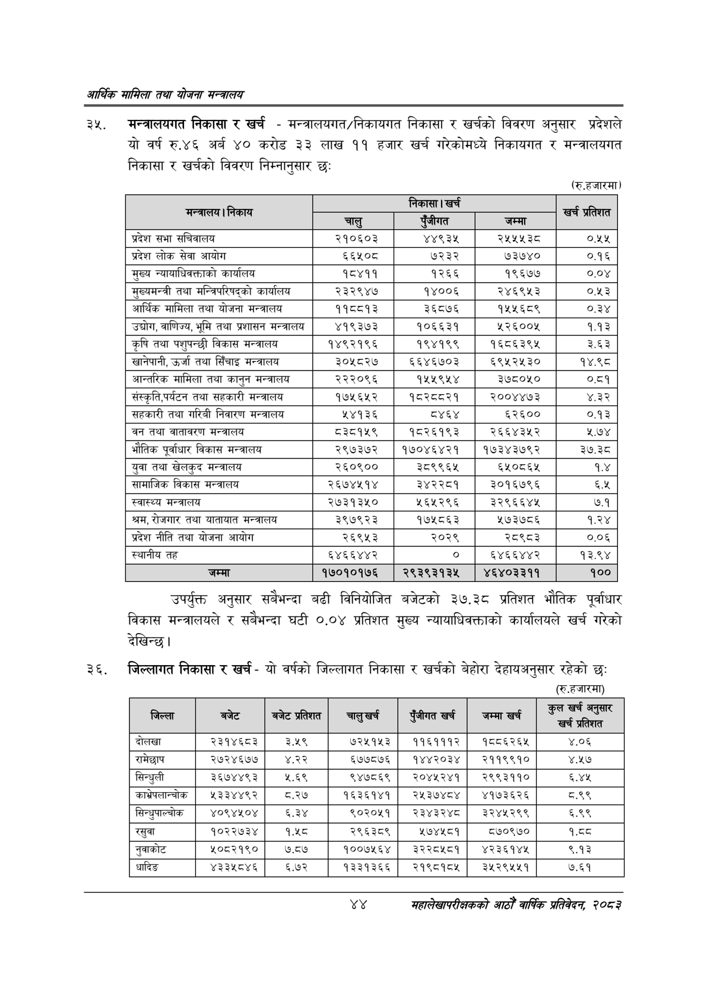

# Page 66 QA

## Rendered page


## Extracted text

```text
आर्थिक मामिला तथा योजना सन्चबालय
मन्त्रालयगत निकासा र खर्च -मन्त्रालयगत/निकायगत निकासा र खर्चको विवरण अनुसार प्रदेशले यो वर्ष रु.४६ अर्ब ४० करोड ३३ लाख ११ हजार खर्च गरेकोमध्ये निकायगत र मन्त्रालयगत निकासा र खर्चको विवरण निम्नानुसार छः
(रु.हजारमा)
उपर्युक्त अनुसार सबैभन्दा बढी विनियोजित बजेटको ३७.३८ प्रतिशत भौतिक पूर्वाधार विकास मन्त्रालयले र सबैभन्दा घटी ०.०४ प्रतिशत मुख्य न्यायाधिवक्ताको कार्यालयले खर्च गरेको देखिन्छ।
जिल्लागत निकासा र खर्च -यो वर्षको जिल्लागत निकासा र खर्चको बेहोरा देहायअनुसार रहेको छः (रु.हजारमा)
४४
महालेखापरीक्षकको आठौँ वाषिकि प्रतिवेदन २०८२

| निकाय |  |  |  | खर्च प्रतिशत |
| --- | --- | --- | --- | --- |
| सन्तालन | चालु | निक | जम्मा |  |
| प्रदेश सभा सचिवालय | २१०६०३ | ४४९३४५ | २५५४५३८ | ०.५४५ |
| प्रदेश लोक सेवा आयोग | ६६५०८ | ७२३२ | ७३७४० | ०.१६ |
| मुख्य न्यायाधिवत्ताको कार्यालय | १८४११ | १२६६ | १९६७७ | ०.०४ |
| मुख्यमन्त्री तथा सन्जिषरिषद्को कार्यालन | २३२९४७ | १४००६ | २४६९५३ | ०.५३ |
| आर्थिक मामिला तथा योजना मन्त्रालय | ११८८१३ | ३६८७६ | १५५६८९ | ०.३४ |
| , वाणिज्य, भूमि तथा प्रशासन मन्त्रालय | ४१९३७३ | १०६६३१ | १२६००५ | १.१३ |
| कृषि तथा पशुषन्छी विकास भन्त्रालय | १४९२१९६ | १९४१९९ | १६८६३९४५ | ३८३ |
| खानेपानी, उर्जा तथा सिँचाइ | ३०५८२७ | ६६४६७०३ | ६९५२५३० | १४.९८ |
| आन्तरिक मामिला तथा कानुन भन्त्रालय | २२२०९६ | १५४५९५४ | ३७८०५० | ०.८१ |
| संस्कृति,पर्यटन तथा सहकारी मन्त्रालय | १७५६५२ | १८२८८२१ | २००४४७३ | ४.३२ |
| सहकारी तथा गरिवी निवारण भन्त्रालय | २४१३६ | ८४६४ | ६२६०० | ०.१३ |
| वन तथा वातावरण मन्त्रालय | ८३८१५९ | १८२६१९३ | २६६४३५२ | २.७४ |
| भौतिक पूर्वाधार विकास भन्ना।स४ | २९७३७२ | १७०४६४२१ | १७३४३७९२ | ३७.३८ |
| युवा तथा खेलकुद भन्नासाथ | २६०९०० | ३८९९६५ | ६५०८६५ | १.४ |
| सामाजिक विकास मन्त्रालय | २६७४५१४ | ३४२२८१ | ३०१६७९६ | ६.५ |
| स्वास्थ्य भन्त्रालय | २७३१३५० | २५६५२९६ | ३२९६६४५ | ७.१ |
| श्रम, रोजगार तथा बातावात भन्त्रालय | ३९७९२३ | १७५८६३ | १७३७८६ | १.२४ |
| प्रदेश नीति तथा योजना आयोग | २६९५३ | २०२९ | २८९८३ | ०.०६ |
| स्थानीय तह | ६४६६४४२ | ० | ६४६६४४२ | १३.९४ |
| जम्मा | १७०१०१७६ | २९३९३१३५ | ४६४०३३११ | १०० |

| जिल्ला | 'बजेट | बजेट प्रतिशत |  | रजीगत खर्च | जम्मा खर्च | कुल खर्च बुसार |
| --- | --- | --- | --- | --- | --- | --- |
| दोलखा | २३१४६८३ | ३.५९ | ७२५१५३ | ११६१११२ | १८८६२६५ | ४.०६ |
| रामेछाप | २७२४६७७ | ४.२२ | ६७७८७६ | १४४२०३४ | २११९९१० | ४.५७ |
| सिन्धुली | ३६७४४९३ | २५.६९ | ९४७८६९ | २०४५२४१ | २९९३११० | ६.४५ |
| काभ्रेपलान्चोक | १३३४४९२ | ५.२७ | १६३६१४१ | र२४३७४८४ | ४१७३६२६ | ८.९९ |
| सिन्धुपाल्चोक | ४०९४१०४ | ६.३४ | ९०२०१५१ | २३४३२४८ | ३२४५२९९ | ६.९९ |
| रसुवा | १०२२७३४ | १.५८ | २९६३८९ | ५७४५८१ | ८७०९७० | १.८८ |
| नुवाकोट | ₹०८२१९० | ७.८४ | १००७१२६४ | र३े२२८१८१ | ४२३६१४४ | ९.१३ |
| धादिङ | ४३३५८४६ | ६.७२ | १३३१३६६ | २१९८१८५ | ३५२९५५१ | ७.६१ |
```

## Flags
- table_page
- medium_quality_table
