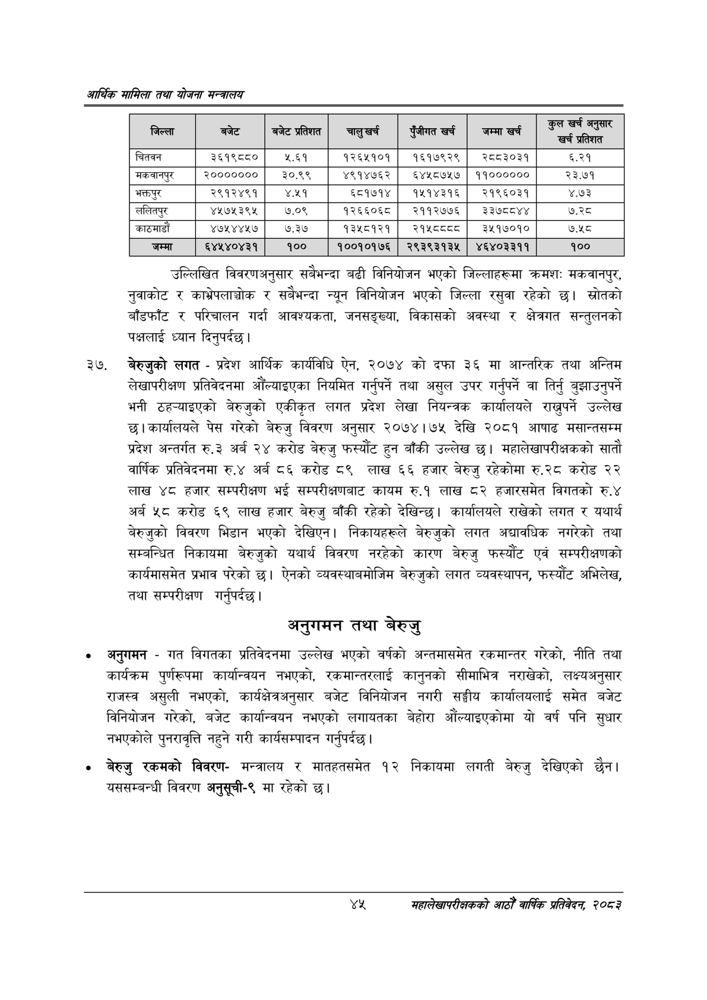

# Page 67 QA

## Rendered page


## Extracted text

```text
आर्थिक मामिला तथा योजना सन्चबालय
उल्लिखित विवरणअनुसार सबैभन्दा बढी विनियोजन भएको जिल्लाहरूमा क्रमशः मकवानपुर, नुवाकोट र काभ्रेपलाञ्चोक र सबैभन्दा न्यून विनियोजन भएको जिल्ला रसुवा रहेको छ। स्रोतको बाँडफाँट र परिचालन गर्दा आवश्यकता, जनसङ्ख्या, विकासको अवस्था र क्षेत्रगत सन्तुलनको पक्षलाई ध्यान दिनुपर्दछ |
बेरुजुको लगत -प्रदेश आर्थिक कार्यविधि ऐन, २०७४ को दफा ३६ मा आन्तरिक तथा अन्तिम लेखापरीक्षण प्रतिवेदनमा औँल्याइएका नियमित गर्नुपर्ने तथा असुल उपर गर्नुपर्ने वा तिर्नु बुझाउनुपर्ने भनी ठहन्याइएको बेरुजुको एकीकृत लगत प्रदेश लेखा नियन्त्रक कार्यालयले राख्नुपर्ने उल्लेख छ। कार्यालयले पेस गरेको बेरुजु विवरण अनुसार २०७४।७५ देखि २०८१ आषाढ मसान्तसम्म प्रदेश अन्तर्गत रु.३ अर्ब २४ करोड बेरुजु फस्यौट हुन बाँकी उल्लेख छ। महालेखापरीक्षकको सातौ वार्षिक प्रतिवेदनमा रु.४ अर्ब ८६ करोड ८९ लाख ६६ हजार बेरुजु रहेकोमा रु.२८ करोड २२ लाख ४८ हजार सम्परीक्षण भई सम्परीक्षणबाट कायम रु.१ लाख ८२ हजारसमेत विगतको रु.४ अर्ब ५८ करोड ६९ लाख हजार बेरुजु बाँकी रहेको देखिन्छ। कार्यालयले राखेको लगत र यथार्थ बेरुजुको विवरण भिडान भएको देखिएन। निकायहरूले बेरुजुको लगत अद्यावधिक नगरेको तथा सम्बन्धित निकायमा बेरुजुको यथार्थ विवरण नरहेको कारण बेरुजु फस्यौट एवं सम्परीक्षणको कार्यमासमेत प्रभाव परेको | ऐनको व्यवस्थानमोजिम बेरुजुको लगत व्यवस्थापन, फस्यौट अभिलेख, तथा सम्परीक्षण गर्नुपर्दछ।
अनुगमन तथा बेरुजु
अनुगमन -गत विगतका प्रतिवेदनमा उल्लेख भएको वर्षको अन्तमासमेत रकमान्तर गरेको, नीति तथा कार्यक्रम पुर्णरूपमा कार्यान्वयन नभएको, रकमान्तरलाई कानुनको सीमाभित्र नराखेको, लक्ष्यअनुसार राजस्व असुली नभएको, कार्यक्षेत्रअनुसार बजेट विनियोजन नगरी सङ्घीय कार्यालयलाई समेत बजेट विनियोजन गरेको, बजेट कार्यान्वयन नभएको लगायतका बेहोरा औंल्याइएकोमा यो वर्ष पनि सुधार नभएकोले पुनरावृत्ति नहुने गरी कार्यसम्पादन गर्नुपर्दछ |
बेरुजु रकमको विवरणमन्त्रालय र मातहतसमेत १२ निकायमा लगती बेरुजु देखिएको छैन। यससम्बन्धी विवरण अनुसूची-९ मा रहेको |
यश
महालेखापरीक्षकको आठौँ वाषिकि प्रतिवेदन २०८२

| जिल्ला | बजेट | बजेट प्रतिशत | जागु खर्च | प्जीगत खर्च | जम्मा खर्च | क्लास जनुसार प्रतिशत |
| --- | --- | --- | --- | --- | --- | --- |
| चितवन | ३६१९८५८० | ५.६१ | १२६५१०१ | १६१७९२९ | २८८३०३१ | ६.२१ |
| मकवानपुर | २००००००० | ३०.९९ | ४९१४७६२ | ६४५८७५७ | ११०००००० | २३.७१ |
| भक्तपुर | २९१२४९१ | ४.११ | ६८१७१४ | १५१४३१६ | २१९६०३१ | ४.७३ |
| ललितपुर | ४५७५३९५ | ७.०९ | १२६६०६८ | २११२७७६ | ३३७८८४४ | ७.२८ |
| काठमाडौं | ४७५४४५७ | ७.३७ | १३५८१२१ | ९ | ३५१७०१० | ७.५८ |
| जम्मा | ६४५४०४३१ | १०० | १००१०१७६ | २९३९३१३५ | ४६४०३३११ | १०० |
```

## Flags
- table_page
- medium_quality_table
