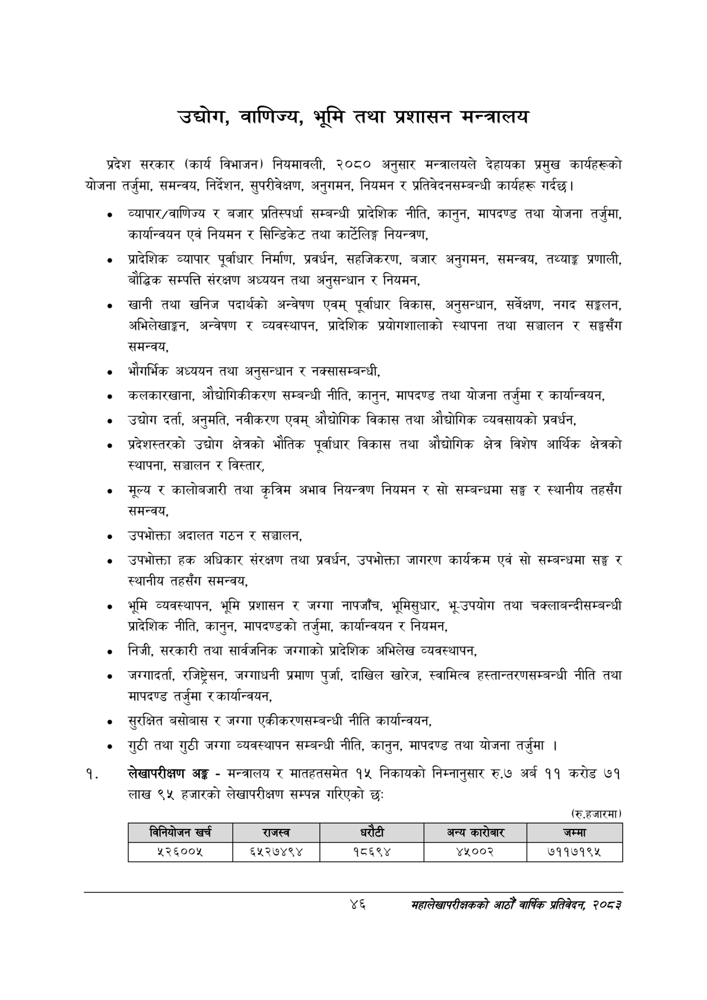

# Page 68 QA

## Rendered page


## Extracted text

```text
उद्योग, वाणिज्य, भूमि तथा प्रशासन मन्त्रालय
प्रदेश सरकार (कार्य विभाजन) नियमावली, २०८० अनुसार मन्त्रालयले देहायका प्रमुख कार्यहरूको योजना तर्जुमा, समन्वय, निर्देशन, सुपरीवेक्षण, अनुगमन, नियमन र प्रतिवेदनसम्बन्धी कार्यहरू गर्दछ।
व्यापार/वाणिज्य र बजार प्रतिस्पर्धा सम्बन्धी प्रादेशिक नीति, कानुन, मापदण्ड तथा योजना तर्जुमा, कार्यान्वयन एवं नियमन र सिन्डिकेट तथा कार्टलिङ्ग नियन्त्रण,
प्रादेशिक व्यापार पूर्वाधार निर्माण, प्रवर्धन, सहजिकरण, बजार अनुगमन, समन्वय, तथ्याङ्क प्रणाली, बौद्धिक सम्पत्ति संरक्षण अध्ययन तथा अनुसन्धान र नियमन,
खानी तथा खनिज पदार्थको अन्वेषण एवम्‌ पूर्वाधार विकास, अनुसन्धान, सर्वेक्षण, नगद सङ्कलन, अभिलेखाङ्गन, अन्वेषण र व्यवस्थापन, प्रादेशिक प्रयोगशालाको स्थापना तथा सञ्चालन र सङ्घगसँग समन्वय,
भौगर्भिक अध्ययन तथा अनुसन्धान र नक्सासम्बन्धी,
कलकारखाना, औद्योगिकीकरण सम्बन्धी नीति, कानुन, मापदण्ड तथा योजना तर्जुमा र कार्यान्वयन,
उद्योग दर्ता, अनुमति, नवीकरण एवम्‌ औद्योगिक विकास तथा औद्योगिक व्यवसायको प्रवर्धन,
प्रदेशस्तरको उद्योग क्षेत्रको भौतिक पूर्वाधार विकास तथा औद्योगिक क्षेत्र विशेष आर्थिक क्षेत्रको स्थापना, सञ्चालन र विस्तार,
मूल्य र कालोबजारी तथा कृत्रिम अभाव नियन्त्रण नियमन र सो सम्बन्धमा सङ्घ र स्थानीय तहसँग समन्वय,
उपभोक्ता अदालत गठन र सञ्चालन,
उपभोक्ता हक अधिकार संरक्षण तथा प्रवर्धन, उपभोक्ता जागरण कार्यक्रम एवं सो सम्बन्धमा सङ्घ र स्थानीय तहसँग समन्वय,
भूमि व्यवस्थापन, भूमि प्रशासन र जग्गा नापजाँच, भूमिसुधार, भू-उपयोग तथा चक्लाबन्दीसम्बन्धी प्रादेशिक नीति, कानुन, मापदण्डको तर्जुमा, कार्यान्वयन र नियमन,
निजी, सरकारी तथा सार्वजनिक जग्गाको प्रादेशिक अभिलेख व्यवस्थापन,
जग्गादर्ता, रजिष्ट्रेसन, जग्गाधनी प्रमाण पुर्जा, दाखिल खारेज, स्वामित्व हस्तान्तरणसम्बन्धी नीति तथा मापदण्ड तर्जुमा र कार्यान्वयन,
सुरक्षित बसोबास र जग्गा एकीकरणसम्बन्धी नीति कार्यान्वयन,
गुठी तथा गुठी जग्गा व्यवस्थापन सम्बन्धी नीति, कानुन, मापदण्ड तथा योजना तर्जुमा।
लेखापरीक्षण अङ्क -मन्त्रालय र मातहतसमेत १५ निकायको निम्नानुसार रु.७ अर्ब ११ करोड ७१ लाख ९५ हजारको लेखापरीक्षण सम्पन्न गरिएको छ:
(रु.हजारमा)
४६
महालेखापरीक्षकको आठौँ वाषिकि प्रतिवेदन २०८२

|  |  | बिनिवोजन खर्च | राजस्व |  | रेटी | अन्य कारोबार | जम्मा |
| --- | --- | --- | --- | --- | --- | --- | --- |
|  |  | २२६००४५ | ६२५२७४९४ |  | १८६९४ | ४४५००२ | ७११७१९५ |
```

## Flags
- table_page
- medium_quality_table
