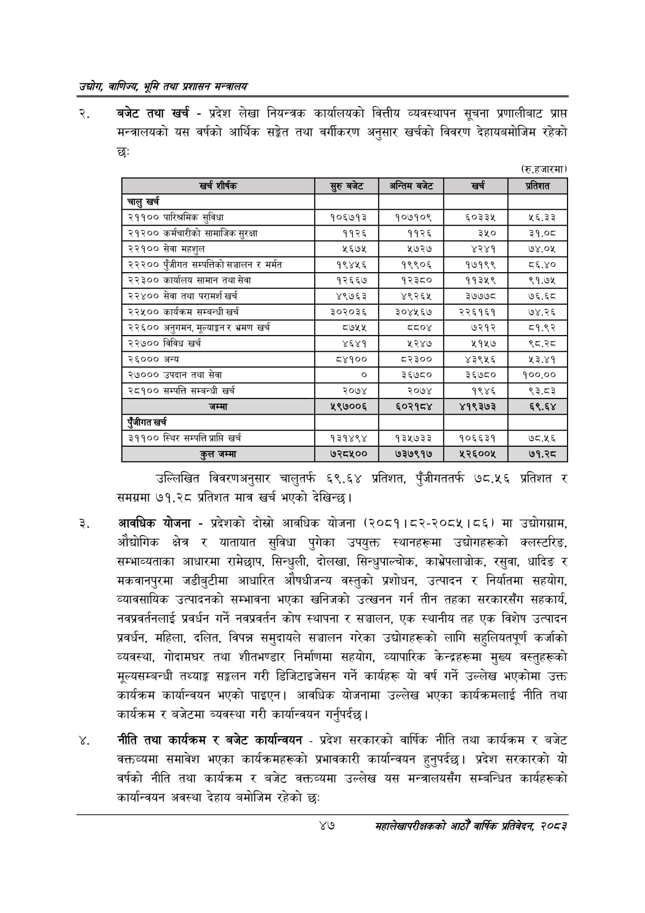

# Page 69 QA

## Rendered page


## Extracted text

```text
उद्घोग वाणिज्य; भूमि तथा प्रशासन सन्वालय
बजेट तथा खर्च -प्रदेश लेखा नियन्त्रक कार्यालयको वित्तीय व्यवस्थापन सूचना प्रणालीबाट प्राप्त मन्त्रालयको यस वर्षको आर्थिक सङ्ेत तथा वर्गीकरण अनुसार खर्चको विवरण देहायबमोजिम रहेको छः
(रु.हजारमा)
उल्लिखित विवरणअनुसार चालुतर्फ ६९.६४ प्रतिशत, पुँजीगततर्फ ७८.५६ प्रतिशत समग्रमा ७१.२८ प्रतिशत मात्र खर्च भएको देखिन्छ |
आवधिक योजना -प्रदेशको दोस्रो आवधिक योजना (२०८१।८२-२०८५।८६) मा उद्योगग्राम, औद्योगिक क्षेत्र र यातायात सुविधा पुगेका उपयुक्त स्थानहरूमा उद्योगहरूको क्लस्टरिङ, सम्भाव्यताका आधारमा रामेछाप, सिन्धुली, दोलखा, सिन्धुपाल्चोक, काभ्रेपलाञ्चोक, रसुवा, धादिङ र मकवानपुरमा जडीबुटीमा आधारित औषधीजन्य वस्तुको प्रशोधन, उत्पादन र निर्यातमा सहयोग, व्यावसायिक उत्पादनको सम्भावना भएका खनिजको उत्खनन गर्न तीन तहका सरकारसँग सहकार्य, नवप्रवर्तनलाई प्रवर्धन गर्ने नवप्रवर्तन कोष स्थापना र सञ्चालन, एक स्थानीय तह एक विशेष उत्पादन प्रवर्धन, महिला, दलित, विपन्न समुदायले सञ्चालन गरेका उद्योगहरूको लागि सहुलियतपूर्ण कर्जाको व्यवस्था, गोदामघर तथा शीतभण्डार निर्माणमा सहयोग, व्यापारिक केन्द्रहरूमा मुख्य वस्तुहरूको मूल्यसम्बन्धी तथ्याङ्क सङ्कलन गरी डिजिटाइजेसन गर्ने कार्यहरू यो वर्ष गर्ने उल्लेख भएकोमा उक्त कार्यक्रम कार्यान्वयन भएको पाइएन। आवधिक योजनामा उल्लेख भएका कार्यक्रमलाई नीति तथा कार्यक्रम र बजेटमा ब्यवस्था गरी कार्यान्वयन गर्नुपर्दछ |
नीति तथा कार्यक्रम र बजेट कार्यान्वयन -प्रदेश सरकारको वार्षिक नीति तथा कार्यक्रम र बजेट वक्तव्यमा समावेश भएका कार्यक्रमहरूको प्रभावकारी कार्यान्वयन हुनुपर्दछ। प्रदेश सरकारको यो वर्षको नीति तथा कार्यक्रम र बजेट वक्तव्यमा उल्लेख यस मन्त्रालयसँग सम्बन्धित कार्यहरूको कार्यान्वयन अवस्था देहाय बमोजिम रहेको छ:
४७
महालेखापरीक्षकको आठौँ वाषिकि प्रतिवेदन २०८२

| टा) |  | भन्तिष बजेट |  |  |
| --- | --- | --- | --- | --- |
|  | बुलु |  |  |  |
| चालु खर्च |  |  |  |  |
| २११०० पारिश्रमिक सुविधा | १०६७१३ | १०७१०९ | §०३३ | ५६.३३ |
| २१२०० कर्मचारीको सामाजिक सुरक्षा | ११२६ | ११२६ | ३५० | ३१.०८ |
| २२१०० सेवा महशुल | ५६७५ | ५७२७ | ४२४१ | ७४.०५ |
| २२२०० पुँजीगत सञ्चालन र मर्मत | १९४५६ | १९९०६ | १७१९९ | ८६.४० |
| २२३०० कार्यालय सामान तथा सेवा | १२६६७ | १२३८० | ११३५९ | ९१.७५ |
| २२४०० सेवा तथा परामर्श खर्च | ४९७६३ | ४९२६५ | ३७७७८ | ७६.६८ |
| २२५०० कार्यक्रम सम्बन्धी खर्च | ३०२०३६ | ३०४५६७ | २२६१६१ | ७४.२६ |
| २२६०० अनुगमन, मूल्याङ्कन र भ्रमण खर्च | ८७५५ | ८०४ | ७२१२ | ८१.९२ |
| २२७०० विविध खर्च | ४६४१ | ५२४७ | ५१५७ | ९८.२८ |
| २६००० अन्य | ८४१०० | ८२३०० | ४३९५६ | ४३.९ |
| २००० उपदान तथा सेवा | ० | ३६७८० | ३६७८० | १००.०० |
| २८१०० सम्पत्ति सम्बन्धी खर्च | २०७४ | २०७४ | १९४६ | ९३.८३ |
| जम्मा | २९७००६ | ६०२१८४ | ४१९३७३ | ६९.६४ |
| पुँजीगत खर्च |  |  |  |  |
| ३११०० स्थिर सम्पत्ति प्राप्ति खर्च | १३१४९४ | १३५७३३ | १०६६३१ | ७८.१६ |
| कुल जम्मा | ७२८५०० | ७३७९१७ | ५२६००५ | ७१.२८ |
```

## Flags
- table_page
- medium_quality_table
