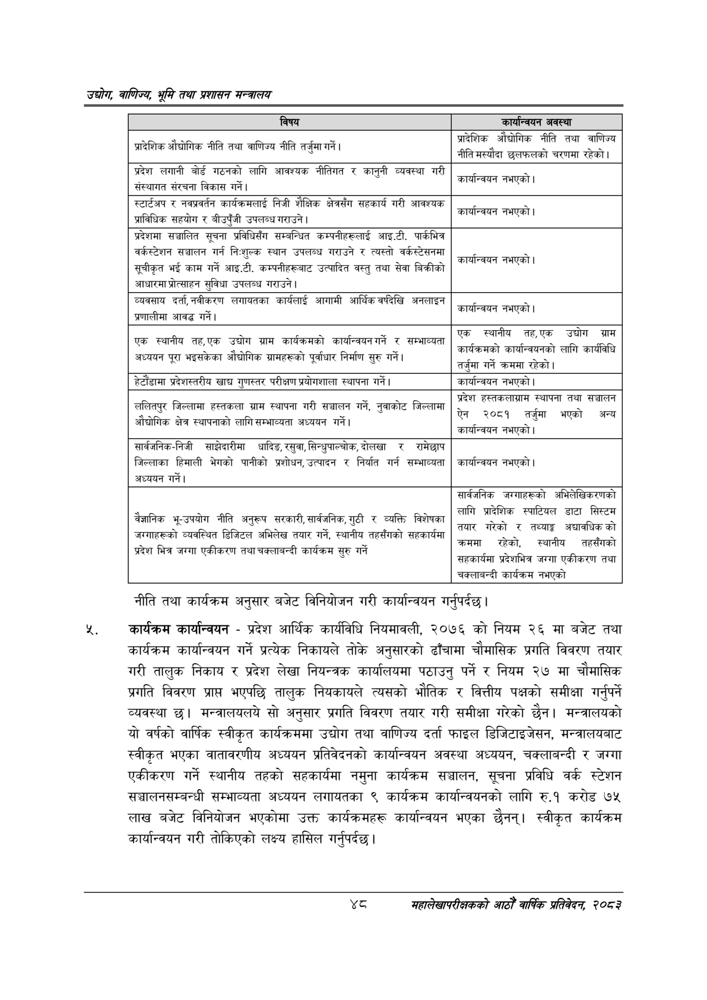

# Page 70 QA

## Rendered page


## Extracted text

```text
उद्घोग वाणिज्य; भूमि तथा प्रशासन सन्वालय
नीति तथा कार्यक्रम अनुसार बजेट विनियोजन गरी कार्यान्वयन गर्नुपर्दछ |
कार्यक्रम कार्यान्वयन -प्रदेश आर्थिक कार्यविधि नियमावली, २०७६ को नियम २६ मा बजेट तथा कार्यक्रम कार्यान्वयन गर्ने प्रत्येक निकायले तोके अनुसारको ढाँचामा चौमासिक प्रगति विवरण तयार गरी तालुक निकाय र प्रदेश लेखा नियन्त्रक कार्यालयमा पठाउनु पर्ने र नियम २७ मा चौमासिक प्रगति विवरण प्राप्त भएपछि तालुक नियकायले त्यसको भौतिक र वित्तीय पक्षको समीक्षा गर्नुपर्ने व्यवस्था छ। मन्त्रालयलये सो अनुसार प्रगति विवरण तयार गरी समीक्षा गरेको छैन। मन्त्रालयको यो वर्षको वार्षिक स्वीकृत कार्यक्रममा उद्योग तथा वाणिज्य दर्ता फाइल डिजिटाइजेसन, मन्त्रालयबाट स्वीकृत भएका वातावरणीय अध्ययन प्रतिवेदनको कार्यान्वयन अवस्था अध्ययन, चक्लाबन्दी र जग्गा एकीकरण गर्ने स्थानीय तहको सहकार्यमा नमुना कार्यक्रम सञ्चालन, सूचना प्रविधि वर्क स्टेशन सञ्चालनसम्बन्धी सम्भाव्यता अध्ययन लगायतका ९ कार्यक्रम कार्यान्वयनको लागि रु.१ करोड ७५ लाख बजेट विनियोजन भएकोमा उक्त कार्यक्रमहरू कार्यान्वयन भएका छैनन्‌। स्वीकृत कार्यक्रम कार्यान्वयन गरी तोकिएको लक्ष्य हासिल गर्नुपर्दछ |
शव
महालेखापरीक्षकको आठौँ वाषिकि प्रतिवेदन २०८२

| विषय | कार्यान्चणन अवस्था |
| --- | --- |
| न प्रादेशिक औद्योगिक नीति तथा वाणिज्य नीति तर्जुमा गर्ने। = | प्रादेशिक औच्चोनिक नीति तथा वाणिज्य - नीति मस्यौदा छलफलको चरणमा रहेको \| |
| प्रदेश लगानी बोर्ड गठनको लागि आवश्यक नीतिगत र कानुनी व्यवस्था गरी संल्थागत संरचना विकास गर्ने। | . < कार्यान्वन नभएको \| |
| स्टार्टपप र नवभ्रवर्तन कार्यक्रमलाई निजी शैक्षिक क्षेत्रसँग सहकार्य गरी आवश्यक त्राविधिक सहयोग र बीउपुँजी उपलब्ध गराउने \| | . - कार्यान्वयन नभएको \| |
| प्रदेशमा सञ्चालित सूचना प्रविधिसँग सम्बन्धित कम्पनीहरूलाई आइ.टी. पार्कभित्र बर्कह्टेशन सञ्चालन गर्न निःशुल्क स्थान उपलब्ध गराउने र त्यस्तो १स्टसनमा. -~ है ति ~ सेवा बिक्रीको सूचीकृत भई काम गर्ने आइ.टी. कमी६%१८ उत्पादित वस्तु तथा सेवा बिक्रीको आधारमा श्रोल्साहन सुविधा उपलब्ध गराउने। | . < कार्यान्वयन नभएको \| |
| व्यवसाय दर्ता, नवीकरण लगाबतका कार्यलाई आगामी आर्थिक वर्षदेखि अनलाइन - - नालीमा आवद्ध गर्ने। | . - कार्यान्वन नभएको \| |
| ~ एक स्थानीय तह,एक उद्योग ग्राम कार्यक्रमको कार्यान्वबनगर्ने र सम्भाव्यता अध्ययन पूरा भइने ४ को पूर्वाधार निर्माण सुरु गर्ने। औच्चोगिक भ्रानहरूको ® | एक स्थानीय तह,एक उद्योग ग्राम - क कार्यक्रमको कार्यान्चकनको लागि कार्यविधि रहेको तर्जुमा गर्ने कममा रहेको \| |
| हेटौंडामा ५द२।६तर४ खाद्य गुणस्तर परीक्षण ९४५२ स्थापना गर्ने। | कार्यान्वयन नभएको \| |
| -. ललितपुर जिल्लामा हल्तकला ग्राम स्थापना गरी सञ्चालन गर्ने, नुवाकोट जिल्लामा ओच्योगिक क्षेत्र ल्यापनाको लागि सम्भाव्यता अध्ययन गर्ने \| | प्रदेश हत्तकलाभ्रान स्थापना तथा सञ्चालन हो अन्य ऐन २०८१ तर्जुमा भएको अन्त. - कार्यान्वयन नभएको \| |
| सार्वजनिक-निजी शान्ेदारीमा धादिङ, रसुवा,सिन्छुपाल्चोक, दोलखा र रामेछाप जिल्लाका हिमाली भेगको पानीको प्रशोधन, उत्पादन र निर्यात गर्न सम्भाव्यता अध्ययन गर्ने \| | कार्यान्वयन नभएको। |
| - विशेषका बैज्ञानिक भू-उपयोग नीति अनुरूप सरकारी, सार्वजनिक, गुठी र व्यक्ति विशेषका व्यवस्थित « » अन्माहरूको ठ् डिजिटल अभिलेख तयार गर्ने, स्थानीय तहसँगको सहकार्यमा ~ प्रदेश भित्र जग्गा एकीकरण तथा चक्लाबन्दी कार्यक्रम सुरु गर्ने | सार्वजनिक जन्माहरूको अभिलेखिकरणको लागि प्रादेशिक स्वाटिषल डाटा सिस्टम तयार गरेको र तथ्याङ्क अच्चावधिक को. कममा रहेको, स्थानीय तहर्गको ५५ प्रदेशभितर न खहकार्थमा प्रदे जग्गा एकीकरण तथा चक्लाबन्दी कार्वक्रम नभएको |
```

## Flags
- table_page
- medium_quality_table
