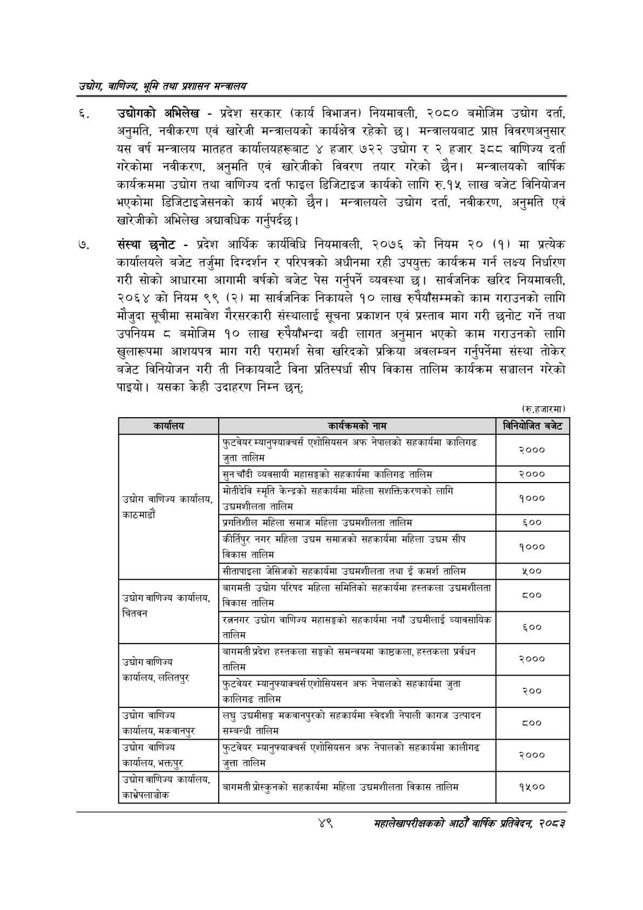

# Page 71 QA

## Rendered page


## Extracted text

```text
उद्घोग वाणिज्य; भूमि तथा प्रशासन सन्वालय
उद्योगको अभिलेख -प्रदेश सरकार (कार्य विभाजन) नियमावली, २०८० बमोजिम उद्योग दर्ता, अनुमति, नवीकरण एवं खारेजी मन्त्रालयको कार्यक्षेत्र रहेको छ। मन्त्रालयबाट प्राप्त विवरणअनुसार यस वर्ष मन्त्रालय मातहत कार्यालयहरूबाट ४ हजार ७२२ उद्योग र २ हजार ३८८ वाणिज्य दर्ता गरेकोमा नवीकरण, अनुमति एवं खारेजीको विवरण तयार गरेको छैन। मन्त्रालयको वार्षिक कार्यक्रममा उद्योग तथा वाणिज्य दर्ता फाइल डिजिटाइज कार्यको लागि रु.१५ लाख बजेट विनियोजन भएकोमा डिजिटाइजेसनको कार्य भएको छैन। मन्त्रालयले उद्योग दर्ता, नवीकरण, अनुमति एवं खारेजीको अभिलेख अद्यावधिक गर्नुपर्दछ |
संस्था छनोट -प्रदेश आर्थिक कार्यविधि नियमावली, २०७६ को नियम २० (१) मा प्रत्येक कार्यालयले बजेट तर्जुमा दिग्दर्शन र परिपत्रको अधीनमा रही उपयुक्त कार्यक्रम गर्न लक्ष्य निर्धारण गरी सोको आधारमा आगामी वर्षको बजेट पेस गर्नुपर्ने व्यवस्था छ। सार्वजनिक खरिद नियमावली, २०६४ को नियम ९९ (२) मा सार्वजनिक निकायले १० लाख रुपैयाँसम्मको काम गराउनको लागि मौजुदा सूचीमा समावेश गैरसरकारी संस्थालाई सूचना प्रकाशन एवं प्रस्ताव माग गरी छनोट गर्ने तथा उपनियम ८ बमोजिम १० लाख रुपैयाँभन्दा बढी लागत अनुमान भएको काम गराउनको लागि खुलारूपमा आशयपत्र माग गरी परामर्श सेवा खरिदको प्रक्रिया अवलम्बन गर्नुपर्नेमा संस्था तोकेर बजेट विनियोजन गरी ती निकायबाटै विना प्रतिस्पर्धा सीप विकास तालिम कार्यक्रम सञ्चालन गरेको पाइयो। यसका केही उदाहरण निम्न छन्‌;
(रु.हजारमा)
महालेखापरीक्षकको आठौँ वाषिकि प्रतिवेदन २०८२

| कार्षालन | नाम | निनिबाजित बजेट |
| --- | --- | --- |
|  |  |  |
|  | फुटबबर न्वानुफ्याकचर्स एशोसिवलन अफ नेपालको खहकार्मा कालिगढ जुता तालिम | ३००० |
|  | सुन चाँदी व्यवसायी महासङ्घको खहकार्षमा कालिगढ तालिम | २००० |
| उद्योग. उद्योग वाणिज्य कार्यालय, | आोतीदेव स्मृति केन्द्रको खहकार्थमा महिला क्षशत्तिकरणको लागि उच्चमशीलता तालिम | १००० |
| काठमाडौं | . श्रगतिशील महिला समाज महिला उच्चमशीलता तालिम | ६०० |
|  | कीर्तिपुर नगर महिला उद्यम क्षमाजको सहकार्यमा महिला उद्यम सीप छ विकास तालिम | १००० |
|  | खीतापाइला जेसिजको सहकार्षमा उच्चमशीलता तथा ई कमर्श तालिम | ५०० |
| उद्योग वाणिज्य कार्षालथ, | बागमती उद्योग परिषद महिला समितिको सहकार्षमा हल्तकला उच्चमशीलता विकास तालिम | ८०० |
| चितवन | रोग बाणिज्य -. ~ रत्ननगर उद्योग वाणिज्य भहासङ्घको सहकार्थमा नयाँ न्वानसाथिक तालिम | ६०० |
| उद्योग वाणिज्य | बागमती प्रदेश हत्तकला सङ्घको समन्वयमा काठकला, हल्तकला प्रर्वघन तालिम | २००० |
| , सालक |  |  |
|  | फुटबेयर न्यानुक्याक्चर्स एशोसिवसन अफ नेपालको सहकार्षमा जुता कालिगङ तालिम | २०० |
| उद्योग वाणिज्य - कार्यालय, नकबानपुर | लघु उच्चमीसङ्घ मकवानपुरको सहकार्यमा स्वेदशी नेपाली कागज उत्पादन सम्बन्धी तालिम | ०० |
|  |  |  |
| उद्योग वाणिज्य कार्यालय, भक्तपुर | फुटबबर न्वानुफबाकचर्स दुशोसिवलन अफ नेपालको सहकार्यमा कालीनढ जुत्ता तालिम | २००० |
| उद्योग वाणिज्य कार्यालय, काभ्रेपलाञ्चोक | नर - बागमती श्रोह्कुनको क्षहकार्षमा महिला उच्चनशीलता विकास तालिम | १५०० |
```

## Flags
- table_page
- medium_quality_table
