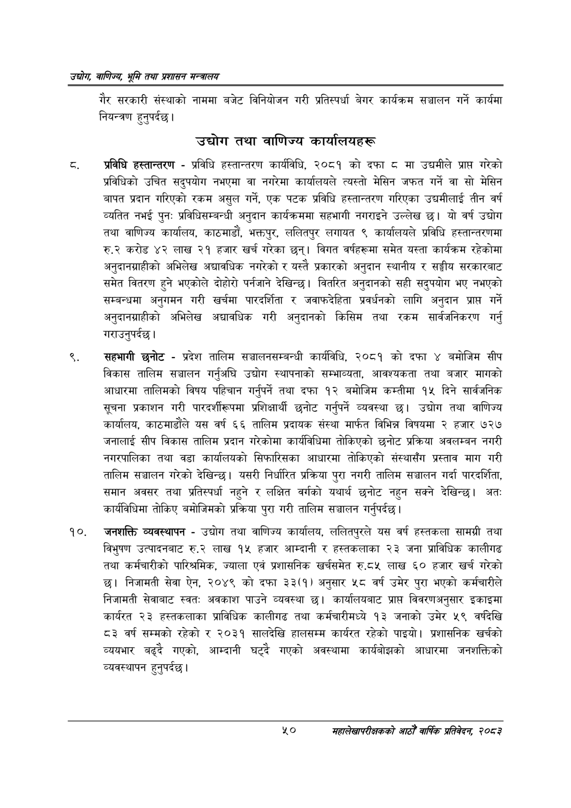

# Page 72 QA

## Rendered page


## Extracted text

```text
उद्घोग वाणिज्य; भूमि तथा प्रशासन सन्वालय
गैर सरकारी संस्थाको नाममा बजेट विनियोजन गरी प्रतिस्पर्धा बेगर कार्यक्रम सञ्चालन गर्ने कार्यमा नियन्त्रण हुनुपर्दछ |
उद्योग तथा वाणिज्य कार्यालयहरू
प्रविधि हस्तान्तरण -प्रविधि हस्तान्तरण कार्यविधि, २०८१ को दफा ८ मा उद्यमीले प्राप्त गरेको प्रविधिको उचित सदुपयोग नभएमा वा नगरेमा कार्यालयले त्यस्तो मेसिन जफत गर्ने वा सो मेसिन बापत प्रदान गरिएको रकम असुल गर्ने, एक पटक प्रविधि हस्तान्तरण गरिएका उद्यमीलाई तीन वर्ष व्यतित नभई पुनः प्रविधिसम्बन्धी अनुदान कार्यक्रममा सहभागी नगराइने उल्लेख छ। यो वर्ष उद्योग तथा वाणिज्य कार्यालय, काठमाडौं, भक्तपुर, ललितपुर लगायत ९ कार्यालयले प्रविधि हस्तान्तरणमा रु.२ करोड ४२ लाख २१ हजार खर्च गरेका छन्‌। विगत वर्षहरूमा समेत यस्ता कार्यक्रम रहेकोमा अनुदानग्राहीको अभिलेख अद्यावधिक नगरेको र यस्तै प्रकारको अनुदान स्थानीय र सङ्घीय सरकारबाट समेत वितरण हुने भएकोले दोहोरो पर्नजाने देखिन्छ। वितरित अनुदानको सही सदुपयोग भए नभएको सम्बन्धमा अनुगमन गरी खर्चमा पारदर्शिता र जवाफदेहिता प्रवर्धनको लागि अनुदान प्राप्त गर्ने अनुदानग्राहीको अभिलेख अद्यावधिक गरी अनुदानको किसिम तथा रकम सार्वजनिकरण गर्नु गराउनुपर्दछ।
सहभागी छनोट -प्रदेश तालिम सञ्चालनसम्बन्धी कार्यविधि, २०८१ को दफा ४ बमोजिम सीप विकास तालिम सञ्चालन गर्नुअघि उद्योग स्थापनाको सम्भाव्यता, आवश्यकता तथा बजार मागको आधारमा तालिमको विषय पहिचान गर्नुपर्ने तथा दफा १२ बमोजिम कम्तीमा १५ दिने सार्वजनिक सूचना प्रकाशन गरी पारदर्शीरूपमा प्रशिक्षार्थी छनोट गर्नुपर्ने व्यवस्था छ। उद्योग तथा वाणिज्य कार्यालय, काठमाडौंले यस वर्ष ६६ तालिम प्रदायक संस्था मार्फत विभिन्न विषयमा २ हजार ७२७ जनालाई सीप विकास तालिम प्रदान गरेकोमा कार्यविधिमा तोकिएको छनोट प्रक्रिया अवलम्बन नगरी नगरपालिका तथा वडा कार्यालयको सिफारिसका आधारमा तोकिएको संस्थासँग प्रस्ताव माग गरी तालिम सञ्चालन गरेको देखिन्छ। यसरी निर्धारित प्रक्रिया पुरा नगरी तालिम सञ्चालन गर्दा पारदर्शिता, समान अवसर तथा प्रतिस्पर्धा नहुने र लक्षित वर्गको यथार्थ छनोट नहुन सक्ने देखिन्छ। अतः कार्यविधिमा तोकिए बमोजिमको प्रक्रिया पुरा गरी तालिम सञ्चालन गर्नुपर्दछ |
जनशक्ति व्यवस्थापन -उद्योग तथा वाणिज्य कार्यालय, ललितपुरले यस वर्ष हस्तकला सामग्री तथा विभुषण उत्पादनबाट रु.२ लाख १५ हजार आम्दानी र हस्तकलाका २३ जना प्राविधिक कालीगढ तथा कर्मचारीको पारिश्रमिक, ज्याला एवं प्रशासनिक खर्चसमेत रु.८« लाख ६० हजार खर्च गरेको छ। निजामती सेवा ऐन, २०४९ को दफा ३३(१) अनुसार ५८ वर्ष उमेर पुरा भएको कर्मचारीले निजामती सेवाबाट स्वतः: अवकाश पाउने व्यवस्था छ। कार्यालयबाट प्राप्त विवरणअनुसार इकाइमा कार्ययत २३ हस्तकलाका प्राविधिक कालीगढ तथा कर्मचारीमध्ये १३ जनाको उमेर ५९ वर्षदेखि ८३ वर्ष सम्मको रहेको र २०३१ सालदेखि हालसम्म कार्यरत रहेको पाइयो। प्रशासनिक खर्चको व्ययभार बढ्दै गएको, आम्दानी घट्दै गएको अवस्थामा कार्यबोझको आधारमा जनशक्तिको व्यवस्थापन हुनुपर्दछ |
%०
महालेखापरीक्षकको आठौँ वाषिकि प्रतिवेदन २०८२
```

## Flags
- None
