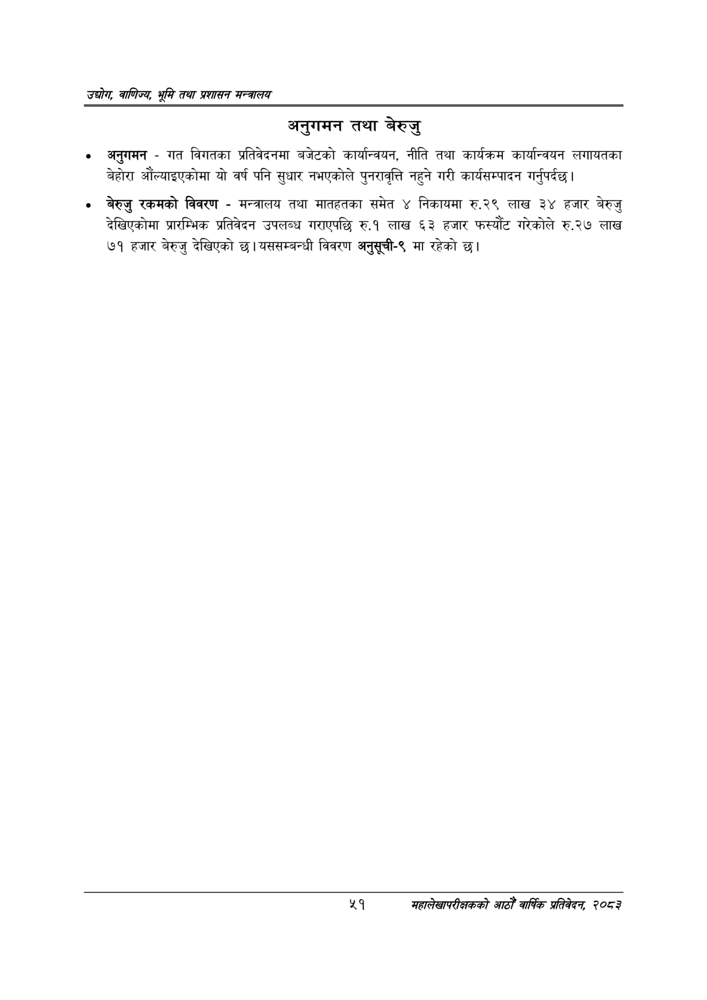

# Page 73 QA

## Rendered page


## Extracted text

```text
उद्घोग वाणिज्य; भूमि तथा प्रशासन सन्वालय
अनुगमन तथा बेरुजु
अनुगमन -गत विगतका प्रतिवेदनमा बजेटको कार्यान्वयन, नीति तथा कार्यक्रम कार्यान्वयन लगायतका बेहोरा औंल्याइएकोमा यो वर्ष पनि सुधार नभएकोले पुनरावृत्ति नहुने गरी कार्यसम्पादन गर्नुपर्दछ |
बेरुजु रकमको विवरण -मन्त्रालय तथा मातहतका समेत ४ निकायमा रु.२९ लाख ३४ हजार बेरुजु देखिएकोमा प्रारम्भिक प्रतिवेदन उपलब्ध गराएपछि रु.१ लाख ६३ हजार फस्यौट गरेकोले रु.२७ लाख ७१ हजार बेरुजु देखिएको छ। यससम्बन्धी विवरण अनुसूची-९ मा रहेको छ।
%९
महालेखापरीक्षकको आठौँ वाषिकि प्रतिवेदन २०८२
```

## Flags
- None
