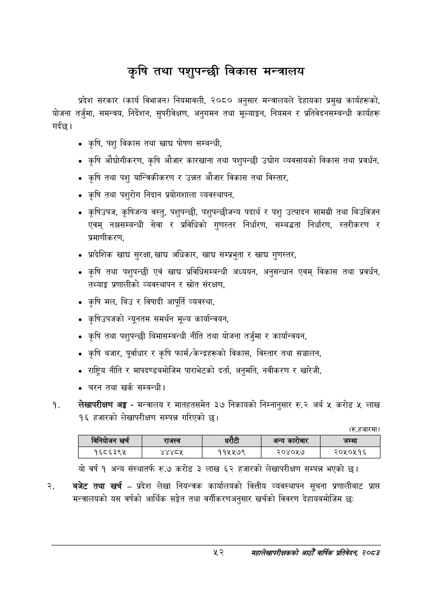

# Page 74 QA

## Rendered page


## Extracted text

```text
कृषि तथा पशुपन्छी विकास मन्त्रालय
गर्दछ | प्रदेश सरकार (कार्य विभाजन) नियमावली, २०८० अनुसार मन्त्रालयले देहायका प्रमुख कार्यहरूको, योजना तर्जुमा, समन्वय, निर्देशन, सुपरीवेक्षण, अनुगमन तथा मूल्याङ्कन, नियमन र प्रतिवेदनसम्बन्धी कार्यहरू
कृषि, पशु विकास तथा खाद्य पोषण सम्बन्धी,
कृषि औद्योगीकरण, कृषि औजार कारखाना तथा पशुपन्छी उद्योग व्यवसायको विकास तथा प्रवर्धन,
कृषि तथा पशु यान्त्रिकीकरण र उन्नत औजार विकास तथा विस्तार,
कृषि तथा पशुरोग निदान प्रयोगशाला व्यवस्थापन,
कृषिउपज, कृषिजन्य वस्तु, पशुपन्छी, पशुपन्छीजन्य पदार्थ र पशु उत्पादन सामग्री तथा बिउविजन एवम्‌ नक्षसम्बन्धी सेवा र प्रविधिको गुणस्तर निर्धारण, सम्बद्धता निर्धारण, स्तरीकरण र प्रमाणीकरण,
प्रादेशिक खाद्य सुरक्षा, खाड अधिकार, खाद्य सम्प्रभुता र खाद्य गुणस्तर,
कृषि तथा पशुपन्छी एवं खाद्य प्रविधिसम्बन्धी अध्ययन, अनुसन्धान एवम्‌ विकास तथा प्रवर्धन, तथ्याङ्क प्रणालीको व्यवस्थापन र स्रोत संरक्षण,
कृषि मल, बिउ र विषादी आपूर्ति व्यवस्था,
कृषिउपजको न्यूनतम समर्थन मूल्य कार्यान्वयन,
कृषि तथा पशुपन्छी बिमासम्बन्धी नीति तथा योजना तर्जुमा र कार्यान्वयन,
कृषि बजार, पूर्वाधार र कृषि फार्म/केन्द्रहरूको विकास, विस्तार तथा सञ्चालन,
राष्ट्रिय नीति र मापदण्डबमोजिम पाराभेटको दर्ता, अनुमति, नवीकरण र खारेजी,
चरन तथा खर्क सम्बन्धी |
लेखापरीक्षण अङ्ग -मन्त्रालय र मातहतसमेत ३७ निकायको निम्नानुसार रु.२ अर्ब ५ करोड ५ लाख १६ हजारको लेखापरीक्षण सम्पन्न गरिएको छ।
(रु.हजारमा)
यो वर्ष १ अन्य संस्थातर्फ रु.७ करोड ३ लाख ६२ हजारको लेखापरीक्षण सम्पन्न भएको छ।
बजेट तथा खर्च -प्रदेश लेखा नियन्त्रक कार्यालयको वित्तीय व्यवस्थापन सूचना प्रणालीबाट प्राप्त मन्त्रालयको यस वर्षको आर्थिक सङ्ेत तथा वर्गीकरणअनुसार खर्चको विवरण देहायबमोजिम छः
५२
महालेखापरीक्षकको आठौँ वाषिकि प्रतिवेदन २०८२

|  | खर्च | राजस्व |  | धरेटी | अन्य कारोबार | जम्मा |
| --- | --- | --- | --- | --- | --- | --- |
|  | १६८६३९४५ | १८२१. | ११५५७९ |  | २०४०५७ | २०५०५१६ |
```

## Flags
- table_page
- medium_quality_table
