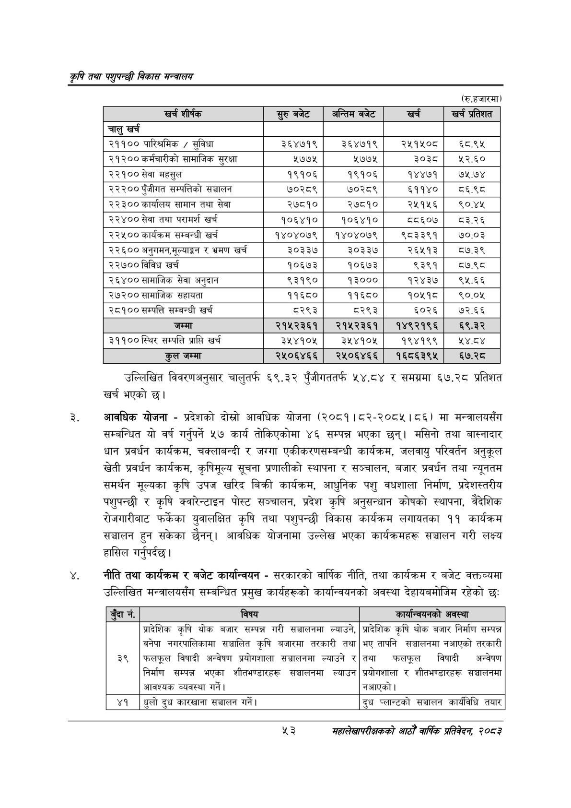

# Page 75 QA

## Rendered page


## Extracted text

```text
कृषि तथा पशुपन्छी विकास मन्वालय
(रु.हजारमा)
उल्लिखित विवरणअनुसार चालुतर्फ ६९.३२ पुँजीगततर्फ ५४.८४ र समग्रमा ६७.२८ प्रतिशत खर्च भएको |
आवधिक योजना -प्रदेशको दोस्रो आवधिक योजना (२०८१।८२-२०८५। ८६) मा मन्त्रालयसँग सम्बन्धित यो वर्ष गर्नुपर्ने ५७ कार्य तोकिएकोमा ४६ सम्पन्न भएका छन्‌। मसिनो तथा बास्नादार धान प्रवर्धन कार्यक्रम, चक्लाबन्दी र जग्गा एकीकरणसम्बन्धी कार्यक्रम, जलवायु परिवर्तन अनुकूल खेती प्रवर्धन कार्यक्रम, कृषिमूल्य सूचना प्रणालीको स्थापना र सञ्चालन, बजार प्रवर्धन तथा न्यूनतम समर्थन मूल्यका कृषि उपज खरिद बिक्री कार्यक्रम, आधुनिक पशु वधशाला निर्माण, प्रदेशस्तरीय पशुपन्छी र कृषि क्वारेन्टाइन पोस्ट सञ्चालन, प्रदेश कृषि अनुसन्धान कोषको स्थापना, वैदेशिक रोजगारीबाट फर्केका युवालक्षित कृषि तथा पशुपन्छी विकास कार्यक्रम लगायतका ११ कार्यक्रम सञ्चालन हुन सकेका छैनन्‌। आवधिक योजनामा उल्लेख भएका कार्यक्रमहरू सञ्चालन गरी लक्ष्य हासिल गर्नुपर्दछ।
नीति तथा कार्यक्रम र बजेट कार्यान्वयन -सरकारको वार्षिक नीति, तथा कार्यक्रम र बजेट वक्तव्यमा उल्लिखित मन्त्रालयसँग सम्बन्धित प्रमुख कार्यहरूको कार्यान्वयनको अवस्था देहायबमोजिम रहेको छः
५३
महालेखापरीक्षकको आठौँ वाषिकि प्रतिवेदन २०८२

| खर्च शीर्षक | सुरुबबेट | अन्तिम बजेट | खर्च | = प्रतिशत |
| --- | --- | --- | --- | --- |
| चालु खर्च |  |  |  |  |
| २११०० पारिश्रमिक / सुविधा | ३६४७१९ | ३६४७१९ | २५१५०८ | ६८.९५ |
| २१२०० कर्मचारीको सामाजिक सुरक्षा | १७७५ | २७७५ | ३०३८ | १२.६० |
| २२१०० सेवा महसुल | १९१०६ | १९१०६ | १४४७१ | ७५.७४ |
| २२२०० पुँजीगत क्षम्पतिको सञ्चालन | ७०२८९ | ७०२८९ | ६११४० | व६.९८ |
| २२३०० कार्यालय सामान तथा सेवा | २७८१० | २७८१० | २५१५६ | ९०.४४५ |
| २२४०० सेवा तथा परामर्श खर्च | १०६४१० | १०६४१० | ८५६०७ | ८३.२६ |
| २२५०० कार्यक्रम सम्बन्धी खर्च | १४०४०७९ | १४०४०७९ | ९८३३९१ | ७०.०३ |
| २२६०० र भ्रमण खर्च | ३०३३७ | ३०३३७ | २६५१३ | ०७.३९ |
| २२७०० विविध खर्च | १०६७३ | १०६७३ | ९३९१ | ८७.९८ |
| २६४०० सामाजिक सेवा अनुदान | ९३१९० | १३००० | १२४३७ | ९५.६६ |
| २७२०० सामाजिक सहायता | ११६८० | ११६८० | १०५१८ | १०.०५ |
| २८१०० सम्पत्ति सम्बन्धी खर्च | ८२९३ | ८२९३ | ६०२६ | ७२.६६ |
| जम्मा | २१५२३६१ | २१५२३६१ | १४९२१९६ | ६९.३२ |
| ३११००स्थिर सम्पत्ति प्राप्ति खर्च | ३५४१०४५ | ३५४१०५ | १९४१९९ | र४.८४ |
| कुल जम्मा | २५०६४६६ | २५०६४६६ | १६८६३९५ | ६७.२८ |

| ३ | विषय | कार्यान्चयनको अवस्था |
| --- | --- | --- |
|  | श्रादेशिक कृषि थोक बजार सम्पन्न गरी सञ्चालनमा ल्याउने, | प्रादेशिक कृषि थोक वजार निर्माण सम्पन्न |
| ३९ | बनेपा नगरपालिकामा सञ्चालित कृषि बजारमा तरकारी तथा फलफूल विषादी अन्वेषण प्रयोगशाला सञ्चालनमा ल्याउने र | भए तापनि खच्चालनमा नआएको तरकारी तथा फलफूल बिषादी अन्वेषण |
|  | निर्माण सम्पन्न भएका शीतभ"्डारहरू सञ्चालनमा ल्याउन आवश्यक व्यवस्था गर्ने। | प्रवोगशाला र शीतभ"०्डारहरू सञ्चालनमा नआएको। |
| ४१ | धुलो दुध कारखाना सञ्चालन गर्ने। | दुध प्लान्टको लच्चालन कार्यविधि तयार |
```

## Flags
- table_page
- medium_quality_table
