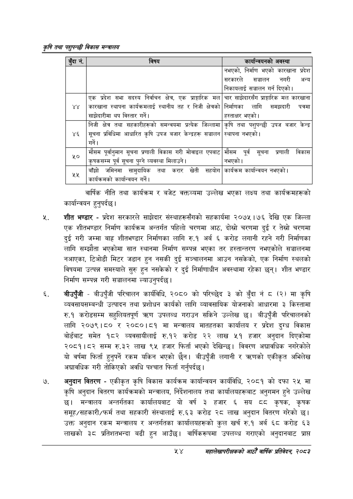

# Page 76 QA

## Rendered page


## Extracted text

```text
कृषि तथा पशुपन्छी विकास मन्वालय
वार्षिक नीति तथा कार्यक्रम र बजेट वक्तव्यमा उल्लेख भएका लक्ष्य तथा कार्यक्रमहरूको कार्यान्वयन हुनुपर्दछ |
शीत भण्डार -प्रदेश सरकारले साझेदार संस्थाहरूसँगको सहकार्यमा २०७५।७६ देखि एक जिल्ला एक शीतभण्डार निर्माण कार्यक्रम अन्तर्गत पहिलो चरणमा आठ, दोस्रो चरणमा दुई र तेस्रो चरणमा दुई गरी जम्मा बाह्र शीतभण्डार निर्माणका लागि रु.१ अर्ब ६ करोड लगानी रहने गरी निर्माणका लागि सम्झौता भएकोमा सात स्थानमा निर्माण सम्पन्न भएका तर हस्तान्तरण नभएकोले सञ्चालनमा नआएका, टिओडी मिटर जडान हुन नसकी दुई सञ्चालनमा आउन नसकेको, एक निर्माण स्थलको विषयमा उत्पन्न समस्याले सुरु हुन नसकेको र दुई निर्माणाधीन अवस्थामा रहेका छन्‌। शीत भण्डार निर्माण सम्पन्न गरी सञ्चालनमा ल्याउनुपर्दछ।
बीउपुँजी -बीउपुँजी परिचालन कार्यविधि, २०८० को परिच्छेद ३ को बुँदा नं ८ (२) मा कृषि व्यवसायसम्बन्धी उत्पादन तथा प्रशोधन कार्यको लागि व्यावसायिक योजनाको आधारमा ३ किस्तामा रु.१ करोडसम्म सहुलियतपूर्ण उपलब्ध गराउन सकिने उल्लेख छ। बीउपुँजी परिचालनको लागि २०७९।८० र २०८०।८१ मा मन्त्रालय मातहतका कार्यालय र प्रदेश दुग्ध विकास बोर्डबाट समेत १८२ व्यवसायीलाई रु.१२ करोड २२ लाख ५१ हजार अनुदान दिएकोमा २०८१।८२ सम्म रु.३२ लाख ९५ हजार फिर्ता भएको देखिन्छ। विवरण अद्यावधिक नगरेकोले यो वर्षमा फिर्ता हुनुपर्ने रकम यकिन भएको छैन। बीउपुँजी लगानी र त्रृणको एकीकृत अभिलेख अद्यावधिक गरी तोकिएको अवधि पश्चात फिर्ता गर्नुपर्दछ |
अनुदान वितरण -एकीकृत कृषि विकास कार्यक्रम कार्यान्वयन कार्यविधि, २०८१ को दफा २५ मा कृषि अनुदान वितरण कार्यक्रमको मन्त्रालय, निर्देशनालय तथा कार्यालयहरूबाट अनुगमन हुने उल्लेख छ। मन्त्रालय अन्तर्गतका कार्यालयबाट यो वर्ष ३ हजार ६ सय कृषक, कृषक समूह/सहकारी/फर्म तथा सहकारी संस्थालाई रु.६३ करोड २८ लाख अनुदान वितरण गरेको छ। उक्त अनुदान रकम मन्त्रालय र अन्तर्गतका कार्यालयहरूको कुल खर्च रु.१ अर्ब ६८ करोड ६३ लाखको ३८ प्रतिशतभन्दा बढी हुन | वार्षिकरूपमा उपलब्ध गराएको अनुदानबाट प्राप्त
५४
महालेखापरीक्षकको आठौँ वाषिकि प्रतिवेदन २०८२

| ड्दान॑, | विषय | कार्षान्चयनको अवस्था |
| --- | --- | --- |
|  |  | नभएको, निर्माण भएको कारखाना प्रदेश सरकारले सञ्चालन नगरी अन्य निकाबलाई सञ्चालन गर्न दिएको। |
|  |  |  |
| ४४ | एक प्रदेश सभा सदस्य निर्वाचन क्षेत्र, एक अाङ्गारिक मल कारखाना स्थापना कार्यक्रमलाई स्थानीय तह र निजी क्षेत्रको साझेदारीमा थप विस्तार गर्ने। | चार साझेदारसँग पराङ्गारिक मल कारखाना निर्माणका लागि समन्चदारी पत्रमा हस्ताक्षर भएको \| |
|  |  |  |
| ४६ | निजी क्षेत्र तथा सहकारीहरूको समन्वयमा प्रत्येक [जिल्लामा सूचना प्रविधिमा आधारित कृषि उपज बजार केन्द्रहरू सञ्चालन गर्ने। | कृषि तथा पशुपन्छी उपज बजार केन्द्र स्थापना नभएको। |
| ५० | मौसम पूर्वानुमान सूचना प्रणाली विकास गरी भोवाइल एपबाट पूर्व सूचना पुग्ने व्यवस्था भिलाउने। | मौसम पूर्व सूचना प्रणाली विकास नभएको \| |
| कक | बाँझो जमिनमा सासुदानिक तथा करार खेती सहयोग कार्यान्वन गर्ने। | कार्यक्रम कार्यान्वयन नभएको \| |
```

## Flags
- table_page
- medium_quality_table
