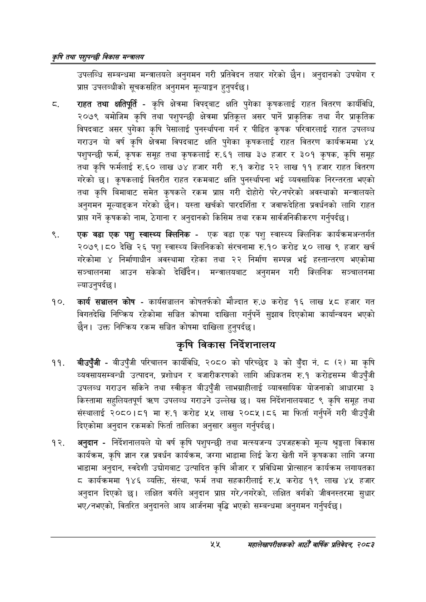

# Page 77 QA

## Rendered page


## Extracted text

```text
कृषि तथा पशुपन्छी विकास मन्वालय
उपलब्धि सम्बन्धमा मन्त्रालयले अनुगमन गरी प्रतिवेदन तयार गरेको छैन। अनुदानको उपयोग र प्रापत उपलब्धीको सूचकसहित अनुगमन मूल्याङ्कन हुनुपर्दछ |
राहत तथा क्षतिपूर्ति -कृषि क्षेत्रमा विपद्बाट क्षति पुगेका कृषकलाई राहत वितरण कार्यविधि, २०७९ बमोजिम कृषि तथा पशुपन्छी क्षेत्रमा प्रतिकूल असर पार्ने प्राकृतिक तथा गैर प्राकृतिक विपदबाट असर पुगेका कृषि पेसालाई पुनर्स्थापना गर्न र पीडित कृषक परिवारलाई राहत उपलब्ध गराउन यो वर्ष कृषि क्षेत्रमा विपदबाट क्षति पुगेका कृषकलाई राहत वितरण कार्यक्रममा ४५ पशुपन्छी फर्म, कृषक समूह तथा कृषकलाई रु.६१ लाख ३७ हजार र ३०१ कृषक, कृषि समूह तथा कृषि फर्मलाई रु.६० लाख ७४ हजार गरी रु.१ करोड २२ लाख ११ हजार राहत वितरण गरेको छ। कृषकलाई वितरीत राहत रकमबाट क्षति पुनर्स्थापना भई व्यवसायिक निरन्तरता भएको तथा कृषि बिमाबाट समेत कृषकले रकम प्राप्त गरी दोहोरो परे/नपरेको अवस्थाको मन्त्रालयले अनुगमन मूल्याङ्कन गरेको छैन। यस्ता खर्चको पारदर्शिता र जवाफदेहिता प्रवर्धनको लागि राहत प्राप्त गर्ने कृषकको नाम, ठेगाना र अनुदानको किसिम तथा रकम सार्वजनिकीकरण गर्नुपर्दछ |
एक वडा एक पशु स्वास्थ्य क्लिनिक -एक वडा एक पशु स्वास्थ्य क्लिनिक कार्यक्रमअन्तर्गत २०७९।८० देखि २६ पशु स्वास्थ्य क्लिनिकको संरचनामा रु.१० करोड ५० लाख ९ हजार खर्च गरेकोमा निर्माणाधीन अवस्थामा रहेका तथा २२ निर्माण सम्पन्न भई हस्तान्तरण भएकोमा सञ्चालनमा आउन सकेको देखिँदैन। मन्त्रालयबाट अनुगमन गरी क्लिनिक सञ्चालनमा ल्याउनुपर्दछ।
कार्य सञ्चालन कोष -कार्यसञ्चालन कोषतर्फको मौज्दात रु.७ करोड १६ लाख ५८ हजार गत विगतदेखि निष्क्रिय रहेकोमा सञ्चित कोषमा दाखिला गर्नुपर्ने सुझाव दिएकोमा कार्यान्वयन भएको छैन। उक्त निष्क्रिय रकम सञ्चित कोषमा दाखिला हुनुपर्दछ।
कृषि विकास निर्देशनालय
बीउपुँजी -बीउपुँजी परिचालन कार्यविधि, २०८० को परिच्छेद ३ को बुँदा नं. ८ (२) मा कृषि व्यवसायसम्बन्धी उत्पादन, प्रशोधन र बजारीकरणको लागि अधिकतम रु.१ करोडसम्म बीउपुँजी उपलब्ध गराउन सकिने तथा स्वीकृत बीउपुँजी लाभग्राहीलाई व्यावसायिक योजनाको आधारमा ३ किस्तामा सहुलियतपूर्ण त्रधण उपलब्ध गराउने उल्लेख छ। यस निर्देशनालयबाट ९ कृषि समूह तथा संस्थालाई २०८०।८१ मा रु.१ करोड ५५ लाख २०८५।८६ मा फिर्ता गर्नुपर्ने गरी बीउपुँजी दिएकोमा अनुदान रकमको फिर्ता तालिका अनुसार असुल गर्नुपर्दछ।
अनुदान -निर्देशनालयले यो वर्ष कृषि पशुपन्छी तथा मत्स्यजन्य उपजहरूको मूल्य श्रृङ्खला विकास कार्यक्रम, कृषि ज्ञान रत्न प्रवर्धन कार्यक्रम, जग्गा भाडामा लिई केरा खेती गर्ने कृषकका लागि जग्गा भाडामा अनुदान, स्वदेशी उद्योगबाट उत्पादित कृषि औजार र प्रविधिमा प्रोत्साहन कार्यक्रम लगायतका ८ कार्यक्रममा १४६ व्यक्ति, संस्था, फर्म तथा सहकारीलाई रु.५ करोड १९ लाख ४५ हजार अनुदान दिएको छ। लक्षित वर्गले अनुदान प्राप्त गरे/नगरेको, लक्षित वर्गको जीवनस्तरमा सुधार भए/नभएको, वितरित अनुदानले आय आर्जनमा वृद्धि भएको सम्बन्धमा अनुगमन गर्नुपर्दछ।
शश्‌
महालेखापरीक्षकको आठौँ वाषिकि प्रतिवेदन २०८२
```

## Flags
- None
