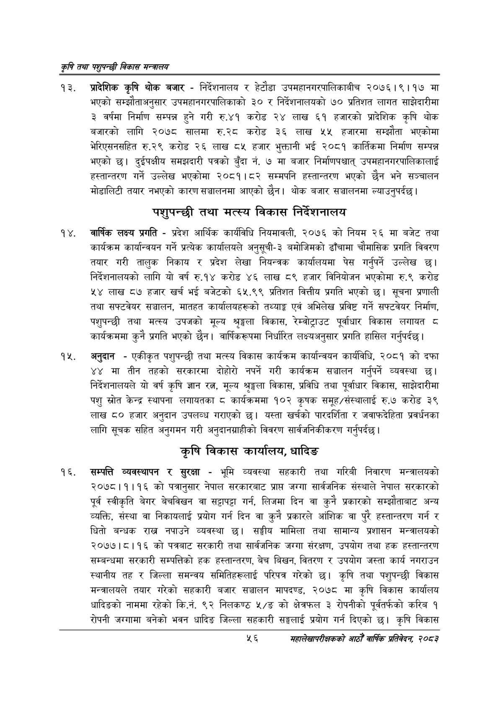

# Page 78 QA

## Rendered page


## Extracted text

```text
कृषि तथा पशुपन्छी विकास मन्वालय
प्रादेशिक कृषि थोक बजार -निर्देशनालय र हेटौडा उपमहानगरपालिकाबीच २०७६।९।१७ मा भएको सम्झौताअनुसार उपमहानगरपालिकाको ३० र निर्देशनालयको ७० प्रतिशत लागत साझेदारीमा ३ वर्षमा निर्माण सम्पन्न हुने गरी रु.४१ करोड २४ लाख ६१ हजारको प्रादेशिक कृषि थोक बजारको लागि २०७८ सालमा रु.२८ करोड ३६ लाख ५५ हजारमा सम्झौता भएकोमा भेरिएसनसहित रु.२९ करोड २६ लाख ८५ हजार भुक्तानी भई २०८१ कार्तिकमा निर्माण सम्पन्न भएको छ। दुईपक्षीय समझदारी पत्रको बुँदा नं. ७ मा बजार निर्माणपश्चात्‌ उपमहानगरपालिकालाई हस्तान्तरण गर्ने उल्लेख भएकोमा २०८१।८२ सम्मपनि हस्तान्तरण भएको छैन भने सञ्चालन मोडालिटी तयार नभएको कारण सञ्चालनमा आएको छैन। थोक बजार सञ्चालनमा ल्याउनुपर्दछ।
पशुपन्छी तथा मत्स्य विकास निर्देशनालय
वार्षिक लक्ष्य प्रगति -प्रदेश आर्थिक कार्यविधि नियमावली, २०७६ को नियम २६ मा बजेट तथा कार्यक्रम कार्यान्वयन गर्ने प्रत्येक कार्यालयले अनुसूची-३ बमोजिमको ढाँचामा चौमासिक प्रगति विवरण तयार गरी तालुक निकाय र प्रदेश लेखा नियन्त्रक कार्यालयमा पेस गर्नुपर्ने उल्लेख छ। निर्देशनालयको लागि यो वर्ष रु.१४ करोड ४६ लाख ८९ हजार विनियोजन भएकोमा रु.९ करोड ४५४ लाख ८७ हजार खर्च भई बजेटको ६५.९९ प्रतिशत वित्तीय प्रगति भएको छ। सूचना प्रणाली तथा सफ्टवेयर सञ्चालन, मातहत कार्यालयहरूको तथ्याङ्क एवं अभिलेख प्रविष्ट गर्ने सफ्टवेयर निर्माण, पशुपन्छी तथा मत्स्य उपजको मूल्य श्रृङ्खला विकास, रेम्वोट्राउट पूर्वाधार विकास लगायत ८ कार्यक्रममा कुनै प्रगति भएको छैन। वार्षिकरूपमा निर्धारित लक्ष्यअनुसार प्रगति हासिल गर्नुपर्दछ |
अनुदान -एकीकृत पशुपन्छी तथा मत्स्य विकास कार्यक्रम कार्यान्वयन कार्यविधि, २०८१ को दफा ४४ मा तीन तहको सरकारमा दोहोरी नपर्ने गरी कार्यक्रम सञ्चालन गर्नुपर्ने व्यवस्था निर्देशनालयले यो वर्ष कृषि ज्ञान रत्न, मूल्य श्रङ्खला विकास, प्रविधि तथा पूर्वाधार विकास, साझेदारीमा पशु स्रोत केन्द्र स्थापना लगायतका कार्यक्रममा १०२ कृषक समूह/संस्थालाई रु.७ करोड ३९ लाख ८० हजार अनुदान उपलव्ध गराएको | यस्ता खर्चको पारदर्शिता र जवाफदेहिता प्रवर्धनका लागि सूचक सहित अनुगमन गरी अनुदानग्राहीको विवरण सार्वजनिकीकरण गर्नुपर्दछ |
कृषि विकास कार्यालय, धादिङ
सम्पत्ति व्यवस्थापन र सुरक्षा -भूमि व्यवस्था सहकारी तथा गरिबी निवारण मन्त्रालयको २०७८।१।१६ को पत्रानुसार नेपाल सरकारबाट प्राप्त जग्गा सार्वजनिक संस्थाले नेपाल सरकारको पूर्व स्वीकृति बेगर बेचविखन वा सट्टापट्टा गर्न, लिजमा दिन वा कुनै प्रकारको सम्झौताबाट अन्य व्यक्ति, संस्था वा निकायलाई प्रयोग गर्न दिन वा कुनै प्रकारले आंशिक वा पुरै हस्तान्तरण गर्न र धितो बन्धक राख्न नपाउने व्यवस्था छ। सङ्घीय मामिला तथा सामान्य प्रशासन मन्त्रालयको २०७७।८।१६ को पत्रबाट सरकारी तथा सार्वजनिक जग्गा संरक्षण, उपयोग तथा हक हस्तान्तरण सम्बन्धमा सरकारी सम्पत्तिको हक हस्तान्तरण, बेच बिखन, वितरण र उपयोग जस्ता कार्य नगराउन स्थानीय तह र जिल्ला समन्वय समितिहरूलाई परिपत्र गरेको छ। कृषि तथा पशुपन्छी विकास मन्त्रालयले तयार गरेको सहकारी बजार सञ्चालन मापदण्ड, २०७८ मा कृषि विकास कार्यालय धादिङको नाममा रहेको कि.नं. ९२ निलकण्ठ ५/ङ को क्षेत्रफल ३ रोपनीको पूर्वतर्फको करिब १ रोपनी जग्गामा बनेको भवन धादिङ जिल्ला सहकारी सङ्घलाई प्रयोग गर्न दिएको छ। कृषि विकास
५६
महालेखापरीक्षकको आठौँ वाषिकि प्रतिवेदन २०८२
```

## Flags
- None
